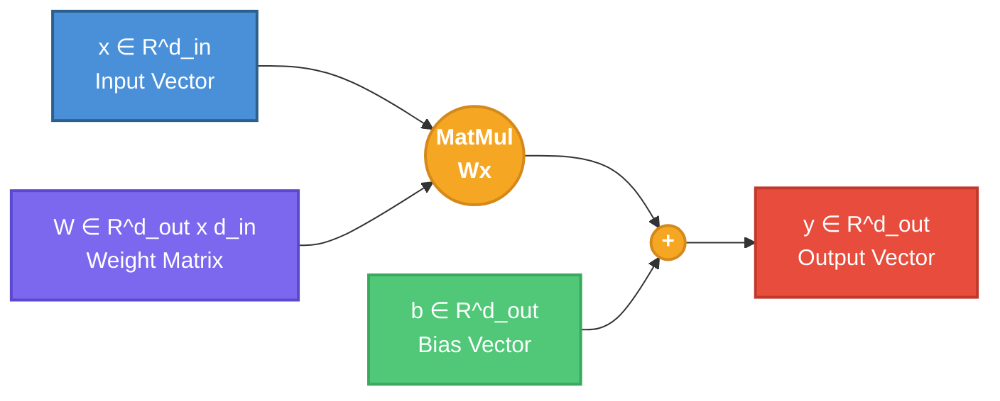
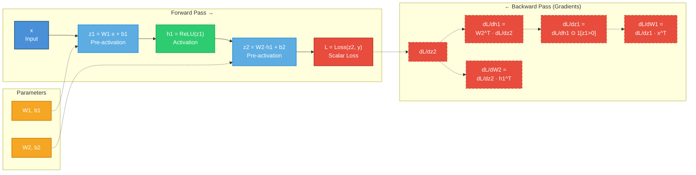
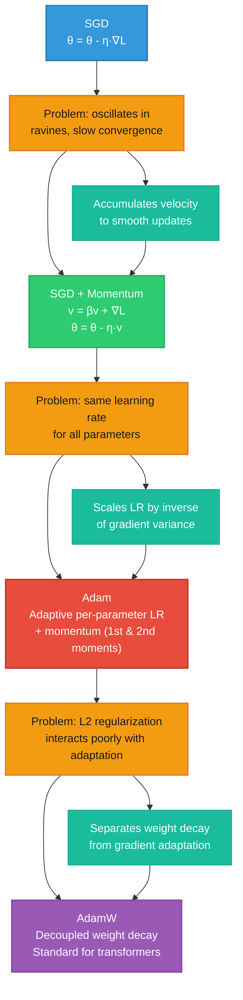
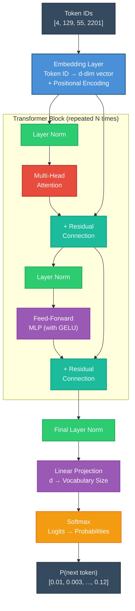

# Module 01: Mathematical and ML Foundations for Generative AI

This document is a practitioner's reference for the mathematics and machine learning
concepts that underpin generative AI. It is not a textbook -- it is meant to build
intuition, connect abstract ideas to concrete code, and serve as something you return
to when a paper or implementation confuses you.

Every section answers two questions: *what is this?* and *why does it show up in
generative AI?*

---

## 1. Linear Algebra Essentials

Linear algebra is the language of deep learning. Tensors (the generalization of
vectors and matrices) are the fundamental data structure, and almost every operation
in a neural network -- forward pass, backward pass, attention, projection -- is a
linear algebra operation under the hood.

### 1.1 Vectors

A vector is an ordered list of numbers. In deep learning, a vector typically
represents a single data point, a single neuron's weights, or a single token's
embedding.

$$\mathbf{x} = \begin{bmatrix} x_1 \\ x_2 \\ \vdots \\ x_n \end{bmatrix} \in \mathbb{R}^n$$

**Why it matters:** A word embedding is a vector. A hidden state is a vector. The
output logits of a language model are a vector. When you read "the model projects
into a 768-dimensional space," that means every token becomes a vector in
$\mathbb{R}^{768}$.

### 1.2 Dot Product

The dot product of two vectors $\mathbf{a}, \mathbf{b} \in \mathbb{R}^n$ is:

$$\mathbf{a} \cdot \mathbf{b} = \sum_{i=1}^{n} a_i b_i = \|\mathbf{a}\| \|\mathbf{b}\| \cos\theta$$

where $\theta$ is the angle between the two vectors.

**Intuition:** The dot product measures *similarity*. If two vectors point in the
same direction, their dot product is large and positive. If they are orthogonal
(unrelated), it is zero. If they point in opposite directions, it is large and
negative.

**Why it matters:** Attention scores in transformers are dot products between query
and key vectors. Cosine similarity (used in contrastive learning, CLIP, retrieval)
is a normalized dot product. The linear transformation $\mathbf{y} = W\mathbf{x}$
is a stack of dot products -- each row of $W$ dotted with $\mathbf{x}$.

### 1.3 Matrices

A matrix $A \in \mathbb{R}^{m \times n}$ is a 2D grid of numbers with $m$ rows
and $n$ columns. In deep learning, matrices most commonly represent:

- **Weight matrices** in linear layers ($W \in \mathbb{R}^{d_{out} \times d_{in}}$)
- **Batches of data** where each row is a sample ($X \in \mathbb{R}^{B \times d}$)
- **Attention score matrices** ($\text{scores} \in \mathbb{R}^{T \times T}$, where $T$ is sequence length)

### 1.4 Matrix Multiplication

Given $A \in \mathbb{R}^{m \times p}$ and $B \in \mathbb{R}^{p \times n}$, their
product $C = AB$ has shape $\mathbb{R}^{m \times n}$, with:

$$C_{ij} = \sum_{k=1}^{p} A_{ik} B_{kj}$$

**The shape rule:** The inner dimensions must match: $(m \times \mathbf{p}) \cdot (\mathbf{p} \times n) \to (m \times n)$. This is the single most important thing to internalize. If shapes do not match, the operation is undefined.

**Why it matters:** A linear layer's forward pass is a matrix multiplication:
$\mathbf{y} = W\mathbf{x} + \mathbf{b}$. For a batch of inputs
$X \in \mathbb{R}^{B \times d_{in}}$, the output is
$Y = XW^T + \mathbf{b} \in \mathbb{R}^{B \times d_{out}}$ (note the transpose --
PyTorch's `nn.Linear` stores weights as $(d_{out} \times d_{in})$ and transposes
internally).

### 1.5 Transpose

The transpose of $A \in \mathbb{R}^{m \times n}$ is $A^T \in \mathbb{R}^{n \times m}$,
where $(A^T)_{ij} = A_{ji}$.

Key properties:
- $(AB)^T = B^T A^T$ (order reverses)
- $(A^T)^T = A$

**Why it matters:** Weight matrices are frequently transposed during forward and
backward passes. In attention, we compute $QK^T$ -- the query matrix multiplied by
the *transpose* of the key matrix.

### 1.6 Norms

The $L^2$ norm (Euclidean norm) of a vector:

$$\|\mathbf{x}\|_2 = \sqrt{\sum_{i=1}^{n} x_i^2}$$

The $L^1$ norm:

$$\|\mathbf{x}\|_1 = \sum_{i=1}^{n} |x_i|$$

**Why it matters:**
- Cosine similarity normalizes by norms: $\text{cos\_sim}(\mathbf{a}, \mathbf{b}) = \frac{\mathbf{a} \cdot \mathbf{b}}{\|\mathbf{a}\|_2 \|\mathbf{b}\|_2}$
- Layer normalization divides by the norm (standard deviation) of a vector.
- Weight decay / L2 regularization penalizes $\|W\|_2^2$.
- Gradient clipping checks $\|\nabla\|_2$ and scales gradients down if it exceeds a threshold.

### Linear Layer Transformation

The following diagram shows how a linear layer transforms an input vector through
matrix multiplication and bias addition -- the most fundamental operation in deep
learning:



For a **batch** of inputs $X \in \mathbb{R}^{B \times d_{in}}$, the operation
becomes $Y = XW^T + \mathbf{b}$, where broadcasting adds the bias to every row.
Each row of $Y$ is one sample's output, computed independently but in parallel via
batched matrix multiplication.

### 1.7 Batched Matrix Multiplication (BMM)

In practice, we almost never multiply single matrices. We multiply *batches* of
matrices. Given tensors $A \in \mathbb{R}^{B \times m \times p}$ and
$B \in \mathbb{R}^{B \times p \times n}$, the batched matmul produces
$C \in \mathbb{R}^{B \times m \times n}$ by performing $B$ independent matrix
multiplications in parallel.

In PyTorch: `torch.bmm(A, B)` or the more general `torch.matmul(A, B)` (which
handles broadcasting).

**Why it matters:** Multi-head attention computes $\text{softmax}(QK^T / \sqrt{d_k})V$
where $Q, K, V$ each have shape $(B, H, T, d_k)$ -- batch, heads, sequence length,
head dimension. This is a batched matmul over the batch *and* head dimensions
simultaneously. If you cannot reason about batched matmul shapes, attention will be
impenetrable.

### 1.8 Eigenvalues and Singular Values (Brief)

For a square matrix $A$, an eigenvector $\mathbf{v}$ satisfies
$A\mathbf{v} = \lambda\mathbf{v}$ -- the matrix only *scales* this vector, it does
not change its direction. The scalar $\lambda$ is the eigenvalue.

The singular value decomposition (SVD) generalizes this to non-square matrices:
$A = U \Sigma V^T$.

**Why it matters:** You will encounter these in:
- PCA for dimensionality reduction
- Low-rank approximations (LoRA fine-tuning decomposes weight updates as low-rank matrices)
- Understanding why certain weight initializations work (they preserve singular values across layers)

You do not need to compute eigenvalues by hand. You need to know what they *mean*:
they describe how a matrix stretches and rotates space.

### 1.9 Broadcasting

Broadcasting is how PyTorch (and NumPy) handle operations between tensors of
different shapes. The rules:

1. Dimensions are compared from the *right* (trailing dimensions).
2. Dimensions are compatible if they are equal, or one of them is 1.
3. A dimension of size 1 is "stretched" to match the other.

Example: adding a bias vector $\mathbf{b} \in \mathbb{R}^{d}$ to a batch
$X \in \mathbb{R}^{B \times d}$ works because the shapes align from the right:
$(B, d)$ and $(d,)$ -- the bias is broadcast across the batch dimension.

**Why it matters:** Nearly every operation in deep learning relies on broadcasting.
Masking in attention (adding $-\infty$ to certain positions) uses broadcasting.
Getting broadcasting wrong is one of the most common sources of silent bugs --
tensors get added or multiplied in unexpected ways without raising an error.

---

## 2. Probability and Information Theory

Generative models are, at their core, models of probability distributions. A
language model learns $P(\text{next token} | \text{context})$. A diffusion model
learns to reverse a noise process, implicitly modeling $P(\text{image})$. A VAE
explicitly parameterizes a distribution over latent variables. You cannot understand
generative AI without understanding probability.

### 2.1 Probability Distributions

A **discrete probability distribution** assigns a probability to each outcome in a
finite (or countable) set:

$$P(X = x_i) = p_i, \quad \sum_i p_i = 1, \quad p_i \geq 0$$

A **continuous probability distribution** is described by a probability density
function (PDF) $p(x)$ where:

$$P(a \leq X \leq b) = \int_a^b p(x) \, dx, \quad \int_{-\infty}^{\infty} p(x) \, dx = 1$$

**Key distributions you will encounter:**

| Distribution | Type | Where it appears |
|---|---|---|
| Categorical | Discrete | Token probabilities in language models |
| Bernoulli | Discrete | Binary classification, dropout masks |
| Gaussian (Normal) | Continuous | VAE latent spaces, diffusion noise, weight initialization |
| Uniform | Both | Random sampling, noise schedules |

### 2.2 Expectation and Variance

The **expectation** (mean) of a random variable:

$$\mathbb{E}[X] = \sum_i x_i p_i \quad \text{(discrete)}, \qquad \mathbb{E}[X] = \int x \, p(x) \, dx \quad \text{(continuous)}$$

The **variance** measures spread:

$$\text{Var}(X) = \mathbb{E}[(X - \mathbb{E}[X])^2] = \mathbb{E}[X^2] - (\mathbb{E}[X])^2$$

**Why it matters:** Loss functions are expectations. When we compute the loss over a
minibatch, we are estimating $\mathbb{E}[\mathcal{L}]$. Batch normalization computes
the mean and variance of activations. The reparameterization trick in VAEs rewrites
sampling from $\mathcal{N}(\mu, \sigma^2)$ as $\mu + \sigma \cdot \epsilon$ where
$\epsilon \sim \mathcal{N}(0, 1)$ -- this only makes sense if you understand what
expectation and variance mean.

### 2.3 Bayes' Theorem

$$P(A \mid B) = \frac{P(B \mid A) \, P(A)}{P(B)}$$

In words: the posterior is proportional to the likelihood times the prior.

**Why it matters:** Bayesian reasoning is the conceptual foundation of:
- VAEs: the encoder approximates the posterior $P(z|x)$, the decoder models the likelihood $P(x|z)$, and the prior is $P(z)$.
- Diffusion models: the reverse process is derived from Bayes' theorem applied to the forward noising process.
- Bayesian neural networks and uncertainty estimation.

Even if you never compute Bayes' theorem by hand, the vocabulary of "prior,"
"posterior," and "likelihood" is essential for reading generative AI papers.

### 2.4 Entropy

The **entropy** of a discrete distribution measures its uncertainty:

$$H(P) = -\sum_i p_i \log p_i$$

**Intuition:** A uniform distribution over 1000 tokens has high entropy -- you are
very uncertain about which token comes next. A distribution that puts 99% of its mass
on one token has low entropy -- you are nearly certain.

Properties:
- $H(P) \geq 0$, with equality iff the distribution is deterministic (all mass on one outcome).
- $H(P)$ is maximized by the uniform distribution.
- Measured in nats (natural log) or bits (log base 2).

**Why it matters:** Language model perplexity is $\exp(H)$, where $H$ is the
cross-entropy of the model's predictions. Temperature sampling scales logits before
softmax, directly controlling the entropy of the output distribution.

### 2.5 Cross-Entropy

The **cross-entropy** between a true distribution $P$ and a model distribution $Q$:

$$H(P, Q) = -\sum_i p_i \log q_i$$

For classification with one-hot labels (true class is $c$), this simplifies to:

$$H(P, Q) = -\log q_c$$

This is the negative log-likelihood of the true class under the model's predicted
distribution.

**Why it matters:** Cross-entropy loss is THE loss function for:
- Language modeling (predict the next token)
- Classification (predict the correct class)
- Any model that outputs a probability distribution over discrete outcomes

When a paper says "we train with cross-entropy loss," they mean they are minimizing
$-\log P_\text{model}(\text{correct answer})$.

### 2.6 KL Divergence

The **Kullback-Leibler divergence** measures how one distribution $Q$ differs from
a reference distribution $P$:

$$D_{KL}(P \| Q) = \sum_i p_i \log \frac{p_i}{q_i} = H(P, Q) - H(P)$$

Properties:
- $D_{KL}(P \| Q) \geq 0$ (Gibbs' inequality), with equality iff $P = Q$.
- It is **not symmetric**: $D_{KL}(P \| Q) \neq D_{KL}(Q \| P)$ in general.
- It is not a true distance metric (no triangle inequality, no symmetry).

**Why it matters:**
- The VAE loss (ELBO) contains a KL term: $D_{KL}(q(z|x) \| p(z))$, which pushes the encoder's output distribution toward the prior.
- Knowledge distillation minimizes the KL divergence between a teacher's and student's output distributions.
- Minimizing cross-entropy is equivalent to minimizing KL divergence (since $H(P, Q) = D_{KL}(P \| Q) + H(P)$ and $H(P)$ is constant w.r.t. model parameters).
- Policy optimization in RLHF uses KL penalties to keep the fine-tuned model close to the base model.

### Entropy, Cross-Entropy, and KL Divergence: How They Connect

These three quantities are deeply interrelated. The following diagram shows their
relationships and where each appears in generative AI training:

```mermaid
graph TB
    classDef entropyStyle fill:#2ECC71,stroke:#27AE60,color:#FFFFFF,stroke-width:2px
    classDef ceStyle fill:#E74C3C,stroke:#C0392B,color:#FFFFFF,stroke-width:2px
    classDef klStyle fill:#9B59B6,stroke:#8E44AD,color:#FFFFFF,stroke-width:2px
    classDef formulaStyle fill:#34495E,stroke:#2C3E50,color:#ECF0F1,stroke-width:1px
    classDef noteStyle fill:#F39C12,stroke:#E67E22,color:#FFFFFF,stroke-width:2px
    classDef linkStyle fill:#3498DB,stroke:#2980B9,color:#FFFFFF,stroke-width:1px

    H["H(P)<br/>Entropy"]:::entropyStyle
    CE["H(P, Q)<br/>Cross-Entropy"]:::ceStyle
    KL["D_KL(P || Q)<br/>KL Divergence"]:::klStyle

    F1["H(P) = - Σ p_i log p_i<br/>Uncertainty in true distribution"]:::formulaStyle
    F2["H(P,Q) = - Σ p_i log q_i<br/>Surprise when using Q to encode P"]:::formulaStyle
    F3["D_KL = H(P,Q) - H(P)<br/>Extra bits from using Q instead of P"]:::formulaStyle

    H --- F1
    CE --- F2
    KL --- F3

    CE -->|"minus"| KL
    H -->|"subtracted from H(P,Q)<br/>gives KL"| KL

    N1["Language model training:<br/>minimize cross-entropy"]:::noteStyle
    N2["VAE training:<br/>minimize KL to prior"]:::noteStyle
    N3["RLHF:<br/>KL penalty to base model"]:::noteStyle

    CE --> N1
    KL --> N2
    KL --> N3

    KEY["Key insight: minimizing H(P,Q)<br/>w.r.t. model Q is equivalent<br/>to minimizing D_KL(P||Q)<br/>since H(P) is constant"]:::linkStyle
    CE --> KEY
    KL --> KEY
```

The critical takeaway: when training a model $Q$ to match data distribution $P$,
minimizing cross-entropy and minimizing KL divergence are the *same thing* (they
differ only by the constant $H(P)$, which does not depend on model parameters).
This is why cross-entropy loss "works" -- it is implicitly pushing the model's
distribution toward the true distribution.

### 2.7 Maximum Likelihood Estimation (MLE)

Given data $\{x_1, \ldots, x_N\}$ and a parameterized model $P_\theta$, MLE finds:

$$\theta^* = \arg\max_\theta \prod_{i=1}^{N} P_\theta(x_i) = \arg\max_\theta \sum_{i=1}^{N} \log P_\theta(x_i)$$

The second form (log-likelihood) is used in practice because products of small numbers
cause numerical underflow.

**Why it matters:** Training a language model with cross-entropy loss IS maximum
likelihood estimation. Training a diffusion model by predicting noise IS (a variant of)
maximum likelihood. MLE is the unifying principle behind most generative model training
objectives.

---

## 3. Calculus and Optimization

Training a neural network means finding parameters that minimize a loss function.
Calculus tells us which direction to move (gradients), and optimization algorithms
tell us how far to step.

### 3.1 Gradients

The **gradient** of a scalar function $f(\mathbf{x})$ with respect to a vector
$\mathbf{x} \in \mathbb{R}^n$ is:

$$\nabla_\mathbf{x} f = \begin{bmatrix} \frac{\partial f}{\partial x_1} \\ \frac{\partial f}{\partial x_2} \\ \vdots \\ \frac{\partial f}{\partial x_n} \end{bmatrix}$$

**Intuition:** The gradient points in the direction of steepest *increase* of $f$.
To minimize $f$, we move in the *opposite* direction: $-\nabla f$.

**Why it matters:** Every parameter update in deep learning follows some variant of
"move parameters in the direction that reduces the loss." The gradient tells us that
direction.

### 3.2 The Chain Rule (This IS Backpropagation)

If $f(x) = h(g(x))$, then:

$$\frac{df}{dx} = \frac{dh}{dg} \cdot \frac{dg}{dx}$$

For a composition of many functions $f = f_n \circ f_{n-1} \circ \cdots \circ f_1$:

$$\frac{df}{dx} = \frac{df_n}{df_{n-1}} \cdot \frac{df_{n-1}}{df_{n-2}} \cdots \frac{df_2}{df_1} \cdot \frac{df_1}{dx}$$

**This is backpropagation.** A neural network is a composition of functions (layers).
The loss is a scalar at the end. Backpropagation applies the chain rule from the loss
backward through each layer to compute $\frac{\partial \mathcal{L}}{\partial \theta}$
for every parameter $\theta$.

**Concrete example:** Consider a two-layer network:

$$\mathcal{L} = \text{loss}(\text{softmax}(W_2 \cdot \text{ReLU}(W_1 \mathbf{x} + \mathbf{b}_1) + \mathbf{b}_2), \, \mathbf{y})$$

To compute $\frac{\partial \mathcal{L}}{\partial W_1}$, backprop applies the chain
rule through: loss $\to$ softmax $\to$ linear($W_2$) $\to$ ReLU $\to$ linear($W_1$).

The following diagram shows a computational graph for a two-layer network. Blue
nodes show the **forward pass** (left to right). Red arrows show the **backward
gradient flow** (right to left). Each backward step is one application of the
chain rule:



Each gradient computation in the backward pass only needs: (1) the gradient flowing
in from the right, and (2) the local values saved from the forward pass. This
locality is what makes backpropagation efficient.

**Why understanding this matters even with autograd:** PyTorch computes gradients
automatically. But:
1. Debugging gradient issues (vanishing/exploding gradients) requires understanding
   what the chain rule does to gradient magnitudes.
2. Custom operations sometimes need manual gradient definitions.
3. Understanding why certain architectures (residual connections, normalization) help
   training requires understanding gradient flow.

### 3.3 Gradient Descent

The simplest optimization algorithm:

$$\theta_{t+1} = \theta_t - \eta \nabla_\theta \mathcal{L}(\theta_t)$$

where $\eta$ is the **learning rate**.

**Stochastic Gradient Descent (SGD)** computes the gradient on a random minibatch
instead of the full dataset. This introduces noise but makes computation feasible
for large datasets.

**Why the learning rate matters so much:**
- Too large: the loss oscillates or diverges. Parameters overshoot the minimum.
- Too small: training is painfully slow and may get stuck in poor local minima.
- Just right: depends on the problem, architecture, batch size, and training phase.

This is why learning rate schedules (warmup, cosine decay, etc.) are important.

### 3.4 Momentum

SGD with momentum maintains a running average of past gradients:

$$\mathbf{v}_{t+1} = \beta \mathbf{v}_t + \nabla_\theta \mathcal{L}$$
$$\theta_{t+1} = \theta_t - \eta \mathbf{v}_{t+1}$$

**Intuition:** Think of a ball rolling down a hilly loss landscape. Without momentum,
it changes direction at every bump. With momentum, it accumulates velocity and rolls
through small bumps, converging faster.

### 3.5 Adam Optimizer

Adam (Adaptive Moment Estimation) is the default optimizer for most deep learning.
It combines momentum with per-parameter adaptive learning rates:

$$m_t = \beta_1 m_{t-1} + (1 - \beta_1) g_t \quad \text{(first moment / mean of gradients)}$$
$$v_t = \beta_2 v_{t-1} + (1 - \beta_2) g_t^2 \quad \text{(second moment / mean of squared gradients)}$$
$$\hat{m}_t = \frac{m_t}{1 - \beta_1^t}, \quad \hat{v}_t = \frac{v_t}{1 - \beta_2^t} \quad \text{(bias correction)}$$
$$\theta_{t+1} = \theta_t - \eta \frac{\hat{m}_t}{\sqrt{\hat{v}_t} + \epsilon}$$

Default hyperparameters: $\beta_1 = 0.9$, $\beta_2 = 0.999$, $\epsilon = 10^{-8}$.

**Why it matters:** Adam is used to train virtually every transformer, diffusion
model, and GAN. AdamW (Adam with decoupled weight decay) is the most common variant
for transformer training. Understanding the first and second moments helps when
debugging training instabilities.

### Optimizer Progression

Each optimizer builds on the previous one, adding a capability that addresses a
specific training problem:



### 3.6 Learning Rate Schedules

In practice, the learning rate is not constant. Common schedules:

- **Warmup:** Start with a very small learning rate and linearly increase to the
  target over the first few thousand steps. This stabilizes early training when
  gradients are noisy.
- **Cosine decay:** After warmup, decrease the learning rate following a cosine
  curve down to near zero.
- **Step decay:** Multiply the learning rate by a factor (e.g., 0.1) at specific
  epochs.

The combination of linear warmup + cosine decay is standard for training transformers.

### 3.7 Vanishing and Exploding Gradients

During backpropagation, gradients are multiplied through many layers (chain rule).
If each multiplication scales the gradient by a factor less than 1, the gradient
*vanishes* -- early layers barely update. If the factor is greater than 1, the
gradient *explodes*.

$$\frac{\partial \mathcal{L}}{\partial \theta_1} = \frac{\partial \mathcal{L}}{\partial h_L} \cdot \prod_{l=2}^{L} \frac{\partial h_l}{\partial h_{l-1}} \cdot \frac{\partial h_1}{\partial \theta_1}$$

If each $\frac{\partial h_l}{\partial h_{l-1}} \approx 0.5$, then after 50 layers
the gradient is scaled by $0.5^{50} \approx 10^{-15}$ -- effectively zero.

**Solutions that appear throughout generative AI:**
- **Residual connections:** $h_l = f(h_{l-1}) + h_{l-1}$. The gradient flows directly
  through the skip connection, bypassing the vanishing product.
- **Layer normalization:** Stabilizes the scale of activations (and hence gradients).
- **Careful initialization:** Xavier/Glorot or Kaiming initialization sets initial
  weights to preserve variance across layers.
- **Gradient clipping:** Cap gradient norms to prevent explosion.

---

## 4. Neural Network Fundamentals

### 4.1 The Neuron

A single neuron computes:

$$y = \sigma(\mathbf{w} \cdot \mathbf{x} + b)$$

where $\mathbf{w}$ are weights, $b$ is a bias, and $\sigma$ is an activation
function. This is a linear transformation (dot product + bias) followed by a
nonlinearity.

**Why the nonlinearity matters:** Without activation functions, stacking layers
gives you $W_2(W_1 \mathbf{x}) = (W_2 W_1)\mathbf{x}$ -- just another linear
transformation. No matter how many layers you stack, the result is linear. The
activation function is what gives neural networks the ability to model complex,
nonlinear relationships.

### 4.2 Activation Functions

| Function | Formula | Properties |
|---|---|---|
| ReLU | $\max(0, x)$ | Simple, fast, can "die" (output 0 permanently) |
| GELU | $x \cdot \Phi(x)$ | Smooth approximation to ReLU, used in transformers |
| Sigmoid | $\frac{1}{1 + e^{-x}}$ | Squashes to (0, 1), saturates at extremes |
| Tanh | $\frac{e^x - e^{-x}}{e^x + e^{-x}}$ | Squashes to (-1, 1), zero-centered |
| Swish/SiLU | $x \cdot \sigma(x)$ | Smooth, non-monotonic, used in modern architectures |

**ReLU** is the default for most networks. **GELU** is standard in transformers
(GPT, BERT, etc.) -- it is smoother than ReLU and empirically works better for
attention-based models. **Sigmoid** appears in gating mechanisms (LSTM gates,
mixture of experts routing). **Swish/SiLU** is common in diffusion model U-Nets.

### 4.3 Layers and the Forward Pass

A **fully connected (dense/linear) layer** applies a linear transformation:

$$\mathbf{y} = W\mathbf{x} + \mathbf{b}$$

where $W \in \mathbb{R}^{d_{out} \times d_{in}}$ and $\mathbf{b} \in \mathbb{R}^{d_{out}}$.

A **multi-layer perceptron (MLP)** stacks multiple such layers with activation
functions between them:

$$\mathbf{h}_1 = \sigma(W_1 \mathbf{x} + \mathbf{b}_1)$$
$$\mathbf{h}_2 = \sigma(W_2 \mathbf{h}_1 + \mathbf{b}_2)$$
$$\mathbf{y} = W_3 \mathbf{h}_2 + \mathbf{b}_3$$

The **forward pass** is the process of computing the output given an input by
propagating through each layer sequentially.

### Neural Network Data Flow

The following diagram shows data flowing through a multi-layer perceptron, from
input to prediction. Each layer applies a linear transformation followed by a
nonlinear activation. The final layer typically omits the activation (or uses
softmax for classification):

```mermaid
graph LR
    classDef inputStyle fill:#4A90D9,stroke:#2C5F8A,color:#FFFFFF,stroke-width:2px
    classDef linearStyle fill:#7B68EE,stroke:#5B48CE,color:#FFFFFF,stroke-width:2px
    classDef actStyle fill:#2ECC71,stroke:#27AE60,color:#FFFFFF,stroke-width:2px
    classDef outputStyle fill:#E74C3C,stroke:#C0392B,color:#FFFFFF,stroke-width:2px
    classDef lossStyle fill:#F39C12,stroke:#E67E22,color:#FFFFFF,stroke-width:2px
    classDef dimStyle fill:#34495E,stroke:#2C3E50,color:#ECF0F1,stroke-width:1px

    X["x<br/>Input"]:::inputStyle
    D1["d = 784<br/>(e.g. 28x28 image)"]:::dimStyle

    L1["Linear Layer 1<br/>W1 ∈ R^256x784"]:::linearStyle
    A1["ReLU"]:::actStyle
    D2["d = 256"]:::dimStyle

    L2["Linear Layer 2<br/>W2 ∈ R^128x256"]:::linearStyle
    A2["GELU"]:::actStyle
    D3["d = 128"]:::dimStyle

    L3["Linear Layer 3<br/>W3 ∈ R^10x128"]:::linearStyle
    SM["Softmax"]:::actStyle
    D4["d = 10<br/>(class probabilities)"]:::dimStyle

    Y["P(class)<br/>Prediction"]:::outputStyle
    LOSS["Cross-Entropy<br/>Loss"]:::lossStyle

    X --- D1
    D1 --> L1
    L1 --> A1
    A1 --- D2
    D2 --> L2
    L2 --> A2
    A2 --- D3
    D3 --> L3
    L3 --> SM
    SM --- D4
    D4 --> Y
    Y --> LOSS
```



Note how dimensions change through the network: 784 -> 256 -> 128 -> 10. The
network progressively compresses the representation, extracting higher-level
features at each layer, until the final layer produces one score per class.

### 4.4 Loss Functions

The **loss function** measures how wrong the model's predictions are. Training
minimizes this function.

**Mean Squared Error (MSE):**

$$\mathcal{L}_\text{MSE} = \frac{1}{N} \sum_{i=1}^{N} (y_i - \hat{y}_i)^2$$

Used for regression tasks. In generative AI, it appears in diffusion models
(predicting noise) and autoencoders (reconstruction loss).

**Cross-Entropy Loss:**

$$\mathcal{L}_\text{CE} = -\frac{1}{N} \sum_{i=1}^{N} \sum_{c=1}^{C} y_{ic} \log \hat{y}_{ic}$$

For one-hot labels, simplifies to $-\frac{1}{N} \sum_{i=1}^{N} \log \hat{y}_{i, c_i}$
where $c_i$ is the true class.

Used for classification and language modeling. This is the primary loss for training
transformers on next-token prediction.

**Binary Cross-Entropy (BCE):**

$$\mathcal{L}_\text{BCE} = -\frac{1}{N} \sum_{i=1}^{N} [y_i \log \hat{y}_i + (1 - y_i) \log(1 - \hat{y}_i)]$$

Used in GANs (discriminator output) and multi-label classification.

### 4.5 Backpropagation

Backpropagation is the chain rule applied systematically to compute gradients of
the loss with respect to every parameter in the network.

**Step by step for a two-layer network:**

1. **Forward pass:** Compute all intermediate values.
   - $\mathbf{z}_1 = W_1 \mathbf{x} + \mathbf{b}_1$
   - $\mathbf{h}_1 = \text{ReLU}(\mathbf{z}_1)$
   - $\mathbf{z}_2 = W_2 \mathbf{h}_1 + \mathbf{b}_2$
   - $\mathcal{L} = \text{loss}(\mathbf{z}_2, \mathbf{y})$

2. **Backward pass:** Compute gradients from the loss backward.
   - $\frac{\partial \mathcal{L}}{\partial \mathbf{z}_2}$ -- from the loss function
   - $\frac{\partial \mathcal{L}}{\partial W_2} = \frac{\partial \mathcal{L}}{\partial \mathbf{z}_2} \mathbf{h}_1^T$ -- gradient for layer 2 weights
   - $\frac{\partial \mathcal{L}}{\partial \mathbf{h}_1} = W_2^T \frac{\partial \mathcal{L}}{\partial \mathbf{z}_2}$ -- propagate to layer 1 output
   - $\frac{\partial \mathcal{L}}{\partial \mathbf{z}_1} = \frac{\partial \mathcal{L}}{\partial \mathbf{h}_1} \odot \mathbf{1}[\mathbf{z}_1 > 0]$ -- ReLU derivative
   - $\frac{\partial \mathcal{L}}{\partial W_1} = \frac{\partial \mathcal{L}}{\partial \mathbf{z}_1} \mathbf{x}^T$ -- gradient for layer 1 weights

3. **Update:** $W_i \leftarrow W_i - \eta \frac{\partial \mathcal{L}}{\partial W_i}$

**Key insight:** Each layer only needs the gradient flowing into it from above and
its own local derivatives. This is what makes backprop efficient -- it reuses
intermediate computations and runs in $O(N)$ time, where $N$ is the number of
operations in the forward pass.

### 4.6 Autograd

Modern frameworks (PyTorch, JAX) implement **automatic differentiation**. During
the forward pass, they record every operation in a **computational graph**. During
the backward pass, they traverse this graph in reverse, applying the chain rule
automatically.

```python
x = torch.tensor(2.0, requires_grad=True)
y = x**2 + 3*x + 1  # Forward: PyTorch records the operations
y.backward()          # Backward: PyTorch computes dy/dx
print(x.grad)         # 7.0 (= 2*x + 3 = 2*2 + 3)
```

**What autograd gives you:** You never need to derive gradients by hand. You define
the forward pass, and gradients are computed automatically.

**What autograd does NOT give you:** Understanding of *why* gradients behave the way
they do. When training is unstable, when gradients vanish or explode, when a custom
loss function produces unexpected results -- you need to understand the chain rule
to diagnose the problem.

---

## 5. Key Building Blocks for Generative AI

These components appear in nearly every generative model architecture. Understanding
them here means you will recognize them instantly in later modules.

### Generative AI Building Blocks Overview

Before diving into each component, here is how all the building blocks fit together
in a typical generative model (e.g., a transformer language model). Each colored
block is explained in detail below:



Every colored box in this diagram -- embeddings, layer norm, attention, residual
connections, softmax, the MLP with GELU activation -- is a building block covered
in this section. Understanding each one individually makes the full architecture
straightforward to read.

### 5.1 Embeddings

An **embedding** maps discrete tokens (words, subwords, pixel values) to continuous
vectors. It is implemented as a lookup table:

$$\text{Embedding}(i) = W_e[i, :] \quad \text{where } W_e \in \mathbb{R}^{V \times d}$$

$V$ is the vocabulary size and $d$ is the embedding dimension. Token $i$ is mapped
to the $i$-th row of the embedding matrix.

**Intuition:** Raw token IDs (0, 1, 2, ...) have no meaningful relationship -- token
42 is not "more" than token 7. Embeddings place tokens in a continuous space where
distances and directions are meaningful. After training, similar tokens (e.g.,
"dog" and "puppy") end up close together in embedding space.

**Why it matters:** Every language model starts with an embedding layer. Every VQ-VAE
uses a codebook (which is an embedding). CLIP aligns image and text embeddings in a
shared space. The embedding matrix is often one of the largest parameter groups in a
model.

**Implementation note:** An embedding lookup is mathematically equivalent to
multiplying by a one-hot vector: if $\mathbf{e}_i$ is a one-hot vector with 1 at
position $i$, then $W_e^T \mathbf{e}_i$ gives the $i$-th row of $W_e$. But a
lookup is much more efficient than a matrix multiplication.

### 5.2 Softmax

The **softmax** function converts a vector of raw scores (logits) into a probability
distribution:

$$\text{softmax}(z_i) = \frac{e^{z_i}}{\sum_j e^{z_j}}$$

Properties:
- All outputs are positive and sum to 1.
- It is a "soft" version of argmax -- the largest input gets the most probability,
  but all inputs get some.
- It is invariant to adding a constant: $\text{softmax}(\mathbf{z}) = \text{softmax}(\mathbf{z} + c)$.
  In practice, we subtract $\max(\mathbf{z})$ for numerical stability.

**Temperature scaling:** Dividing logits by a temperature $\tau$ before softmax
controls the "sharpness" of the distribution:

$$\text{softmax}(z_i / \tau)$$

- $\tau \to 0$: approaches argmax (deterministic, picks the highest logit)
- $\tau = 1$: standard softmax
- $\tau \to \infty$: approaches uniform distribution (maximum randomness)

**Why it matters:** Softmax is used:
- In attention to convert scores to weights: $\text{softmax}(QK^T / \sqrt{d_k})$
- At the output of language models to produce token probabilities
- In classification heads
- Temperature is a key inference-time parameter for controlling language model creativity

### 5.3 Layer Normalization

**Layer normalization** normalizes activations across the feature dimension for each
sample independently:

$$\text{LayerNorm}(\mathbf{x}) = \gamma \odot \frac{\mathbf{x} - \mu}{\sqrt{\sigma^2 + \epsilon}} + \beta$$

where $\mu = \frac{1}{d}\sum_i x_i$ and $\sigma^2 = \frac{1}{d}\sum_i (x_i - \mu)^2$
are computed over the feature dimension, and $\gamma, \beta \in \mathbb{R}^d$ are
learnable scale and shift parameters.

**Contrast with batch normalization:** Batch norm normalizes across the batch
dimension (statistics computed over samples in a minibatch). Layer norm normalizes
across the feature dimension (statistics computed within a single sample). Layer norm
does not depend on batch size and works naturally with variable-length sequences,
which is why it dominates in transformers.

**Why it matters:** Layer norm appears in every transformer block (typically before
or after the attention and MLP sub-layers). It stabilizes training by keeping
activations at a consistent scale, preventing the "internal covariate shift" problem
where each layer must constantly adapt to changing input distributions.

**RMSNorm:** A simplified variant used in LLaMA and other modern models that omits
the mean centering:

$$\text{RMSNorm}(\mathbf{x}) = \gamma \odot \frac{\mathbf{x}}{\sqrt{\frac{1}{d}\sum_i x_i^2 + \epsilon}}$$

This is cheaper to compute and works comparably well in practice.

### 5.4 Residual Connections (Skip Connections)

A **residual connection** adds the input of a sub-layer to its output:

$$\mathbf{y} = f(\mathbf{x}) + \mathbf{x}$$

Instead of learning the full transformation $\mathbf{y} = f(\mathbf{x})$, the
network learns the *residual* $f(\mathbf{x}) = \mathbf{y} - \mathbf{x}$ -- how
much to *change* the input.

**Why this is so important for gradient flow:**

Without residual connections:
$$\frac{\partial \mathbf{y}}{\partial \mathbf{x}} = \frac{\partial f}{\partial \mathbf{x}}$$

With residual connections:
$$\frac{\partial \mathbf{y}}{\partial \mathbf{x}} = \frac{\partial f}{\partial \mathbf{x}} + I$$

The identity matrix $I$ ensures that gradients can flow directly through the skip
connection even if $\frac{\partial f}{\partial \mathbf{x}}$ is small. This is why
residual networks can be trained with hundreds or thousands of layers while plain
networks cannot.

**Why it matters:** Every transformer block uses residual connections. The standard
transformer block is:

$$\mathbf{h}' = \text{LayerNorm}(\text{Attention}(\mathbf{h}) + \mathbf{h})$$
$$\mathbf{h}'' = \text{LayerNorm}(\text{MLP}(\mathbf{h}') + \mathbf{h}')$$

U-Nets in diffusion models use skip connections between encoder and decoder. ResNets
(used as image encoders) are built entirely on residual blocks. The concept is
ubiquitous.

### 5.5 Attention (Preview)

Attention is the core mechanism of transformers and will be covered in depth in
Module 02. Here is the minimal version to set up the intuition.

The fundamental idea: given a set of values, compute a weighted sum where the weights
depend on the *content* (not just the position).

**Scaled dot-product attention:**

$$\text{Attention}(Q, K, V) = \text{softmax}\left(\frac{QK^T}{\sqrt{d_k}}\right)V$$

where:
- $Q$ (queries): "what am I looking for?"
- $K$ (keys): "what do I contain?"
- $V$ (values): "what information do I provide?"

$QK^T$ computes similarity scores between all pairs of positions. Softmax converts
scores to weights. The weighted sum of values produces the output.

**The $\sqrt{d_k}$ scaling:** Without it, when $d_k$ is large, the dot products
grow large in magnitude, pushing softmax into regions where its gradients are
extremely small (the saturation problem). Dividing by $\sqrt{d_k}$ keeps the
variance of the scores at approximately 1, keeping softmax in a well-behaved regime.

**Multi-head attention** runs multiple attention operations in parallel, each with
different learned projections, then concatenates and projects the results:

$$\text{MultiHead}(Q, K, V) = \text{Concat}(\text{head}_1, \ldots, \text{head}_h) W^O$$
$$\text{head}_i = \text{Attention}(QW_i^Q, KW_i^K, VW_i^V)$$

This allows the model to attend to information from different representation
subspaces at different positions simultaneously.

Full derivation and implementation in Module 02.

### 5.6 Positional Encoding (Preview)

Attention treats its input as a *set* -- it has no inherent notion of order. But
sequence order matters (obviously: "the cat sat on the mat" and "mat the on sat cat
the" have the same words but different meanings). Positional encodings inject
position information.

The original sinusoidal encoding from "Attention Is All You Need":

$$PE_{(pos, 2i)} = \sin\left(\frac{pos}{10000^{2i/d}}\right)$$
$$PE_{(pos, 2i+1)} = \cos\left(\frac{pos}{10000^{2i/d}}\right)$$

Modern models (GPT, LLaMA) use **learned positional embeddings** or **Rotary
Position Embeddings (RoPE)**, which encode relative positions through rotation
matrices applied to queries and keys.

Full treatment in Module 02.

---

## 6. Connecting the Pieces: How These Foundations Appear in Generative Models

To ground everything above, here is how the foundations map to specific generative
model families (each covered in detail in later modules):

### Language Models (GPT, LLaMA)

| Foundation concept | Where it appears |
|---|---|
| Embedding lookup | Token IDs to vectors |
| Matrix multiplication | Every linear layer, attention projections |
| Softmax | Attention weights, output token probabilities |
| Cross-entropy loss | Training objective (next-token prediction) |
| Layer normalization | Before/after every sub-layer |
| Residual connections | Around every attention and MLP block |
| Adam optimizer | Standard training optimizer |
| Chain rule / backprop | Computing gradients through 100+ layers |

### Variational Autoencoders (VAEs)

| Foundation concept | Where it appears |
|---|---|
| Gaussian distribution | Latent space prior and posterior |
| KL divergence | Regularization term in ELBO loss |
| Bayes' theorem | Conceptual foundation for encoder/decoder relationship |
| MSE or BCE loss | Reconstruction loss |
| Reparameterization trick | $z = \mu + \sigma \cdot \epsilon$ (requires understanding of expectation) |

### Diffusion Models (DDPM, Stable Diffusion)

| Foundation concept | Where it appears |
|---|---|
| Gaussian noise | Forward process adds $\mathcal{N}(0, I)$ noise |
| MSE loss | Predicting the added noise |
| Bayes' theorem | Deriving the reverse process |
| Residual connections | U-Net architecture (encoder-decoder skip connections) |
| Layer normalization | Throughout the denoising network |
| Variance and standard deviation | Noise schedules ($\beta_t$, $\alpha_t$) |

### Generative Adversarial Networks (GANs)

| Foundation concept | Where it appears |
|---|---|
| Binary cross-entropy | Discriminator loss |
| Minimax optimization | Generator vs. discriminator training |
| Gradient flow | Mode collapse and training instability analysis |
| Matrix multiplication | Generator and discriminator networks |

---

## 7. Notation Reference

A quick reference for notation used throughout this project:

| Symbol | Meaning |
|---|---|
| $\mathbf{x}$ | Input vector or data point |
| $\mathbf{y}$ | Target / label |
| $\hat{\mathbf{y}}$ | Model prediction |
| $\theta$ | Model parameters (all weights and biases) |
| $\mathcal{L}$ | Loss function |
| $\nabla_\theta \mathcal{L}$ | Gradient of loss w.r.t. parameters |
| $\eta$ | Learning rate |
| $W, \mathbf{b}$ | Weight matrix and bias vector |
| $d$ | Dimension (e.g., embedding dimension, hidden dimension) |
| $B$ | Batch size |
| $T$ | Sequence length |
| $V$ | Vocabulary size |
| $H$ | Number of attention heads |
| $d_k$ | Dimension per attention head ($d / H$) |
| $\mathbb{E}[\cdot]$ | Expectation |
| $\mathcal{N}(\mu, \sigma^2)$ | Gaussian distribution with mean $\mu$, variance $\sigma^2$ |
| $D_{KL}(P \| Q)$ | KL divergence from $Q$ to $P$ |
| $H(P)$ | Entropy of distribution $P$ |
| $H(P, Q)$ | Cross-entropy between $P$ and $Q$ |
| $\odot$ | Element-wise (Hadamard) product |
| $\sigma(\cdot)$ | Sigmoid function (when used as activation) |
| $\text{softmax}(\cdot)$ | Softmax function |

---

## 8. Recommended Resources for Deeper Dives

These are for going deeper on specific topics, not prerequisites for continuing:

- **Linear algebra:** 3Blue1Brown "Essence of Linear Algebra" (YouTube series) -- the best visual intuition available.
- **Probability:** Chapter 3 of Bishop's "Pattern Recognition and Machine Learning."
- **Calculus / backprop:** Andrej Karpathy's "micrograd" (builds autograd from scratch in ~100 lines of Python).
- **Neural networks:** FastAI's "Practical Deep Learning for Coders" (top-down, code-first approach).
- **Information theory:** Chapter 3 of Goodfellow et al. "Deep Learning" (the "DL Book").
- **Optimization:** Ruder's "An overview of gradient descent optimization algorithms" (blog post / paper).

---

*Next: [Module 02 -- Transformers](../02-transformers/notes.md) builds on every concept here
to derive the transformer architecture from scratch.*
