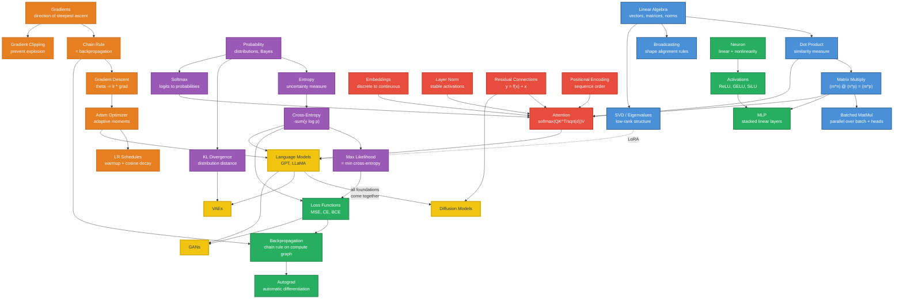

# Module 01: ML Foundations -- Study Guide

Quick reference for the night before an exam. Key formulas, core intuitions,
common pitfalls, and self-test questions.

---

## Quick Reference Card

### Linear Algebra

| Item | Formula |
|---|---|
| Matrix multiply dimensions | $(m \times n) \cdot (n \times p) = (m \times p)$ |
| Dot product | $\mathbf{a} \cdot \mathbf{b} = \sum a_i b_i = \|\mathbf{a}\|\|\mathbf{b}\|\cos\theta$ |
| Cosine similarity | $\frac{\mathbf{a} \cdot \mathbf{b}}{\|\mathbf{a}\|_2 \|\mathbf{b}\|_2}$ |
| L2 norm | $\|\mathbf{x}\|_2 = \sqrt{\sum x_i^2}$ |
| Transpose of product | $(AB)^T = B^T A^T$ |
| Broadcasting rule | Align from right; dims match if equal or one is 1 |

### Probability and Information Theory

| Item | Formula |
|---|---|
| Softmax | $\text{softmax}(z_i) = \frac{e^{z_i}}{\sum_j e^{z_j}}$ |
| Cross-entropy loss | $\mathcal{L} = -\sum_c y_c \log p_c$ (one-hot: $-\log p_{c^*}$) |
| KL divergence | $D_{KL}(P \| Q) = \sum p_i \log \frac{p_i}{q_i}$ |
| Entropy | $H(P) = -\sum p_i \log p_i$ |
| Bayes' theorem | $P(A|B) = \frac{P(B|A)P(A)}{P(B)}$ |
| Perplexity | $\text{PPL} = \exp(H(P, Q))$ |

### Calculus and Optimization

| Item | Formula |
|---|---|
| Chain rule | $\frac{df}{dx} = \frac{df}{dg} \cdot \frac{dg}{dx}$ |
| Gradient descent | $\theta_{t+1} = \theta_t - \eta \nabla_\theta \mathcal{L}$ |
| Adam (simplified) | $\theta_{t+1} = \theta_t - \eta \frac{\hat{m}_t}{\sqrt{\hat{v}_t} + \epsilon}$ where $\hat{m}_t = \frac{\beta_1 m_{t-1} + (1-\beta_1)g_t}{1-\beta_1^t}$, $\hat{v}_t = \frac{\beta_2 v_{t-1} + (1-\beta_2)g_t^2}{1-\beta_2^t}$ |
| Adam defaults | $\beta_1 = 0.9$, $\beta_2 = 0.999$, $\epsilon = 10^{-8}$ |

### Building Blocks

| Item | Formula |
|---|---|
| Layer norm | $\text{LN}(\mathbf{x}) = \gamma \odot \frac{\mathbf{x} - \mu}{\sqrt{\sigma^2 + \epsilon}} + \beta$ (stats over feature dim) |
| RMSNorm | $\gamma \odot \frac{\mathbf{x}}{\sqrt{\frac{1}{d}\sum x_i^2 + \epsilon}}$ |
| Residual connection | $\mathbf{y} = f(\mathbf{x}) + \mathbf{x}$ |
| Attention | $\text{softmax}\left(\frac{QK^T}{\sqrt{d_k}}\right)V$ |
| Embedding | Lookup: row $i$ of $W_e \in \mathbb{R}^{V \times d}$ |
| Temperature sampling | $\text{softmax}(z_i / \tau)$; $\tau \to 0$ = argmax, $\tau \to \infty$ = uniform |

---

## Key Intuitions

**Why cross-entropy, not MSE, for classification.**
Cross-entropy loss $-\log(p)$ approaches infinity as $p \to 0$, punishing
confident wrong answers catastrophically. MSE $(1-p)^2$ maxes out at 1 with
weak gradients when the model is confidently wrong. Cross-entropy also
corresponds to MLE over a categorical distribution. Its gradient w.r.t. logits
is simply $p - y$ -- no saturation through softmax.

**Why residual connections enable deep networks.**
The gradient through a residual block is $\frac{\partial f}{\partial \mathbf{x}} + I$.
The additive identity gives gradients a direct path through the skip connection.
Without it, gradients pass through every layer's Jacobian -- if eigenvalues are
below 1, the gradient shrinks exponentially. Residual connections break this
multiplicative chain, enabling 100+ layer transformers to train stably.

**Why layer norm over batch norm for transformers.**
Batch norm computes statistics across the batch dimension -- it depends on batch
size and breaks with variable-length sequences. Layer norm computes statistics
across the feature dimension within a single sample, independent of batch size
and identical at train/test time. No running-mean bookkeeping required.

**Why embeddings work (the geometry of meaning).**
Embeddings map discrete tokens into continuous space where arithmetic encodes
semantics ("King - Man + Woman = Queen"). The training objective (predicting
context) forces co-occurring tokens toward nearby regions. The space has
directional structure -- consistent offsets encode consistent relationships
(gender, tense, plurality), making cosine similarity a meaningful measure.

**Why Adam is the default optimizer.**
SGD uses one global learning rate -- parameters with rare gradients update too
slowly, frequent ones may overshoot. Adam tracks per-parameter first moments
(momentum) and second moments (adaptive step size), handling sparse/noisy
gradients and different parameter scales without manual tuning. AdamW
(decoupled weight decay) is the standard transformer variant.

---

## Common Pitfalls

**Forgetting to zero gradients.**
PyTorch accumulates gradients by default. Without `optimizer.zero_grad()`
before each backward pass, gradients from previous steps add to the current
ones, producing incorrect updates. Symptom: loss that oscillates wildly or
diverges from the start. Fix: always zero gradients before `loss.backward()`.

**Numerical instability in softmax.**
Computing $e^{z_i}$ for large $z_i$ overflows to `inf`. The fix: subtract
$\max(\mathbf{z})$ before exponentiating. Since softmax is shift-invariant
($\text{softmax}(\mathbf{z}) = \text{softmax}(\mathbf{z} - c)$), this
changes nothing mathematically but keeps all exponents in a safe range.
PyTorch's `F.cross_entropy` accepts raw logits and handles this internally --
never manually apply softmax then pass to `NLLLoss`.

**Wrong dimensions in matrix operations.**
The inner dimensions must match: $(m \times \mathbf{p}) \cdot (\mathbf{p} \times n)$.
A common mistake is forgetting to transpose a weight matrix. PyTorch's
`nn.Linear` stores weights as $(d_{out} \times d_{in})$ and transposes
internally, so the forward pass is $Y = XW^T + b$. Broadcasting can silently
produce wrong results without raising errors -- always verify tensor shapes
with `.shape` when debugging.

**Learning rate too high or too low.**
Too high: loss spikes, oscillates, or goes to NaN. Gradients overshoot
minima. Too low: loss decreases painfully slowly, may plateau early in a
poor region. Diagnosis: plot the loss curve. A healthy curve drops steeply
at first then gradually levels. Use warmup (start low, ramp up) to avoid
early instability, then cosine decay to fine-tune convergence.

**Vanishing and exploding gradients.**
Vanishing: loss plateaus, early layers barely update, weights stay near
initialization. Exploding: loss goes to NaN, gradient norms spike.
Fixes: residual connections (additive gradient path), layer normalization
(stable activation scale), gradient clipping (cap gradient norms), proper
weight initialization (Xavier/Kaiming to preserve variance across layers).

---

## Self-Test Questions

**1. Why does the transformer divide attention scores by $\sqrt{d_k}$?**

When $d_k$ is large, the dot products $QK^T$ tend to have large magnitude
(variance proportional to $d_k$). This pushes softmax into saturated regions
where gradients are near zero. Dividing by $\sqrt{d_k}$ normalizes the
variance to approximately 1, keeping softmax in a region with healthy gradients.

**2. What is the difference between $D_{KL}(P \| Q)$ and $D_{KL}(Q \| P)$?**

KL divergence is asymmetric. $D_{KL}(P \| Q)$ penalizes $Q$ heavily where $P$
has mass but $Q$ does not (mode-seeking). $D_{KL}(Q \| P)$ penalizes $Q$ where
it has mass but $P$ does not (mode-covering). In VAEs, we minimize
$D_{KL}(q(z|x) \| p(z))$, pushing the approximate posterior toward the prior.

**3. A tensor $A$ has shape (32, 10, 64) and tensor $B$ has shape (32, 64, 20). What is the shape of `torch.bmm(A, B)`, and what does each dimension represent?**

Shape is (32, 10, 20). 32 independent matrix multiplications are performed in
parallel. Each one multiplies a (10, 64) matrix by a (64, 20) matrix, producing
a (10, 20) result. In a transformer context, 32 could be batch size, 10 is
sequence length, and 64/20 are feature dimensions.

**4. Why is the embedding lookup mathematically equivalent to multiplying by a one-hot vector, and why don't we do it that way?**

If $\mathbf{e}_i$ is one-hot with 1 at position $i$, then $W_e^T \mathbf{e}_i$
selects row $i$ of $W_e$ -- identical to a lookup. But one-hot multiplication is
$O(V \times d)$ while a lookup is $O(d)$. With vocabularies of 50k+ tokens, the
matrix multiply wastes enormous computation on multiplying by zeros.

**5. You are training a model and the loss is NaN after 100 steps. What are the three most likely causes, and how would you diagnose each?**

(a) Learning rate too high -- gradient explosion. Check: print gradient norms
per step; they will spike before NaN. Fix: lower LR or add warmup.
(b) Numerical instability in softmax/log -- taking log of zero or exp of large
values. Check: print logit ranges; look for extreme values. Fix: use
`F.cross_entropy` on raw logits.
(c) Bad data -- NaN or inf in inputs. Check: `torch.isnan(x).any()` on inputs
and targets. Fix: clean the data pipeline.

**6. In the Adam optimizer, what do $\hat{m}_t$ and $\hat{v}_t$ represent, and why is bias correction needed?**

$\hat{m}_t$ is the bias-corrected estimate of the first moment (mean) of
gradients; $\hat{v}_t$ is the bias-corrected estimate of the second moment
(uncentered variance). Bias correction is needed because $m$ and $v$ are
initialized to zero, so early estimates are biased toward zero. Dividing by
$(1 - \beta^t)$ compensates, and the correction becomes negligible as $t$
grows.

**7. Explain why `loss = nn.MSELoss()(softmax_output, target)` is a bad idea for classification, using gradient behavior.**

After softmax, outputs are in (0, 1). MSE gradients are proportional to
$(p - y)$, but this must be backpropagated through the softmax Jacobian, which
has near-zero gradients when the softmax output is saturated (near 0 or 1).
Result: when the model is confidently wrong, the gradient vanishes exactly when
you need it most. Cross-entropy's gradient w.r.t. logits is simply $(p - y)$
with no saturation issue.

**8. What happens if you add a bias of shape (64,) to a tensor of shape (32, 128)?**

RuntimeError -- broadcasting aligns from the right, and 128 != 64. If the bias
were (128,), it would broadcast correctly across the batch dim. The real danger:
shapes like (32, 1) + (1, 128) = (32, 128) silently broadcasting when you
intended element-wise addition.

**9. Why does layer normalization use learnable $\gamma$ and $\beta$ parameters?**

Normalization forces zero mean and unit variance, removing potentially useful
scale/shift information. Learnable $\gamma$ (scale) and $\beta$ (shift) let the
network undo the normalization if optimal -- it can set $\gamma = \sigma$,
$\beta = \mu$ to recover original activations, making layer norm strictly more
expressive than hard normalization.

**10. Residual connections require $f(\mathbf{x})$ and $\mathbf{x}$ to have the same shape. How does a transformer handle this when the MLP expands the hidden dimension by 4x internally?**

The MLP expands to $4d$ internally (first linear layer: $d \to 4d$) but
projects back to $d$ with the second linear layer ($4d \to d$) before the
residual addition. The expansion happens inside the block, but the input and
output dimensions match. This is why transformer MLPs always have two linear
layers -- the second one projects back to the residual stream dimension.

---

## Concept Map

---

*Companion to [notes.md](notes.md) -- see that file for full explanations and derivations.*
