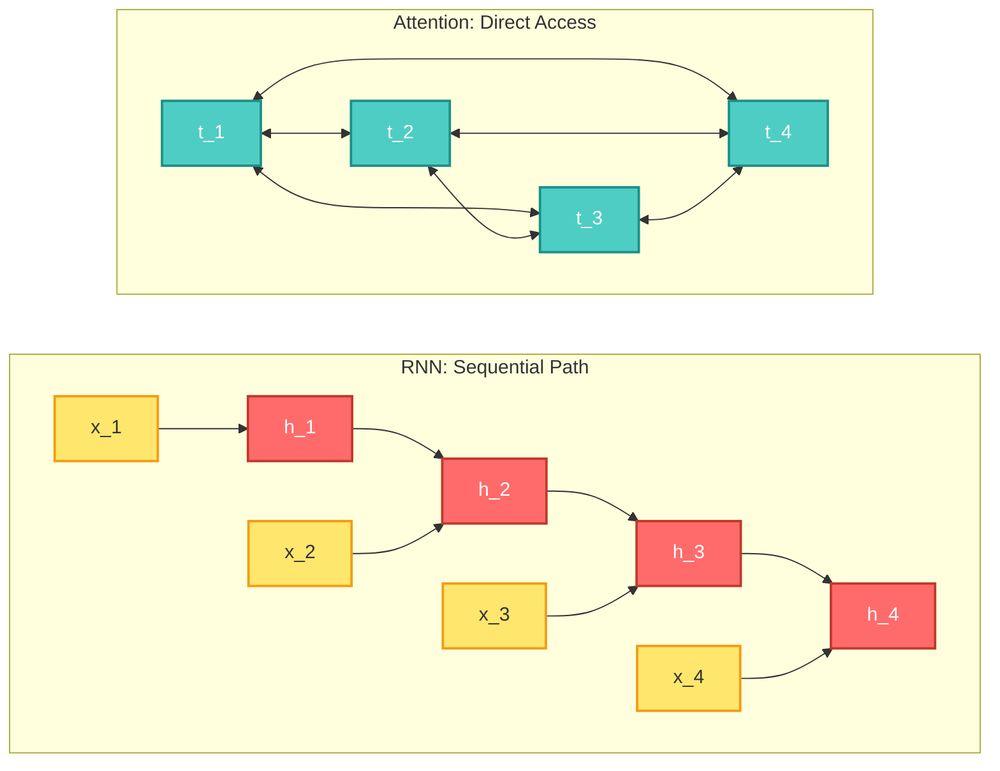
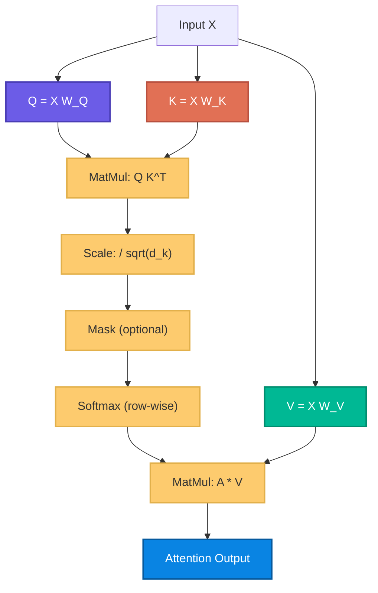
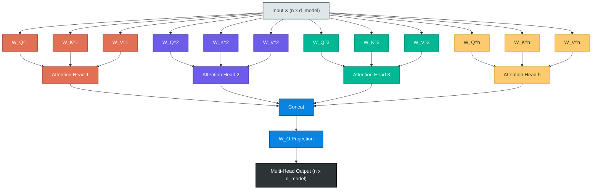
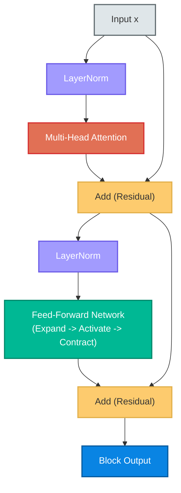
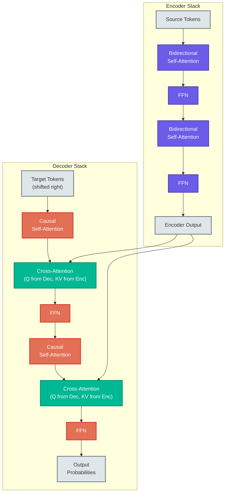

# The Transformer Architecture: A First-Principles Treatment

---

## Table of Contents

1. [Why Attention?](#1-why-attention)
2. [Scaled Dot-Product Attention](#2-scaled-dot-product-attention)
3. [Multi-Head Attention](#3-multi-head-attention)
4. [Positional Encodings](#4-positional-encodings)
5. [The Transformer Block](#5-the-transformer-block)
6. [Encoder vs Decoder](#6-encoder-vs-decoder)
7. [Training Transformers](#7-training-transformers)
8. [Scaling and Practical Considerations](#8-scaling-and-practical-considerations)

---

## 1. Why Attention?

### The Sequential Bottleneck

Before Transformers, recurrent neural networks (RNNs) and their variants --- LSTMs and GRUs
--- dominated sequence modeling. An RNN processes a sequence one token at a time, threading
a hidden state $h_t$ forward through time:

$$h_t = f(h_{t-1}, x_t)$$

This design creates three fundamental problems.

**Problem 1: Sequential computation prevents parallelism.** Each hidden state $h_t$ depends
on $h_{t-1}$, which depends on $h_{t-2}$, and so on. You cannot compute $h_{100}$ without
first computing $h_1$ through $h_{99}$. On modern GPUs with thousands of cores designed for
parallel workloads, this serialization is catastrophic for throughput.

**Problem 2: Vanishing and exploding gradients.** During backpropagation through time, the
gradient signal must traverse the entire chain of hidden states. For a sequence of length
$T$, the gradient involves a product of $T$ Jacobian matrices:

$$\frac{\partial h_T}{\partial h_1} = \prod_{t=2}^{T} \frac{\partial h_t}{\partial h_{t-1}}$$

When these Jacobian matrices have spectral norms consistently less than 1, the product
vanishes exponentially. When greater than 1, it explodes. LSTMs and GRUs mitigate this with
gating mechanisms, but they do not eliminate it --- long-range dependencies remain difficult
to learn in practice.

**Problem 3: Information bottleneck.** The entire history of the sequence must be compressed
into a single fixed-dimensional vector $h_t$. By the time the model reaches token 500, the
information about token 1 has been repeatedly overwritten and degraded. The hidden state is
a lossy compression of the entire past.

### The Key Insight

The core insight behind attention is deceptively simple: **let every token look at every
other token directly**, without routing information through a chain of intermediate states.

Instead of asking "what information survived the compression into $h_t$?", we ask: "for
each token, which other tokens are relevant, and how much should they contribute?"

This eliminates all three problems simultaneously:
- Computation becomes parallelizable (every token-pair interaction is independent).
- Gradient paths become short (every token is one step away from every other token).
- There is no information bottleneck (the model has direct access to all positions).

The cost is quadratic: examining every pair of tokens in a sequence of length $n$ requires
$O(n^2)$ operations. This is the fundamental tradeoff that defines the Transformer paradigm.

The diagram above contrasts the two paradigms. In the RNN, information from $t_1$ must pass
through every intermediate state to reach $t_4$. In the attention mechanism, $t_4$ has
direct access to $t_1$ --- and to every other token.

---

## 2. Scaled Dot-Product Attention

### The QKV Formulation

Attention is fundamentally a **soft dictionary lookup**. We have three ingredients:

- **Query** ($Q$): "What am I looking for?"
- **Key** ($K$): "What do I contain?"
- **Value** ($V$): "What information do I provide if matched?"

Given an input matrix $X \in \mathbb{R}^{n \times d_{\text{model}}}$ where $n$ is the
sequence length and $d_{\text{model}}$ is the embedding dimension, we compute:

$$Q = XW_Q, \quad K = XW_K, \quad V = XW_V$$

where $W_Q, W_K \in \mathbb{R}^{d_{\text{model}} \times d_k}$ and
$W_V \in \mathbb{R}^{d_{\text{model}} \times d_v}$ are learned projection matrices.

### Computing Attention Scores

The attention score between query $i$ and key $j$ measures how much token $i$ should
attend to token $j$. We compute this via dot product:

$$\text{score}(i, j) = q_i \cdot k_j = \sum_{m=1}^{d_k} q_{i,m} \cdot k_{j,m}$$

In matrix form, all pairwise scores are computed simultaneously:

$$S = QK^T \in \mathbb{R}^{n \times n}$$

The element $S_{ij}$ is the raw attention score of query $i$ attending to key $j$. This
$n \times n$ matrix is the **attention matrix** --- the beating heart of the Transformer.

### Why Scale by $\sqrt{d_k}$?

The dot product of two random vectors with $d_k$ components, where each component is drawn
from a distribution with mean 0 and variance 1, has variance $d_k$. As $d_k$ grows, the
dot products grow in magnitude, pushing the softmax into regions where its gradients are
extremely small (the saturated regime).

To counteract this, we scale by $\frac{1}{\sqrt{d_k}}$:

$$S_{\text{scaled}} = \frac{QK^T}{\sqrt{d_k}}$$

This normalization keeps the variance of the scores at approximately 1, regardless of $d_k$,
ensuring the softmax operates in a region with healthy gradients.

### The Softmax and Attention Weights

We convert raw scores to a probability distribution over keys using softmax applied
row-wise:

$$A_{ij} = \text{softmax}_j\left(\frac{QK^T}{\sqrt{d_k}}\right) = \frac{\exp(S_{ij} / \sqrt{d_k})}{\sum_{l=1}^{n} \exp(S_{il} / \sqrt{d_k})}$$

Each row of $A$ sums to 1. Entry $A_{ij}$ is the weight that token $i$ places on token $j$.

### The Output

The final output is a weighted combination of value vectors:

$$\text{Attention}(Q, K, V) = \text{softmax}\left(\frac{QK^T}{\sqrt{d_k}}\right) V$$

The output for token $i$ is $\sum_j A_{ij} v_j$ --- a weighted average of all value vectors,
where the weights are determined by how well each key matches the query.

### Causal Masking

For autoregressive (left-to-right) generation, token $i$ must not attend to tokens $j > i$
--- it cannot look into the future. We enforce this with an additive mask before softmax:

$$\text{Attention}(Q, K, V) = \text{softmax}\left(\frac{QK^T}{\sqrt{d_k}} + M\right) V$$

where $M$ is:

$$M_{ij} = \begin{cases} 0 & \text{if } j \leq i \\ -\infty & \text{if } j > i \end{cases}$$

Since $\exp(-\infty) = 0$, masked positions receive zero attention weight. The resulting
attention pattern is lower-triangular: each token attends only to itself and preceding
tokens.

This diagram traces the complete data flow of scaled dot-product attention: from input $X$
through the QKV projections, score computation, scaling, optional masking, softmax
normalization, and the final weighted combination with values.

---

## 3. Multi-Head Attention

### Why Multiple Heads?

A single attention head computes one set of attention weights --- one "view" of which tokens
are relevant to which. But relevance is multifaceted. In a sentence like "The cat sat on the
mat because it was tired", the word "it" needs to attend to "cat" for coreference
resolution, but also to "sat" for understanding the action, and to "tired" for state
information.

A single head must collapse all these relationships into a single attention distribution.
Multi-head attention instead runs $h$ independent attention operations in parallel, each
free to learn a different type of relationship.

### The Mechanism

Given the model dimension $d_{\text{model}}$ and $h$ heads, we set
$d_k = d_v = d_{\text{model}} / h$. Each head $i$ has its own projection matrices:

$$\text{head}_i = \text{Attention}(XW_Q^{(i)}, XW_K^{(i)}, XW_V^{(i)})$$

where $W_Q^{(i)}, W_K^{(i)} \in \mathbb{R}^{d_{\text{model}} \times d_k}$ and
$W_V^{(i)} \in \mathbb{R}^{d_{\text{model}} \times d_v}$.

The outputs of all heads are concatenated and projected:

$$\text{MultiHead}(X) = \text{Concat}(\text{head}_1, \ldots, \text{head}_h) W_O$$

where $W_O \in \mathbb{R}^{d_{\text{model}} \times d_{\text{model}}}$ is the output
projection matrix.

### Parameter Accounting

Each head operates in a $d_k$-dimensional subspace. The total computation across all heads
is:

- $h$ sets of $W_Q^{(i)}, W_K^{(i)}, W_V^{(i)}$: $h \times 3 \times d_{\text{model}} \times d_k = 3 \times d_{\text{model}}^2$ parameters
- One $W_O$: $d_{\text{model}}^2$ parameters
- **Total: $4 d_{\text{model}}^2$ parameters**

This is the same cost as if we had used a single head with $d_k = d_{\text{model}}$, but
with far more representational flexibility.

### What Heads Learn

Empirical studies of trained Transformers reveal that different heads specialize:
- Some heads learn **positional patterns** (attend to the previous token, or to a token at a fixed relative offset).
- Some learn **syntactic relationships** (subject-verb agreement across long distances).
- Some learn **semantic similarity** (tokens with related meanings attend to each other).
- Some are near-degenerate and could be pruned with minimal performance loss.

This specialization emerges naturally from training --- it is not engineered.

Each head independently projects the input into its own query, key, and value subspaces,
computes attention, and produces an output. These outputs are concatenated and linearly
projected back to the model dimension through $W_O$.

---

## 4. Positional Encodings

### The Permutation Invariance Problem

Attention is a set operation. The function $\text{softmax}(QK^T / \sqrt{d_k}) V$ is
**equivariant to permutation**: if you shuffle the input tokens, the output tokens are
shuffled in exactly the same way. The attention mechanism has no notion of order.

But order matters enormously in language. "The dog bit the man" and "The man bit the dog"
contain the same tokens but have very different meanings. Without positional information, a
Transformer cannot distinguish between these two sentences.

### Sinusoidal Positional Encodings

The original "Attention Is All You Need" paper introduces deterministic sinusoidal encodings.
For position $\text{pos}$ and dimension $i$:

$$PE_{(\text{pos}, 2i)} = \sin\left(\frac{\text{pos}}{10000^{2i / d_{\text{model}}}}\right)$$

$$PE_{(\text{pos}, 2i+1)} = \cos\left(\frac{\text{pos}}{10000^{2i / d_{\text{model}}}}\right)$$

These are added directly to the token embeddings:

$$z_{\text{pos}} = \text{Embed}(x_{\text{pos}}) + PE_{\text{pos}}$$

The design has several elegant properties:

1. **Unique encoding per position.** Each position gets a distinct vector.
2. **Bounded magnitude.** All values lie in $[-1, 1]$, preventing the positional signal from overwhelming the semantic embedding.
3. **Relative position via linear transformation.** For any fixed offset $k$, there exists a linear transformation $T_k$ such that $PE_{\text{pos}+k} = T_k \cdot PE_{\text{pos}}$. This allows the model to learn relative-position-dependent patterns.
4. **Graceful extrapolation.** The functions are defined for arbitrarily large positions, so the model can (in principle) handle sequences longer than those seen during training.

The different frequencies across dimensions create a "frequency spectrum" --- low dimensions
oscillate slowly (distinguishing distant positions) while high dimensions oscillate rapidly
(distinguishing nearby positions). This is analogous to binary positional encoding but in a
continuous, differentiable form.

### Learned Positional Embeddings

An alternative is to learn a positional embedding matrix
$P \in \mathbb{R}^{n_{\max} \times d_{\text{model}}}$ where $n_{\max}$ is the maximum
sequence length. Position $t$ simply looks up $P[t]$.

This approach is more flexible --- the model can learn arbitrary positional patterns --- but
cannot extrapolate beyond $n_{\max}$ without additional techniques.

BERT and GPT-2 use learned positional embeddings. In practice, they perform comparably to
sinusoidal encodings for sequences within the trained length.

### Rotary Position Embeddings (RoPE)

Modern large language models (LLaMA, PaLM, etc.) predominantly use Rotary Position
Embeddings (RoPE), proposed by Su et al. (2021). Rather than adding a positional vector to
the embedding, RoPE encodes position by **rotating** the query and key vectors in 2D
subspaces:

$$\tilde{q}_m = R_{\Theta, m} \cdot q_m, \quad \tilde{k}_n = R_{\Theta, n} \cdot k_n$$

where $R_{\Theta, t}$ is a block-diagonal rotation matrix that rotates each pair of
dimensions $(2i, 2i+1)$ by angle $t \cdot \theta_i$.

The critical property is that the dot product $\tilde{q}_m^T \tilde{k}_n$ depends only on
the **relative** position $m - n$, not the absolute positions. This inductive bias is
well-suited to language, where relative distance between tokens typically matters more than
absolute position.

RoPE also exhibits better length extrapolation properties than learned embeddings, and can
be extended via techniques like NTK-aware scaling and YaRN to handle sequences far longer
than those seen during training.

### Comparison of Approaches

| Property | Sinusoidal | Learned | RoPE |
|---|---|---|---|
| Parameters | 0 | $n_{\max} \times d$ | 0 |
| Relative position | Via linear transform | Implicit | Native |
| Extrapolation | Theoretical | Poor | Good (with scaling) |
| Used in | Original Transformer | BERT, GPT-2 | LLaMA, PaLM, Mistral |

---

## 5. The Transformer Block

### Composition of Components

A single Transformer block (also called a Transformer layer) combines multi-head attention
with a position-wise feed-forward network (FFN), connected by residual connections and layer
normalization. This block is the fundamental repeating unit --- a Transformer model is a
stack of $N$ identical blocks.

### Residual Connections

Every sub-layer (attention, FFN) is wrapped in a residual connection:

$$\text{output} = \text{SubLayer}(x) + x$$

Residual connections serve two purposes:
1. **Gradient flow.** The identity branch provides a direct gradient path from the output back to earlier layers, mitigating vanishing gradients in deep networks.
2. **Incremental refinement.** Each layer computes a *delta* to the representation rather than a complete transformation. The model can learn to make small adjustments, and identity-initialized layers have no effect, making it easier to train deeper networks.

### Layer Normalization

Layer normalization normalizes activations across the feature dimension:

$$\text{LayerNorm}(x) = \gamma \odot \frac{x - \mu}{\sqrt{\sigma^2 + \epsilon}} + \beta$$

where $\mu$ and $\sigma^2$ are the mean and variance computed across the $d_{\text{model}}$
dimensions for each token independently, and $\gamma, \beta \in \mathbb{R}^{d_{\text{model}}}$
are learned scale and shift parameters.

Unlike batch normalization, layer normalization operates per-token and is independent of
batch size, making it well-suited to variable-length sequences.

**Post-Norm (original paper):**

$$x' = \text{LayerNorm}(x + \text{Attention}(x))$$
$$x'' = \text{LayerNorm}(x' + \text{FFN}(x'))$$

**Pre-Norm (modern standard):**

$$x' = x + \text{Attention}(\text{LayerNorm}(x))$$
$$x'' = x' + \text{FFN}(\text{LayerNorm}(x'))$$

Pre-norm has become the dominant choice in modern architectures (GPT-2 onward) because it
produces more stable training dynamics. The residual stream maintains roughly unit-scale
activations throughout the network, and the gradient norms are more uniform across layers.
The cost is that pre-norm models may have slightly lower representational capacity at fixed
depth, but this is more than compensated by the ability to train deeper models stably.

Some recent architectures use **RMSNorm** (Root Mean Square Normalization) instead, which
drops the mean-centering step:

$$\text{RMSNorm}(x) = \gamma \odot \frac{x}{\sqrt{\frac{1}{d}\sum_{i=1}^{d} x_i^2 + \epsilon}}$$

RMSNorm is simpler and marginally faster while performing comparably. LLaMA uses RMSNorm.

### Position-Wise Feed-Forward Network

The FFN applies an identical transformation to each token independently:

$$\text{FFN}(x) = W_2 \cdot \sigma(W_1 x + b_1) + b_2$$

where $W_1 \in \mathbb{R}^{d_{\text{model}} \times d_{\text{ff}}}$ and
$W_2 \in \mathbb{R}^{d_{\text{ff}} \times d_{\text{model}}}$.

The standard choice is $d_{\text{ff}} = 4 d_{\text{model}}$. This expand-then-contract
pattern is sometimes called a "bottleneck" in reverse --- it projects to a higher dimension,
applies a nonlinearity, then projects back down.

The original paper uses ReLU as the activation $\sigma$. Modern models frequently use:

- **GELU** (Gaussian Error Linear Unit): $\text{GELU}(x) = x \cdot \Phi(x)$ where $\Phi$ is the standard normal CDF. Used in GPT-2, BERT.
- **SwiGLU**: A gated variant that splits the up-projection into two paths and multiplies them element-wise: $\text{SwiGLU}(x) = (\text{Swish}(xW_1)) \odot (xW_3)$. Used in LLaMA, PaLM. This requires three weight matrices instead of two but improves performance.

**Why does the FFN matter?** Attention alone is a linear operation over values (the softmax
produces weights, but the combination $AV$ is linear in $V$). The FFN introduces the
crucial nonlinearity and provides per-token processing capacity. Mechanistic interpretability
research suggests that FFN layers act as "memory banks" --- the first layer activates
features (key-value memories stored in the weights), and the second layer reads them out.

### The Complete Block

Putting it all together, a single pre-norm Transformer block computes:

$$h = x + \text{MultiHeadAttention}(\text{LayerNorm}(x))$$
$$\text{output} = h + \text{FFN}(\text{LayerNorm}(h))$$

The residual connections (yellow "Add" nodes) ensure that information can bypass both the
attention and FFN sub-layers. The layer norms (purple) stabilize the input to each sub-layer.
The entire block transforms a tensor of shape $(n, d_{\text{model}})$ to the same shape ---
blocks are perfectly stackable.

---

## 6. Encoder vs Decoder

The original Transformer paper describes an **encoder-decoder** architecture for sequence-to-
sequence tasks (machine translation). Since then, three architectural variants have emerged,
each suited to different tasks.

### The Encoder

The encoder processes the **full input** bidirectionally. Each token can attend to every
other token in the input sequence --- there is no causal mask. This produces a rich
contextualized representation of the input.

The attention pattern is fully dense: the $n \times n$ attention matrix has no masked entries.
Token 5 can attend to token 50 and vice versa.

**Where it is used:** BERT, RoBERTa, and other models designed for understanding tasks
(classification, named entity recognition, extractive question answering). When the full
input is available at once, bidirectional context is strictly more informative than
unidirectional.

### The Decoder

The decoder generates output **autoregressively**, one token at a time. It uses a **causal
mask** to prevent each token from attending to future positions. Token $i$ can only attend
to tokens $1, \ldots, i$.

This constraint is not merely architectural --- it is a consequence of the generation
process. At inference time, token $i+1$ does not exist when token $i$ is being generated.
The causal mask during training simulates this autoregressive structure so that training and
inference conditions match.

**Where it is used:** GPT-series, LLaMA, Claude, and essentially all modern large language
models. The decoder-only architecture has become dominant for generative tasks because it
naturally models $P(x_{t+1} | x_1, \ldots, x_t)$.

### Cross-Attention in the Encoder-Decoder

In the full encoder-decoder architecture, the decoder contains an additional **cross-
attention** layer between its self-attention and FFN. In cross-attention:

- **Queries** come from the decoder (the partially generated output).
- **Keys and Values** come from the encoder (the processed input).

$$\text{CrossAttention}(Q_{\text{dec}}, K_{\text{enc}}, V_{\text{enc}}) = \text{softmax}\left(\frac{Q_{\text{dec}} K_{\text{enc}}^T}{\sqrt{d_k}}\right) V_{\text{enc}}$$

This allows each decoder token to attend to all positions in the encoded input, providing
the mechanism by which the decoder "reads" the source. There is no masking in cross-attention
--- the full encoder output is available to every decoder position.

**Where it is used:** T5, BART, the original Transformer, Whisper (speech-to-text). Encoder-
decoder models are natural for tasks with a clear input-output structure: translation,
summarization, speech recognition.

### Architectural Comparison

| | Encoder-Only | Decoder-Only | Encoder-Decoder |
|---|---|---|---|
| Self-Attention Mask | Bidirectional (none) | Causal (lower-triangular) | Enc: bidir, Dec: causal |
| Cross-Attention | No | No | Yes (Dec attends to Enc) |
| Primary Task | Understanding | Generation | Seq-to-seq |
| Examples | BERT, RoBERTa | GPT, LLaMA, Claude | T5, BART, Whisper |

The left stack is the encoder: fully bidirectional self-attention at every layer. The right
stack is the decoder: causal self-attention followed by cross-attention to the encoder
output, then an FFN. The cross-attention layers (green) are the bridge between encoder and
decoder.

### The Decoder-Only Unification

A notable trend is the consolidation around decoder-only architectures. A decoder-only model
can be made to perform encoder-decoder-style tasks by simply concatenating the input and
output sequences with a separator token. The causal mask means the "input" tokens attend to
each other (forming a prefix), and the "output" tokens attend to all preceding tokens
including the input prefix.

This simplification eliminates cross-attention entirely, reduces the number of distinct
architectural components, and has proven remarkably effective at scale. The loss of
bidirectional attention over the input is compensated by the model's raw capacity.

---

## 7. Training Transformers

### The Language Modeling Objective

The dominant pre-training objective for decoder-only models is **next-token prediction**
(also called causal language modeling). Given a sequence of tokens $(x_1, x_2, \ldots, x_T)$,
the model learns to predict:

$$P(x_t | x_1, \ldots, x_{t-1}) \quad \text{for all } t \in \{1, \ldots, T\}$$

The loss is the negative log-likelihood averaged over all positions:

$$\mathcal{L} = -\frac{1}{T} \sum_{t=1}^{T} \log P_{\theta}(x_t | x_1, \ldots, x_{t-1})$$

This is equivalent to minimizing the cross-entropy between the model's predicted distribution
and the one-hot target distribution at each position.

### Teacher Forcing

During training, the model receives the **ground truth** tokens at all positions, regardless
of what it would have predicted. This is called **teacher forcing**. Even if the model
predicts token 5 incorrectly, it receives the correct token 5 as input when predicting
token 6.

Teacher forcing is essential for efficient training because:
1. It allows parallel computation of all positions simultaneously (the causal mask handles the autoregressive constraint).
2. It prevents error accumulation during training, where an early mistake would corrupt all subsequent predictions.

The downside is **exposure bias**: during inference, the model feeds its own (potentially
incorrect) predictions back as input, a regime never experienced during training. In
practice, this matters less than originally feared for large language models, likely because
the models become accurate enough that the mismatch is small.

### Optimization: AdamW

Transformers are almost universally trained with the **AdamW** optimizer, which combines
adaptive learning rates with decoupled weight decay:

$$m_t = \beta_1 m_{t-1} + (1 - \beta_1) g_t$$
$$v_t = \beta_2 v_{t-1} + (1 - \beta_2) g_t^2$$
$$\hat{m}_t = m_t / (1 - \beta_1^t), \quad \hat{v}_t = v_t / (1 - \beta_2^t)$$
$$\theta_t = \theta_{t-1} - \eta \left(\frac{\hat{m}_t}{\sqrt{\hat{v}_t} + \epsilon} + \lambda \theta_{t-1}\right)$$

Typical hyperparameters: $\beta_1 = 0.9$, $\beta_2 = 0.95$, $\epsilon = 10^{-8}$,
$\lambda = 0.1$ (weight decay).

### Learning Rate Schedule: Warmup + Cosine Decay

The learning rate schedule is critical for stable Transformer training. The standard
approach:

1. **Linear warmup** over the first $W$ steps (typically $W$ is 0.1--2% of total steps), ramping the learning rate from 0 to the peak $\eta_{\max}$.
2. **Cosine decay** from $\eta_{\max}$ down to $\eta_{\min}$ (typically $\eta_{\min} = 0.1 \times \eta_{\max}$) over the remaining steps.

$$\eta(t) = \begin{cases} \eta_{\max} \cdot \frac{t}{W} & \text{if } t < W \\ \eta_{\min} + \frac{1}{2}(\eta_{\max} - \eta_{\min})\left(1 + \cos\left(\pi \cdot \frac{t - W}{T - W}\right)\right) & \text{if } t \geq W \end{cases}$$

**Why warmup?** In the early stages of training, the model's parameters are randomly
initialized and the Adam moment estimates $m_t, v_t$ are unreliable (biased toward zero).
Large learning rates at this stage cause destructive updates. The warmup phase allows the
optimizer to accumulate accurate moment estimates before taking large steps.

**Why cosine decay?** The cosine schedule provides a smooth, gradual reduction in learning
rate that empirically outperforms step-decay schedules. The intuition is that as training
progresses, the model moves closer to a minimum and benefits from smaller, more precise
updates.

### Weight Initialization

Proper initialization prevents signal explosion or collapse in deep networks. Common schemes:

- **Xavier/Glorot initialization** for embeddings and attention projections:
  $W \sim \mathcal{N}(0, 1/d_{\text{model}})$
- **Scaled initialization for residual branches:** The output projection of each attention
  layer and FFN is initialized with $W \sim \mathcal{N}(0, 1/\sqrt{2N})$ where $N$ is the
  number of layers. This accounts for the $2N$ residual additions (attention + FFN per layer)
  and keeps the output variance approximately constant as depth increases.

GPT-2 uses this $1/\sqrt{2N}$ scaling. Without it, the residual stream's variance grows
linearly with depth, causing instability.

### Mixed Precision Training

Modern Transformer training uses **mixed precision** (FP16 or BF16) to reduce memory usage
and increase throughput:

- Forward and backward passes use half precision (16-bit).
- The optimizer maintains a master copy of weights in FP32.
- Gradient scaling prevents underflow in FP16.

BF16 (Brain Float 16) is preferred over FP16 because it has the same exponent range as FP32
(8 bits), avoiding overflow issues, at the cost of reduced mantissa precision (7 bits vs
10). This tradeoff is acceptable because neural networks are robust to low-precision
activations but sensitive to overflow.

```mermaid
graph LR
    classDef dataColor fill:#74b9ff,stroke:#0984e3,color:#333,stroke-width:2px
    classDef modelColor fill:#a29bfe,stroke:#6c5ce7,color:#fff,stroke-width:2px
    classDef lossColor fill:#e17055,stroke:#d63031,color:#fff,stroke-width:2px
    classDef optColor fill:#00b894,stroke:#00896b,color:#fff,stroke-width:2px
    classDef schedColor fill:#fdcb6e,stroke:#e2b04b,color:#333,stroke-width:2px

    DATA["Training Corpus\n(tokenized)"]:::dataColor
    DATA --> BATCH["Sample Batch\n(batch_size x seq_len)"]:::dataColor
    BATCH --> FWD["Forward Pass\n(causal LM)"]:::modelColor
    FWD --> LOSS["Cross-Entropy Loss\n(per-token NLL)"]:::lossColor
    LOSS --> BWD["Backward Pass\n(compute gradients)"]:::modelColor
    BWD --> CLIP["Gradient Clipping\n(max_norm = 1.0)"]:::optColor
    CLIP --> ADAM["AdamW Update"]:::optColor
    ADAM --> LR["LR Schedule\n(warmup + cosine)"]:::schedColor
    LR --> FWD
```

This diagram shows the training loop: sample a batch of tokenized text, run the forward pass
with causal masking, compute per-token cross-entropy loss, backpropagate gradients, clip
their norm, apply the AdamW update with the current learning rate from the schedule, and
repeat.

### Gradient Clipping

Gradient norms are clipped to a maximum value (typically 1.0) to prevent rare batches with
unusually large gradients from destabilizing training:

$$g \leftarrow g \cdot \frac{\text{max\_norm}}{\max(\|g\|, \text{max\_norm})}$$

This is applied globally (across all parameters) before the optimizer step.

---

## 8. Scaling and Practical Considerations

### Parameter Count

Understanding where parameters live in a Transformer is essential for reasoning about model
size and compute requirements.

For a model with $N$ layers, vocabulary size $V$, model dimension $d$, FFN dimension
$d_{\text{ff}} = 4d$, and $h$ heads:

| Component | Parameters | Fraction (typical) |
|---|---|---|
| Token embedding | $V \times d$ | ~3-5% |
| Per-layer attention ($W_Q, W_K, W_V, W_O$) | $4d^2$ per layer | ~33% total |
| Per-layer FFN ($W_1, W_2$ + biases) | $8d^2$ per layer (or $12d^2$ with SwiGLU) | ~67% total |
| Layer norms | $2 \times 2d$ per layer | <1% |
| Output projection (often tied with embedding) | $V \times d$ (or 0 if tied) | 0-5% |

**Approximate total (non-embedding):** $N \times 12d^2$ (standard FFN) or $N \times 16d^2$
(SwiGLU).

For example, a 7B parameter model (like LLaMA-7B): $N=32$, $d=4096$, $h=32$,
$d_{\text{ff}}=11008$ (SwiGLU). The non-embedding parameters are roughly
$32 \times (4 \times 4096^2 + 3 \times 4096 \times 11008) \approx 6.7B$.

### Memory Requirements

Training a Transformer requires memory for:

1. **Model parameters:** $P$ parameters $\times$ 2 bytes (BF16) = $2P$ bytes.
2. **Optimizer state (AdamW):** First moment ($m$) + second moment ($v$) + master weights, all in FP32: $12P$ bytes.
3. **Gradients:** $2P$ bytes (BF16).
4. **Activations:** Depends on batch size, sequence length, and number of layers. Scales as $O(N \times B \times n \times d)$ where $B$ is batch size and $n$ is sequence length. This is often the dominant term and can be reduced with **activation checkpointing** (recompute activations during backward pass instead of storing them).

**Rule of thumb:** Training a model requires roughly $16P$--$20P$ bytes of GPU memory
(before activation memory). A 7B model needs approximately 112--140 GB just for
parameters + optimizer state, requiring multi-GPU training.

Inference is much cheaper: just $2P$ bytes for the parameters (BF16), plus KV cache memory.

### The KV Cache

During autoregressive generation, each new token requires attending to all previous tokens.
Naively, this means recomputing the full attention for the entire sequence at every step,
yielding $O(n^2)$ total computation for generating $n$ tokens.

The **KV cache** eliminates this redundancy. Observe that when generating token $t+1$:
- The keys and values for tokens $1, \ldots, t$ have not changed (they depend only on tokens at positions $\leq t$, and those tokens are fixed).
- Only the query for position $t+1$ is new.

So we cache the $K$ and $V$ tensors from all previous steps, and at each new step we:
1. Compute $q_{t+1}, k_{t+1}, v_{t+1}$ for the new token only.
2. Append $k_{t+1}, v_{t+1}$ to the cached $K, V$.
3. Compute attention: $q_{t+1}$ against all cached keys, weighted sum of all cached values.

This reduces per-step computation from $O(n \times d)$ to $O(d)$ for the QKV projection,
though the attention computation itself is still $O(n)$ per step ($n$ grows with the
sequence).

**KV cache memory:** For each layer, we store $K, V \in \mathbb{R}^{n \times d_k}$ per head.
Total KV cache memory:

$$\text{KV cache} = 2 \times N \times h \times n \times d_k \times \text{bytes\_per\_element}$$

For a 7B model ($N=32$, $h=32$, $d_k=128$) at sequence length $n=8192$ in BF16:
$2 \times 32 \times 32 \times 8192 \times 128 \times 2 \approx 4.3$ GB.

At long context lengths (128K+ tokens), KV cache memory becomes the primary bottleneck.
Techniques like **Grouped-Query Attention (GQA)** and **Multi-Query Attention (MQA)** reduce
this by sharing key-value heads across multiple query heads.

### Flash Attention

Standard attention computes the full $n \times n$ attention matrix, which requires
$O(n^2)$ memory. For $n = 128K$, this matrix alone would require $128K \times 128K \times 2$
bytes $\approx$ 32 GB in FP16 --- clearly impractical.

**Flash Attention** (Dao et al., 2022) is an IO-aware algorithm that computes exact
attention without materializing the full attention matrix. The key ideas:

1. **Tiling.** Divide $Q$, $K$, $V$ into blocks that fit in GPU SRAM (fast on-chip memory, ~20 MB on an A100). Process attention block-by-block.

2. **Online softmax.** Maintain running statistics (max and sum of exponentials) that allow
   computing the softmax incrementally as blocks are processed, without needing the full row
   of scores at once.

3. **Kernel fusion.** Combine the entire attention computation (QK multiply, scaling, masking,
   softmax, value multiplication) into a single GPU kernel, eliminating intermediate reads
   and writes to slow HBM (high-bandwidth memory).

The result: attention with $O(n)$ memory (instead of $O(n^2)$) and 2--4x wall-clock
speedup due to reduced memory bandwidth usage. Flash Attention does not change the
mathematical result --- it computes the same output as standard attention, just more
efficiently.

Flash Attention 2 and 3 further optimize the algorithm with better work partitioning across
GPU thread blocks and exploit asynchronous execution on newer hardware (H100).

### Scaling Laws

Kaplan et al. (2020) and Hoffmann et al. (2022, "Chinchilla") established empirical scaling
laws for Transformer language models. The loss $L$ follows a power law in model parameters
$N$, dataset size $D$, and compute budget $C$:

$$L(N) \approx \left(\frac{N_c}{N}\right)^{\alpha_N}, \quad L(D) \approx \left(\frac{D_c}{D}\right)^{\alpha_D}$$

The Chinchilla result showed that for a given compute budget, there is an optimal balance
between model size and training data. The compute-optimal ratio is approximately 20 tokens
per parameter --- a 7B model should be trained on ~140B tokens. Many models are now trained
"beyond Chinchilla-optimal" because inference cost (which scales with $N$ but not $D$)
dominates total deployment cost at scale, making it worthwhile to train smaller models on
more data.

### The Residual Stream View

A useful conceptual model for understanding Transformers is the **residual stream** framework.
The initial embedding creates a vector for each token. Each attention layer and FFN layer
reads from this stream and writes an additive update back to it:

$$x_{\text{final}} = x_0 + \sum_{l=1}^{N} \left(\text{Attn}_l(\cdots) + \text{FFN}_l(\cdots)\right)$$

The residual stream is a shared communication channel. Attention layers move information
between token positions (inter-token). FFN layers process information within each position
(intra-token). The final representation is the superposition of all these contributions.

This view makes clear why Transformers can be interpreted as performing iterative refinement:
each layer contributes a small, targeted update to the evolving representation.

---

## Summary

The Transformer architecture, at its core, is built from a remarkably small set of
principles:

1. **Direct token-to-token communication** via attention, replacing sequential processing.
2. **Scaling** the dot-product scores by $\sqrt{d_k}$ to maintain stable gradients through softmax.
3. **Multiple attention heads** to capture diverse relationships in parallel.
4. **Positional encoding** to inject order information into an order-agnostic mechanism.
5. **Residual connections** and **layer normalization** for stable gradient flow in deep stacks.
6. **Position-wise FFNs** to provide per-token nonlinear processing and memory.
7. **Masking patterns** (bidirectional, causal, cross-attention) to adapt the architecture to different tasks.

These components compose into a system that is highly parallelizable, scales predictably
with parameters and data, and has proven to be a universal substrate for sequence modeling
across language, vision, audio, and beyond.

---

## References

- Vaswani, A., et al. "Attention Is All You Need." NeurIPS 2017.
- Kaplan, J., et al. "Scaling Laws for Neural Language Models." arXiv 2020.
- Hoffmann, J., et al. "Training Compute-Optimal Large Language Models (Chinchilla)." arXiv 2022.
- Dao, T., et al. "FlashAttention: Fast and Memory-Efficient Exact Attention with IO-Awareness." NeurIPS 2022.
- Su, J., et al. "RoFormer: Enhanced Transformer with Rotary Position Embedding." arXiv 2021.
- Elhage, N., et al. "A Mathematical Framework for Transformer Circuits." Anthropic 2021.
- Zhang, B. and Sennrich, R. "Root Mean Square Layer Normalization." NeurIPS 2019.
- Shazeer, N. "GLU Variants Improve Transformer." arXiv 2020.
