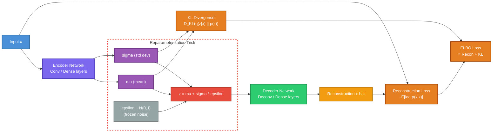
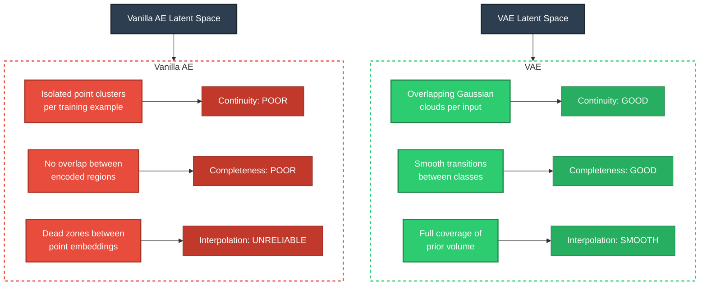
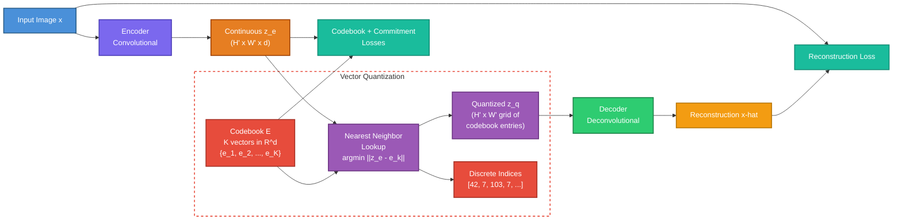

# Autoencoders: From Compression to Generation

A first-principles treatment of autoencoders, variational autoencoders, and their
descendants -- the architectures that taught neural networks to learn latent
representations and, eventually, to generate new data.

---

## Table of Contents

1. [The Autoencoder Idea](#1-the-autoencoder-idea)
2. [Vanilla Autoencoders](#2-vanilla-autoencoders)
3. [Variational Autoencoders (VAEs)](#3-variational-autoencoders-vaes)
4. [The Reparameterization Trick](#4-the-reparameterization-trick)
5. [Latent Space Properties](#5-latent-space-properties)
6. [VQ-VAE](#6-vq-vae)
7. [VQ-VAE-2 and Hierarchical VAEs](#7-vq-vae-2-and-hierarchical-vaes)
8. [Applications in Generative AI](#8-applications-in-generative-ai)

---

## 1. The Autoencoder Idea

### The Core Intuition

An autoencoder is a neural network trained to copy its input to its output --
but forced to do so through a narrow bottleneck. The bottleneck prevents the
network from learning the identity function and instead forces it to discover
compact, meaningful structure in the data.

The architecture has two halves:

- **Encoder** $f_\theta$: maps input $\mathbf{x} \in \mathbb{R}^D$ to a latent
  code $\mathbf{z} \in \mathbb{R}^d$ where $d \ll D$.
- **Decoder** $g_\phi$: maps the latent code back to the input space,
  producing reconstruction $\hat{\mathbf{x}} = g_\phi(\mathbf{z})$.

The full pipeline is:

$$\mathbf{x} \xrightarrow{f_\theta} \mathbf{z} \xrightarrow{g_\phi} \hat{\mathbf{x}}$$

Training minimizes **reconstruction loss**:

$$\mathcal{L}(\theta, \phi) = \frac{1}{N} \sum_{i=1}^{N} \| \mathbf{x}_i - g_\phi(f_\theta(\mathbf{x}_i)) \|^2$$

### Why Compression Forces Useful Representations

If $d < D$, the network cannot memorize each input verbatim. It must learn to
extract the factors of variation that matter most for reconstructing the data.
This is the same principle behind dimensionality reduction: you keep only the
information that explains the most variance.

A 784-dimensional MNIST image, for example, can be compressed to 2-10 latent
dimensions because the underlying manifold of handwritten digits is far
lower-dimensional than the pixel space.

### Architecture Diagram

```mermaid
flowchart LR
    classDef inputNode fill:#4A90D9,stroke:#2C5F8A,color:#fff,stroke-width:2px
    classDef encoderNode fill:#7B68EE,stroke:#4B3CB8,color:#fff,stroke-width:2px
    classDef latentNode fill:#E74C3C,stroke:#A93226,color:#fff,stroke-width:2px
    classDef decoderNode fill:#2ECC71,stroke:#1E8449,color:#fff,stroke-width:2px
    classDef outputNode fill:#F39C12,stroke:#B7770A,color:#fff,stroke-width:2px

    X["Input x<br/>D dimensions"]:::inputNode
    E1["Encoder Layer 1<br/>Dense + ReLU"]:::encoderNode
    E2["Encoder Layer 2<br/>Dense + ReLU"]:::encoderNode
    Z["Latent Code z<br/>d dimensions<br/>(bottleneck)"]:::latentNode
    D1["Decoder Layer 1<br/>Dense + ReLU"]:::decoderNode
    D2["Decoder Layer 2<br/>Dense + Sigmoid"]:::decoderNode
    XH["Reconstruction x-hat<br/>D dimensions"]:::outputNode

    X --> E1 --> E2 --> Z --> D1 --> D2 --> XH

    subgraph ENCODER["Encoder f_theta"]
        E1
        E2
    end

    subgraph BOTTLENECK["Bottleneck"]
        Z
    end

    subgraph DECODER["Decoder g_phi"]
        D1
        D2
    end

    style ENCODER fill:none,stroke:#7B68EE,stroke-width:2px,stroke-dasharray:5
    style BOTTLENECK fill:none,stroke:#E74C3C,stroke-width:2px,stroke-dasharray:5
    style DECODER fill:none,stroke:#2ECC71,stroke-width:2px,stroke-dasharray:5
```

---

## 2. Vanilla Autoencoders

### Architecture Details

A vanilla (deterministic) autoencoder is simply:

$$\mathbf{z} = f_\theta(\mathbf{x}), \quad \hat{\mathbf{x}} = g_\phi(\mathbf{z})$$

Typical choices:
- **Encoder**: stack of fully-connected or convolutional layers with ReLU
  activations, ending in a linear projection to $\mathbb{R}^d$.
- **Decoder**: mirror of the encoder, using transposed convolutions or
  upsampling layers, ending with sigmoid (for pixel values in $[0,1]$) or
  linear output.

### Loss Functions

**Mean Squared Error (MSE)** is the standard choice for continuous data:

$$\mathcal{L}_{\text{MSE}} = \frac{1}{N} \sum_{i=1}^{N} \| \mathbf{x}_i - \hat{\mathbf{x}}_i \|^2$$

For binary or normalized pixel data, **Binary Cross-Entropy (BCE)** is often
better:

$$\mathcal{L}_{\text{BCE}} = -\frac{1}{N} \sum_{i=1}^{N} \left[ \mathbf{x}_i \log \hat{\mathbf{x}}_i + (1 - \mathbf{x}_i) \log(1 - \hat{\mathbf{x}}_i) \right]$$

The choice of loss implicitly defines the decoder's output distribution:
- MSE assumes a Gaussian observation model: $p(\mathbf{x} | \mathbf{z}) = \mathcal{N}(\hat{\mathbf{x}}, \sigma^2 I)$.
- BCE assumes a Bernoulli observation model: $p(\mathbf{x} | \mathbf{z}) = \text{Bern}(\hat{\mathbf{x}})$.

### Undercomplete vs. Overcomplete

| Property | Undercomplete ($d < D$) | Overcomplete ($d \geq D$) |
|---|---|---|
| Bottleneck | Yes, dimensionality forces compression | No, network can learn identity |
| Regularization needed? | Not strictly, though it helps | Yes, or the model memorizes |
| Use case | Standard dimensionality reduction | Sparse autoencoders, denoising AEs |

An **undercomplete** autoencoder with linear activations and MSE loss learns
exactly the same subspace as PCA. The latent dimensions span the principal
component subspace (though not necessarily aligned with individual principal
components).

An **overcomplete** autoencoder has more latent dimensions than input dimensions.
Without additional regularization it can trivially learn the identity mapping.
Overcomplete autoencoders become useful when combined with:
- **Sparsity constraints** (sparse autoencoders): penalize $\|\mathbf{z}\|_1$
  so that only a few latent units activate per input.
- **Noise injection** (denoising autoencoders): train to reconstruct clean
  inputs from corrupted versions, forcing the network to learn robust features.

### Relationship to PCA

Consider a single-layer linear autoencoder with encoder weight $W_e \in \mathbb{R}^{d \times D}$
and decoder weight $W_d \in \mathbb{R}^{D \times d}$. Minimizing MSE:

$$\min_{W_e, W_d} \mathbb{E} \left[ \| \mathbf{x} - W_d W_e \mathbf{x} \|^2 \right]$$

The optimal $W_d W_e$ is the projection onto the top-$d$ principal components of the
data covariance matrix. The autoencoder learns PCA without ever computing
eigenvalues. Add nonlinear activations and you get a nonlinear generalization
of PCA -- this is the fundamental appeal of autoencoders.

### Limitations of Vanilla Autoencoders for Generation

Vanilla autoencoders learn to map data points to codes and back. But the latent
space has no structure guarantees:
- Nearby points in latent space may decode to wildly different outputs.
- Regions between training-point codes may decode to garbage.
- There is no principled way to sample new $\mathbf{z}$ values.

This is why vanilla autoencoders are **representation learning** tools, not
**generative** models. The fix is the variational autoencoder.

---

## 3. Variational Autoencoders (VAEs)

### The Generative Twist

A VAE (Kingma & Welling, 2013) reframes the autoencoder as a latent variable
generative model. Instead of encoding each input to a single point, the encoder
outputs the **parameters of a distribution** over latent codes.

The generative story is:

1. Sample a latent code from the prior: $\mathbf{z} \sim p(\mathbf{z}) = \mathcal{N}(\mathbf{0}, \mathbf{I})$.
2. Decode to produce the observation: $\mathbf{x} \sim p_\phi(\mathbf{x} | \mathbf{z})$.

We want to maximize the marginal likelihood $p_\phi(\mathbf{x}) = \int p_\phi(\mathbf{x} | \mathbf{z}) p(\mathbf{z}) \, d\mathbf{z}$,
but this integral is intractable. We introduce an approximate posterior
$q_\theta(\mathbf{z} | \mathbf{x})$ (the encoder) and derive a tractable lower
bound.

### Deriving the ELBO

Starting from the log marginal likelihood:

$$\log p_\phi(\mathbf{x}) = \log \int p_\phi(\mathbf{x} | \mathbf{z}) p(\mathbf{z}) \, d\mathbf{z}$$

Multiplying and dividing by $q_\theta(\mathbf{z} | \mathbf{x})$ and applying
Jensen's inequality:

$$\log p_\phi(\mathbf{x}) \geq \mathbb{E}_{q_\theta(\mathbf{z} | \mathbf{x})} \left[ \log p_\phi(\mathbf{x} | \mathbf{z}) \right] - D_{\text{KL}}\left( q_\theta(\mathbf{z} | \mathbf{x}) \| p(\mathbf{z}) \right)$$

This is the **Evidence Lower Bound (ELBO)**:

$$\text{ELBO}(\theta, \phi; \mathbf{x}) = \underbrace{\mathbb{E}_{q_\theta(\mathbf{z} | \mathbf{x})} \left[ \log p_\phi(\mathbf{x} | \mathbf{z}) \right]}_{\text{Reconstruction term}} - \underbrace{D_{\text{KL}}\left( q_\theta(\mathbf{z} | \mathbf{x}) \| p(\mathbf{z}) \right)}_{\text{KL regularization term}}$$

The gap between the ELBO and the true log-likelihood is exactly
$D_{\text{KL}}(q_\theta(\mathbf{z}|\mathbf{x}) \| p_\phi(\mathbf{z}|\mathbf{x}))$,
which is non-negative -- hence ELBO is always a lower bound.

### The Two Terms Explained

**Reconstruction term**: this is the expected log-likelihood of the data under
the decoder, averaged over latent samples from the encoder. It pushes the model
to reconstruct inputs well -- the same pressure as in a vanilla autoencoder.

**KL divergence term**: this measures how far the encoder's posterior
$q_\theta(\mathbf{z} | \mathbf{x})$ deviates from the prior $p(\mathbf{z})$.
It acts as a regularizer, pulling every encoded distribution toward the standard
normal. This is what gives the latent space its structure.

When both the approximate posterior and prior are Gaussian, the KL has a
closed-form expression. For $q_\theta(\mathbf{z} | \mathbf{x}) = \mathcal{N}(\boldsymbol{\mu}, \text{diag}(\boldsymbol{\sigma}^2))$
and $p(\mathbf{z}) = \mathcal{N}(\mathbf{0}, \mathbf{I})$:

$$D_{\text{KL}} = -\frac{1}{2} \sum_{j=1}^{d} \left( 1 + \log \sigma_j^2 - \mu_j^2 - \sigma_j^2 \right)$$

### Why KL Regularizes the Latent Space

Without the KL term, each input could map to a tiny, isolated region of latent
space (high $\mu$, near-zero $\sigma$). The decoder would memorize these
isolated points, and the space between them would be meaningless. The KL term
prevents this by:

1. **Penalizing large $\mu$**: keeps all encoded distributions centered near the
   origin so they overlap.
2. **Penalizing small $\sigma$**: prevents point-mass posteriors, ensuring each
   input covers a region of latent space.
3. **Encouraging overlap**: because all posteriors are pulled toward $\mathcal{N}(0, I)$,
   similar inputs share latent-space territory, creating smooth transitions.

### VAE Architecture Diagram with Reparameterization

### KL Annealing and the Beta-VAE

In practice, the KL term can dominate early in training, collapsing the
posterior to the prior before the decoder learns anything useful. This is called
**posterior collapse**. Two common mitigations:

- **KL annealing**: multiply the KL term by a weight $\beta$ that starts at 0
  and linearly increases to 1 during training.
- **Beta-VAE** (Higgins et al., 2017): set $\beta > 1$ to encourage more
  disentangled representations at the cost of reconstruction quality. The loss
  becomes:

$$\mathcal{L}_{\beta\text{-VAE}} = \mathbb{E}_{q_\theta(\mathbf{z} | \mathbf{x})} \left[ \log p_\phi(\mathbf{x} | \mathbf{z}) \right] - \beta \cdot D_{\text{KL}}\left( q_\theta(\mathbf{z} | \mathbf{x}) \| p(\mathbf{z}) \right)$$

When $\beta < 1$, you get better reconstructions but a less regular latent
space. When $\beta > 1$, you get a smoother, more disentangled latent space but
blurrier reconstructions.

---

## 4. The Reparameterization Trick

### The Problem

The ELBO requires computing:

$$\mathbb{E}_{q_\theta(\mathbf{z} | \mathbf{x})} \left[ \log p_\phi(\mathbf{x} | \mathbf{z}) \right]$$

To estimate this with Monte Carlo, we sample $\mathbf{z} \sim q_\theta(\mathbf{z} | \mathbf{x})$.
But sampling is a **stochastic, non-differentiable** operation. The encoder
outputs $\boldsymbol{\mu}$ and $\boldsymbol{\sigma}$, and if we sample directly:

$$\mathbf{z} \sim \mathcal{N}(\boldsymbol{\mu}, \text{diag}(\boldsymbol{\sigma}^2))$$

then the gradient $\nabla_\theta \mathbb{E}_{q_\theta}[\cdot]$ cannot flow back
through the sampling step to update $\boldsymbol{\mu}$ and $\boldsymbol{\sigma}$.
The computation graph is broken at the random node.

### The Solution

Instead of sampling from a $\theta$-dependent distribution, we:

1. Sample noise from a fixed distribution: $\boldsymbol{\epsilon} \sim \mathcal{N}(\mathbf{0}, \mathbf{I})$.
2. Transform it deterministically: $\mathbf{z} = \boldsymbol{\mu} + \boldsymbol{\sigma} \odot \boldsymbol{\epsilon}$.

Now $\mathbf{z}$ is a deterministic, differentiable function of $\boldsymbol{\mu}$
and $\boldsymbol{\sigma}$ (given fixed $\boldsymbol{\epsilon}$). Gradients flow
through $\mathbf{z}$ to the encoder parameters $\theta$ without difficulty.

The key insight: we moved the randomness from a distribution whose parameters we
learn to an external noise source that does not depend on any parameters.

### Why This Works Mathematically

For any function $h(\mathbf{z})$ and $\mathbf{z} = \boldsymbol{\mu} + \boldsymbol{\sigma} \odot \boldsymbol{\epsilon}$:

$$\mathbb{E}_{q_\theta(\mathbf{z}|\mathbf{x})}[h(\mathbf{z})] = \mathbb{E}_{\boldsymbol{\epsilon} \sim \mathcal{N}(0,I)}[h(\boldsymbol{\mu} + \boldsymbol{\sigma} \odot \boldsymbol{\epsilon})]$$

The right-hand side is an expectation over a fixed distribution, so we can
interchange differentiation and expectation:

$$\nabla_\theta \mathbb{E}_{\boldsymbol{\epsilon}}[h(\boldsymbol{\mu}_\theta + \boldsymbol{\sigma}_\theta \odot \boldsymbol{\epsilon})] = \mathbb{E}_{\boldsymbol{\epsilon}}[\nabla_\theta h(\boldsymbol{\mu}_\theta + \boldsymbol{\sigma}_\theta \odot \boldsymbol{\epsilon})]$$

This is estimated with a single sample of $\boldsymbol{\epsilon}$ per data point
per training step (in practice, this low-variance estimator works well).

### Implementation Note

In code, the encoder typically outputs $\boldsymbol{\mu}$ and
$\log \boldsymbol{\sigma}^2$ (not $\boldsymbol{\sigma}$ directly). Working in
log-variance space ensures numerical stability:

$$\boldsymbol{\sigma} = \exp\left(\frac{1}{2} \log \boldsymbol{\sigma}^2\right)$$

$$\mathbf{z} = \boldsymbol{\mu} + \exp\left(\frac{1}{2} \log \boldsymbol{\sigma}^2\right) \odot \boldsymbol{\epsilon}$$

---

## 5. Latent Space Properties

The regularization imposed by the KL divergence gives VAE latent spaces several
desirable geometric properties. These properties are what make VAEs useful for
generation and manipulation.

### Continuity

**Property**: nearby points in latent space decode to similar outputs.

Because the KL term forces each input to cover a region (not a point) of latent
space, the decoder must learn to produce reasonable outputs for an entire
neighborhood around each encoded mean. This creates smooth transitions: small
movements in $\mathbf{z}$ produce small changes in $\hat{\mathbf{x}}$.

### Completeness

**Property**: every point sampled from the prior $p(\mathbf{z}) = \mathcal{N}(0, I)$
decodes to a plausible output.

The KL term ensures the aggregate posterior
$q(\mathbf{z}) = \frac{1}{N} \sum_i q_\theta(\mathbf{z} | \mathbf{x}_i)$
approximates the prior. This means there are no "dead zones" in the latent
space -- regions where the decoder has never seen a latent code and would
produce meaningless output.

### Interpolation

Because of continuity, we can interpolate between two data points by
interpolating their latent codes:

$$\mathbf{z}_{\text{interp}} = (1 - t) \cdot \mathbf{z}_1 + t \cdot \mathbf{z}_2, \quad t \in [0, 1]$$

For Gaussian latent spaces, **spherical linear interpolation** (slerp) is
geometrically more appropriate than linear interpolation, because the prior
concentrates on a spherical shell in high dimensions:

$$\mathbf{z}_{\text{slerp}} = \frac{\sin((1-t)\Omega)}{\sin \Omega} \mathbf{z}_1 + \frac{\sin(t\Omega)}{\sin \Omega} \mathbf{z}_2$$

where $\Omega = \arccos\left(\frac{\mathbf{z}_1 \cdot \mathbf{z}_2}{\|\mathbf{z}_1\| \|\mathbf{z}_2\|}\right)$.

### Disentanglement

A latent space is **disentangled** when individual latent dimensions correspond
to independent, interpretable factors of variation in the data. For faces: one
dimension might control pose, another lighting, another expression.

Standard VAEs do not guarantee disentanglement. Beta-VAE ($\beta > 1$) and its
successors (FactorVAE, DIP-VAE) add pressure for this property, but true
disentanglement remains an active research area. Locatello et al. (2019) showed
that unsupervised disentanglement is theoretically impossible without inductive
biases.

### Latent Space Comparison Diagram

---

## 6. VQ-VAE

### Motivation: Why Discrete Latent Codes?

Continuous latent spaces are elegant, but many real-world phenomena are
inherently categorical. Language is discrete (words, tokens). Object identity is
discrete (cat vs. dog). Music has discrete notes. Furthermore, autoregressive
models (GPT, etc.) operate over discrete tokens. If we want to combine the
representation-learning power of autoencoders with the sequence-modeling power
of transformers, we need **discrete latent codes**.

The Vector Quantized VAE (VQ-VAE, van den Oord et al., 2017) replaces the
continuous Gaussian latent space with a **discrete codebook** of learned
embedding vectors.

### Architecture

The VQ-VAE has three components:

1. **Encoder** $f_\theta$: maps input $\mathbf{x}$ to a continuous
   representation $\mathbf{z}_e(\mathbf{x}) \in \mathbb{R}^{H' \times W' \times d}$
   (for images, a spatial grid of $d$-dimensional vectors).

2. **Codebook** $\mathcal{E} = \{ \mathbf{e}_1, \mathbf{e}_2, \ldots, \mathbf{e}_K \}$:
   a set of $K$ learnable embedding vectors, each $\mathbf{e}_k \in \mathbb{R}^d$.

3. **Decoder** $g_\phi$: takes the quantized representation and reconstructs the
   input.

### Quantization

Each continuous encoder output vector is replaced by its nearest codebook entry:

$$\mathbf{z}_q(\mathbf{x}) = \mathbf{e}_k \quad \text{where} \quad k = \arg\min_j \| \mathbf{z}_e(\mathbf{x}) - \mathbf{e}_j \|_2$$

This is nearest-neighbor lookup in embedding space. The result is a grid of
discrete indices (one per spatial position), each indexing into the shared
codebook.

### The Straight-Through Estimator

The $\arg\min$ operation is non-differentiable -- gradients cannot flow through
discrete selection. VQ-VAE uses the **straight-through estimator**: during the
forward pass, the quantized vectors $\mathbf{z}_q$ are used; during the backward
pass, gradients are copied directly from the decoder input to the encoder
output, bypassing the quantization step.

In code, this is implemented as:

$$\mathbf{z}_q = \mathbf{z}_e + \text{sg}[\mathbf{z}_q - \mathbf{z}_e]$$

where $\text{sg}[\cdot]$ is the stop-gradient operator. The forward pass
computes $\mathbf{z}_q$ (because $\mathbf{z}_e + (\mathbf{z}_q - \mathbf{z}_e) = \mathbf{z}_q$),
but the backward pass sees only $\mathbf{z}_e$ (because the stop-gradient
zeros out the gradient of $\mathbf{z}_q - \mathbf{z}_e$).

### Loss Function

The VQ-VAE loss has three terms:

$$\mathcal{L} = \underbrace{\| \mathbf{x} - g_\phi(\mathbf{z}_q) \|^2}_{\text{reconstruction}} + \underbrace{\| \text{sg}[\mathbf{z}_e] - \mathbf{e} \|^2}_{\text{codebook loss}} + \underbrace{\beta \| \mathbf{z}_e - \text{sg}[\mathbf{e}] \|^2}_{\text{commitment loss}}$$

- **Reconstruction loss**: the standard autoencoder objective, applied to the
  quantized codes.
- **Codebook loss**: moves codebook entries toward the encoder outputs (the
  stop-gradient on $\mathbf{z}_e$ means this only updates the codebook).
- **Commitment loss**: moves encoder outputs toward the codebook entries
  (the stop-gradient on $\mathbf{e}$ means this only updates the encoder).
  $\beta$ is typically 0.25.

In practice, the codebook loss is often replaced by an exponential moving
average (EMA) update of the codebook vectors, which is more stable:

$$\mathbf{e}_k \leftarrow \gamma \mathbf{e}_k + (1 - \gamma) \bar{\mathbf{z}}_k$$

where $\bar{\mathbf{z}}_k$ is the mean of all encoder outputs assigned to
codebook entry $k$, and $\gamma \approx 0.99$.

### VQ-VAE Architecture Diagram

### Key Differences from VAE

| | VAE | VQ-VAE |
|---|---|---|
| Latent type | Continuous ($\mathbb{R}^d$) | Discrete (codebook indices) |
| Regularization | KL divergence to $\mathcal{N}(0, I)$ | Codebook + commitment loss |
| Sampling | Direct from prior | Train a separate prior (PixelCNN, Transformer) |
| Gradient through latent | Reparameterization trick | Straight-through estimator |
| Output quality | Tends to be blurry | Sharper (no KL smoothing) |

A crucial difference: VQ-VAE does not learn a prior over latent codes during
training. The prior is modeled separately -- typically by training an
autoregressive model (PixelCNN or Transformer) over the discrete code sequences
produced by the encoder. Generation then proceeds in two stages: (1) sample
code sequences from the learned prior, (2) decode them through the VQ-VAE
decoder.

### Codebook Collapse

A common failure mode: only a small fraction of codebook entries are used, while
the rest are never selected (their gradients are zero, so they never update).
Mitigations include:
- **EMA updates** with codebook reset: reinitialize dead codes to random encoder
  outputs.
- **Codebook splitting**: periodically split the most-used entries.
- **Entropy regularization**: add a loss that encourages uniform usage.

---

## 7. VQ-VAE-2 and Hierarchical VAEs

### VQ-VAE-2: Multi-Scale Discrete Codes

VQ-VAE-2 (Razavi et al., 2019) extends VQ-VAE with a **hierarchical** latent
structure. The key insight: different levels of abstraction in an image
(global structure vs. local texture) should be captured at different spatial
resolutions.

The architecture uses two (or more) levels of quantized latent codes:

1. **Top level**: low-resolution codes ($32 \times 32$) that capture global
   structure -- object shape, layout, overall color palette.
2. **Bottom level**: high-resolution codes ($64 \times 64$) that capture local
   details -- textures, edges, fine-grained patterns. The bottom encoder
   conditions on the top-level codes.

Generation proceeds top-down:
1. A PixelCNN prior generates top-level codes autoregressively.
2. A second PixelCNN generates bottom-level codes, conditioned on the top codes.
3. The VQ-VAE decoder maps both levels of codes back to pixels.

This hierarchical approach achieved near-photorealistic image generation at
$256 \times 256$ resolution, competitive with GANs of the era, while being
fundamentally likelihood-based.

### Hierarchical VAEs (Continuous)

The same principle applies to continuous VAEs. **Hierarchical VAEs** (Ladder
VAEs, NVAE, VDVAE) use multiple stochastic layers:

$$\mathbf{z} = (\mathbf{z}_1, \mathbf{z}_2, \ldots, \mathbf{z}_L)$$

The generative model factorizes top-down:

$$p(\mathbf{z}_1, \ldots, \mathbf{z}_L) = p(\mathbf{z}_L) \prod_{\ell=1}^{L-1} p(\mathbf{z}_\ell | \mathbf{z}_{\ell+1})$$

Each level captures different scales of variation:
- Top levels: coarse, global features.
- Bottom levels: fine, local details.

**NVAE** (Vahdat & Khorashadizadeh, 2020) demonstrated that deep hierarchical
VAEs with careful architectural design (depth-wise separable convolutions,
spectral regularization, residual cells) could generate high-quality images,
achieving state-of-the-art density estimation and sample quality among
likelihood-based models.

**VDVAE** (Child, 2021) pushed this further with very deep hierarchies (up to
78 stochastic layers), achieving even stronger results on density estimation
benchmarks.

### The Depth-Quality Tradeoff

More latent layers generally improve model capacity, but training becomes harder:
- **Posterior collapse** is more severe: lower layers tend to be ignored.
- **Training instability**: deep stochastic networks have high-variance gradients.
- **Inference cost**: each layer requires a forward pass through the encoder.

Solutions include:
- **Free bits**: set a minimum KL contribution per layer, preventing collapse.
- **Skip connections**: residual paths ensure gradients reach all layers.
- **Spectral regularization**: stabilize training by controlling weight
  magnitudes.

---

## 8. Applications in Generative AI

### Latent Diffusion Models (Stable Diffusion)

The most impactful application of autoencoders in modern generative AI is as
the **perceptual compression** stage of **latent diffusion models** (Rombach
et al., 2022).

Stable Diffusion's architecture:

1. **VAE Encoder**: compresses a $512 \times 512 \times 3$ image to a
   $64 \times 64 \times 4$ latent representation (a 48x compression ratio).
2. **Diffusion model (U-Net)**: operates entirely in this compressed latent
   space, performing the iterative denoising process.
3. **VAE Decoder**: maps the denoised latent back to pixel space.

This design is critical for practical reasons:
- Diffusion in pixel space at $512 \times 512$ is computationally prohibitive
  (the U-Net would need to process 786,432 values per step).
- The VAE removes perceptually irrelevant detail, letting the diffusion model
  focus on semantic content.
- The latent space is lower-dimensional but preserves the information that
  matters for visual quality.

The VAE used in Stable Diffusion is trained with a combination of:
- Reconstruction loss (L1 + perceptual loss using a pretrained VGG network).
- KL regularization (with small weight, $\sim 10^{-6}$).
- Adversarial loss (a patch-based discriminator, borrowed from GANs).

This produces much sharper reconstructions than a standard VAE while
maintaining a regular latent space.

### Tokenization for Language and Multimodal Models

VQ-VAE-style discrete tokenization bridges the gap between continuous signals
(images, audio) and discrete sequence models (transformers).

**Image tokenization**:
- **DALL-E 1** (Ramesh et al., 2021): uses a dVAE (discrete VAE) to tokenize
  $256 \times 256$ images into $32 \times 32$ grids of discrete tokens from a
  codebook of size 8192. A transformer then models the joint distribution of
  text tokens and image tokens.
- **VQGAN** (Esser et al., 2021): combines VQ-VAE with adversarial training
  (GAN discriminator + perceptual loss) for much higher-fidelity tokenization.
  This is the tokenizer used by many subsequent models.
- **Parti, Muse, LlamaGen**: more recent systems continue this pattern of
  VQ-tokenize-then-autoregress.

**Audio tokenization**:
- **SoundStream** and **EnCodec** (Meta): use residual VQ-VAE architectures to
  compress audio to discrete tokens at very low bitrates. These tokens are then
  modeled by language models for text-to-speech (VALL-E) and music generation
  (MusicGen).

**Video tokenization**:
- Extending image tokenizers temporally, models like **VideoGPT** and
  **MAGVIT** use 3D VQ-VAE architectures to tokenize video into discrete
  spatio-temporal codes.

### Image Compression

Autoencoders are the backbone of learned image compression. The encoder-decoder
structure maps directly to the encode-transmit-decode pipeline of compression
codecs.

**Neural image compression** (Balle et al., Minnen et al.) uses:
- A convolutional autoencoder with a quantized bottleneck.
- An entropy model (hyperprior) that estimates the probability of each quantized
  code for arithmetic coding.
- Rate-distortion optimization: $\mathcal{L} = R + \lambda D$ where $R$ is the
  bitrate (estimated by the entropy model) and $D$ is the distortion
  (MSE or perceptual).

These learned codecs now outperform classical codecs (JPEG, HEVC intra) in
rate-distortion performance, and are the basis of standards work in JPEG AI.

### Representation Learning and Transfer

Even without generation, autoencoder representations are useful:
- **Pretrained VAE encoders** provide features for downstream classification,
  detection, and segmentation tasks.
- **Contrastive learning** (SimCLR, BYOL) can be viewed as learning an encoder
  without an explicit decoder, related to autoencoder principles.
- **Masked autoencoders** (MAE, He et al., 2022): mask 75% of image patches and
  train an autoencoder to reconstruct them. The encoder learns powerful
  representations that transfer well to many vision tasks.

### The Autoencoder as Infrastructure

The recurring theme across all these applications: autoencoders are
**infrastructure** for other generative models. They provide:

1. **Dimensionality reduction**: making expensive generative processes
   (diffusion, autoregression) computationally tractable.
2. **Tokenization**: converting continuous signals into discrete sequences that
   transformers can model.
3. **Representation learning**: extracting features that capture the meaningful
   structure in data.

The autoencoder is rarely the final generative model itself -- its blurry
reconstructions and limited expressiveness make it a poor standalone generator.
But as a learned compression layer that sits between raw data and a more
powerful generative model, it is indispensable.

---

## Summary: The Autoencoder Family Tree

| Model | Latent Type | Loss | Generation Method |
|---|---|---|---|
| Vanilla AE | Continuous, deterministic | MSE / BCE | Cannot generate (no prior) |
| Sparse AE | Continuous, sparse | MSE + L1 penalty | Cannot generate directly |
| Denoising AE | Continuous, deterministic | MSE (clean target from noisy input) | Cannot generate directly |
| VAE | Continuous, stochastic | ELBO = Recon + KL | Sample from $\mathcal{N}(0,I)$, decode |
| Beta-VAE | Continuous, stochastic | Recon + $\beta$ * KL | Same as VAE, more disentangled |
| VQ-VAE | Discrete (codebook) | Recon + codebook + commitment | Autoregressive prior over codes |
| VQ-VAE-2 | Hierarchical discrete | Multi-scale VQ-VAE loss | Hierarchical autoregressive prior |
| NVAE/VDVAE | Hierarchical continuous | Hierarchical ELBO | Top-down ancestral sampling |

The trajectory is clear: from deterministic compression (AE) to stochastic
compression with a tractable prior (VAE) to discrete tokenization compatible
with autoregressive models (VQ-VAE) to multi-scale hierarchies (VQ-VAE-2,
NVAE) to serving as the perceptual backbone of diffusion models (Stable
Diffusion). Autoencoders did not become the dominant generative model
themselves, but they became the indispensable foundation on which the dominant
models are built.

---

## References

- Kingma, D.P. & Welling, M. (2013). *Auto-Encoding Variational Bayes*. arXiv:1312.6114
- Higgins, I. et al. (2017). *beta-VAE: Learning Basic Visual Concepts with a Constrained Variational Framework*. ICLR 2017
- van den Oord, A. et al. (2017). *Neural Discrete Representation Learning* (VQ-VAE). NeurIPS 2017
- Razavi, A. et al. (2019). *Generating Diverse High-Fidelity Images with VQ-VAE-2*. NeurIPS 2019
- Vahdat, A. & Khorashadizadeh, J. (2020). *NVAE: A Deep Hierarchical Variational Autoencoder*. NeurIPS 2020
- Child, R. (2021). *Very Deep VAEs Generalize Autoregressive Models and Can Outperform Them on Images*. ICLR 2021
- Rombach, R. et al. (2022). *High-Resolution Image Synthesis with Latent Diffusion Models*. CVPR 2022
- Esser, P. et al. (2021). *Taming Transformers for High-Resolution Image Synthesis* (VQGAN). CVPR 2021
- He, K. et al. (2022). *Masked Autoencoders Are Scalable Vision Learners*. CVPR 2022
- Locatello, F. et al. (2019). *Challenging Common Assumptions in the Unsupervised Learning of Disentangled Representations*. ICML 2019
