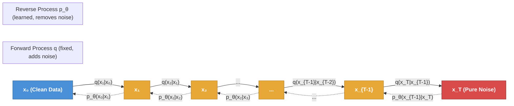
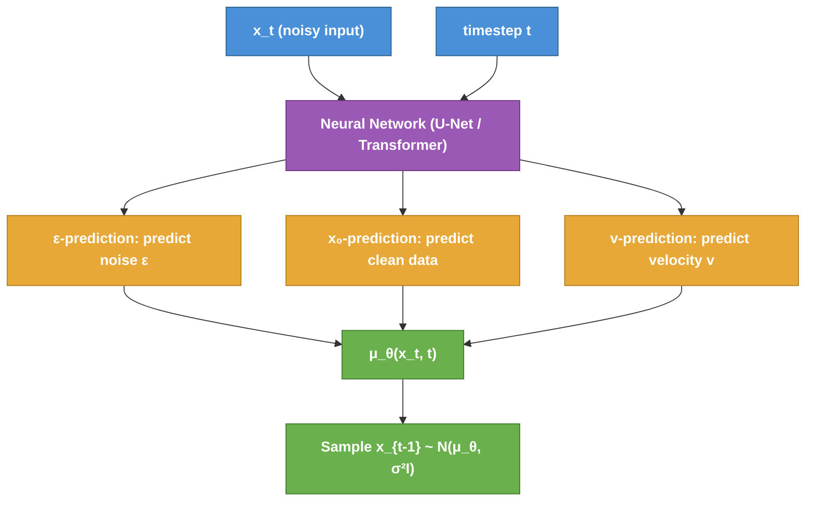
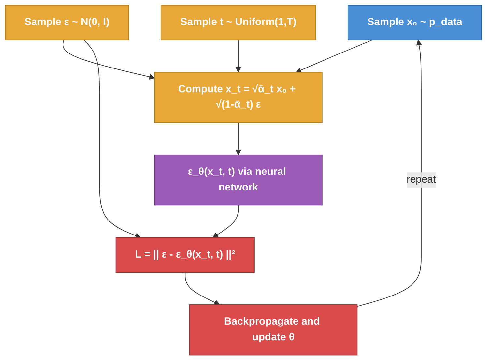
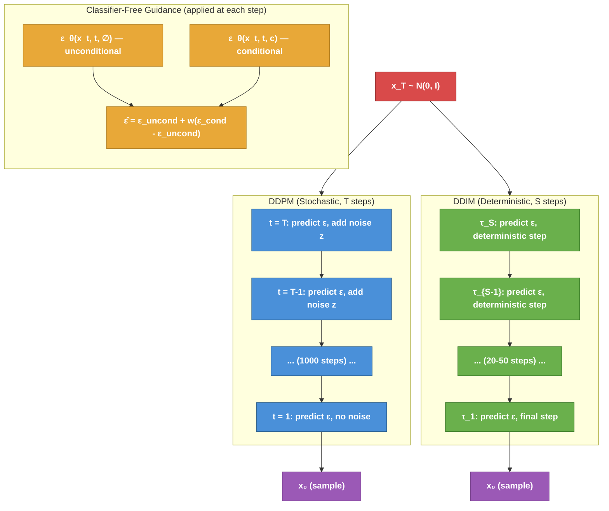
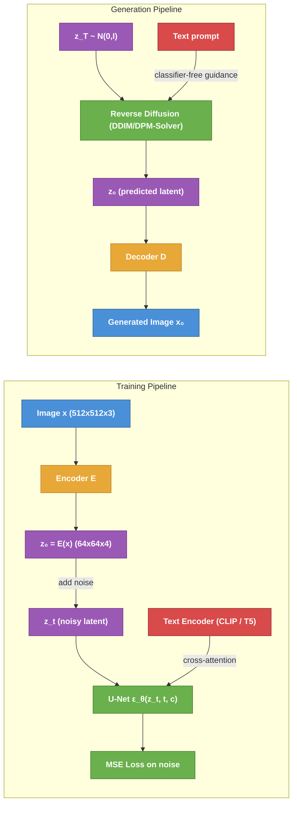

# Diffusion Models: A First-Principles Treatment

---

## Table of Contents

1. [The Core Idea](#1-the-core-idea)
2. [Forward Process (Diffusion)](#2-forward-process-diffusion)
3. [Reverse Process (Denoising)](#3-reverse-process-denoising)
4. [Training Objective](#4-training-objective)
5. [Score Matching Perspective](#5-score-matching-perspective)
6. [Noise Schedules](#6-noise-schedules)
7. [Sampling](#7-sampling)
8. [Conditional Generation](#8-conditional-generation)
9. [Latent Diffusion Models](#9-latent-diffusion-models)
10. [Modern Developments](#10-modern-developments)

---

## 1. The Core Idea

Diffusion models are generative models built on a simple physical intuition: if you
gradually corrupt data with noise until nothing remains but static, and if you can learn
to reverse each tiny corruption step, then you can generate new data by starting from
pure noise and denoising step by step.

This gives rise to two processes:

- **Forward process (fixed):** A Markov chain that incrementally adds Gaussian noise to
  data over $T$ timesteps, transforming any data sample $x_0$ into approximately
  isotropic Gaussian noise $x_T \sim \mathcal{N}(0, I)$. This process requires no
  learning -- it is defined by a predetermined noise schedule.

- **Reverse process (learned):** A Markov chain that runs backward in time, iteratively
  denoising $x_T$ back toward the data distribution. A neural network is trained to
  approximate each denoising step.

The key insight is that while the forward process destroys structure, each individual
step only adds a small amount of noise. When the step size is small enough, the reverse
of each step is also approximately Gaussian. This means a neural network only needs to
learn the parameters (mean and variance) of a Gaussian at each step -- a tractable
learning problem.



The analogy to thermodynamics is deliberate: the forward process increases entropy
(disorder), while the reverse process decreases entropy (restores structure). The name
"diffusion" comes from the connection to physical diffusion processes where particles
spread from regions of high concentration to low concentration.

---

## 2. Forward Process (Diffusion)

### 2.1 Single-Step Transition

The forward process is a Markov chain defined by:

$$q(x_t | x_{t-1}) = \mathcal{N}(x_t; \sqrt{1 - \beta_t}\, x_{t-1},\; \beta_t I)$$

where $\beta_t \in (0, 1)$ is the **variance schedule** at timestep $t$. At each step,
the data is scaled down by $\sqrt{1 - \beta_t}$ and Gaussian noise with variance
$\beta_t$ is added. This can be written as:

$$x_t = \sqrt{1 - \beta_t}\, x_{t-1} + \sqrt{\beta_t}\, \epsilon_t, \quad \epsilon_t \sim \mathcal{N}(0, I)$$

The scaling factor $\sqrt{1 - \beta_t}$ is chosen so that when combined with the noise
variance $\beta_t$, the total variance is preserved: if $x_{t-1}$ has unit variance,
then $x_t$ also has approximately unit variance. This variance-preserving property keeps
the signal from blowing up or collapsing during the forward chain.

### 2.2 The Key Property: Closed-Form Marginal

The critical mathematical convenience of the forward process is that we can jump
directly from $x_0$ to any $x_t$ without iterating through intermediate steps.

Define:

$$\alpha_t = 1 - \beta_t, \qquad \bar{\alpha}_t = \prod_{s=1}^{t} \alpha_s$$

Then by recursively substituting and using the fact that sums of independent Gaussians
are Gaussian:

$$q(x_t | x_0) = \mathcal{N}(x_t;\; \sqrt{\bar{\alpha}_t}\, x_0,\; (1 - \bar{\alpha}_t) I)$$

This means we can sample any noisy version of $x_0$ directly:

$$x_t = \sqrt{\bar{\alpha}_t}\, x_0 + \sqrt{1 - \bar{\alpha}_t}\, \epsilon, \quad \epsilon \sim \mathcal{N}(0, I)$$

**Why this matters for training:** We never need to run the forward chain step by step.
To train the model at any timestep $t$, we simply sample $t$ uniformly, compute $x_t$
from $x_0$ in one step using the formula above, and ask the network to denoise. This
makes training embarrassingly parallel across timesteps.

### 2.3 Properties of $\bar{\alpha}_t$

- At $t = 0$: $\bar{\alpha}_0 = \alpha_0 \approx 1$, so $x_0 \approx x_0$ (minimal noise).
- At $t = T$: $\bar{\alpha}_T \approx 0$, so $x_T \approx \epsilon$ (pure noise).
- $\bar{\alpha}_t$ is a monotonically decreasing function of $t$, representing the
  fraction of the original signal that remains at step $t$.

The signal-to-noise ratio at timestep $t$ is:

$$\text{SNR}(t) = \frac{\bar{\alpha}_t}{1 - \bar{\alpha}_t}$$

This quantity decreases monotonically from a high value (clean data) to near zero
(pure noise), and it turns out to be the natural parameterization for understanding
diffusion models.

### 2.4 Forward Process Posterior

Given both endpoints $x_0$ and $x_t$, the posterior of the intermediate step is
tractable:

$$q(x_{t-1} | x_t, x_0) = \mathcal{N}(x_{t-1};\; \tilde{\mu}_t(x_t, x_0),\; \tilde{\beta}_t I)$$

where:

$$\tilde{\mu}_t(x_t, x_0) = \frac{\sqrt{\bar{\alpha}_{t-1}}\, \beta_t}{1 - \bar{\alpha}_t}\, x_0 + \frac{\sqrt{\alpha_t}\, (1 - \bar{\alpha}_{t-1})}{1 - \bar{\alpha}_t}\, x_t$$

$$\tilde{\beta}_t = \frac{(1 - \bar{\alpha}_{t-1})}{(1 - \bar{\alpha}_t)} \beta_t$$

This posterior is the **ground truth** for what the reverse process should do. The
entire training objective can be understood as making the learned reverse step match
this posterior.

---

## 3. Reverse Process (Denoising)

### 3.1 The Reverse Markov Chain

The reverse process is parameterized as:

$$p_\theta(x_{t-1} | x_t) = \mathcal{N}(x_{t-1};\; \mu_\theta(x_t, t),\; \Sigma_\theta(x_t, t))$$

The neural network takes the noisy sample $x_t$ and the timestep $t$ as input and
produces the parameters of a Gaussian distribution over the slightly-less-noisy
$x_{t-1}$.

### 3.2 Variance Parameterization

In the original DDPM paper (Ho et al., 2020), the variance is fixed rather than
learned:

$$\Sigma_\theta(x_t, t) = \sigma_t^2 I$$

Two common choices for $\sigma_t^2$:

- $\sigma_t^2 = \beta_t$ (lower bound, optimal when $x_0$ is deterministic)
- $\sigma_t^2 = \tilde{\beta}_t$ (upper bound, optimal when $x_0$ is drawn from the
  data distribution)

Improved DDPM (Nichol & Dhariwal, 2021) learns $\Sigma_\theta$ by interpolating between
these bounds in log-space:

$$\log \sigma_t^2 = v \log \tilde{\beta}_t + (1 - v) \log \beta_t$$

where $v$ is a learned scalar output of the network.

### 3.3 Mean Parameterization

The mean $\mu_\theta(x_t, t)$ can be parameterized in several equivalent ways, each
corresponding to the network predicting a different quantity.

**Predicting the noise ($\epsilon$-prediction):**

The network predicts $\epsilon_\theta(x_t, t)$, the noise that was added. The mean is
then:

$$\mu_\theta(x_t, t) = \frac{1}{\sqrt{\alpha_t}} \left( x_t - \frac{\beta_t}{\sqrt{1 - \bar{\alpha}_t}}\, \epsilon_\theta(x_t, t) \right)$$

This is the most common parameterization and was used in the original DDPM.

**Predicting the clean data ($x_0$-prediction):**

The network predicts $\hat{x}_\theta(x_t, t)$, an estimate of the original clean data.
The mean is obtained by plugging $\hat{x}_\theta$ into the posterior mean formula:

$$\mu_\theta(x_t, t) = \frac{\sqrt{\bar{\alpha}_{t-1}}\, \beta_t}{1 - \bar{\alpha}_t}\, \hat{x}_\theta(x_t, t) + \frac{\sqrt{\alpha_t}\, (1 - \bar{\alpha}_{t-1})}{1 - \bar{\alpha}_t}\, x_t$$

This is useful when we want to directly interpret what the model thinks the clean data
looks like, and it is prevalent in some image editing and inpainting applications.

**Predicting the velocity ($v$-prediction):**

Introduced by Salimans & Ho (2022), the network predicts:

$$v_t = \sqrt{\bar{\alpha}_t}\, \epsilon - \sqrt{1 - \bar{\alpha}_t}\, x_0$$

This parameterization is numerically more stable than $\epsilon$-prediction at low noise
levels and more stable than $x_0$-prediction at high noise levels. It interpolates
smoothly between the two regimes and is used in many modern systems.

**Relationship between predictions:**

All three are linearly related given $x_t$:

$$\hat{x}_0 = \frac{x_t - \sqrt{1 - \bar{\alpha}_t}\, \hat{\epsilon}}{\sqrt{\bar{\alpha}_t}}$$

$$\hat{\epsilon} = \frac{x_t - \sqrt{\bar{\alpha}_t}\, \hat{x}_0}{\sqrt{1 - \bar{\alpha}_t}}$$

$$v = \sqrt{\bar{\alpha}_t}\, \hat{\epsilon} - \sqrt{1 - \bar{\alpha}_t}\, \hat{x}_0$$



---

## 4. Training Objective

### 4.1 The Variational Lower Bound (ELBO)

Diffusion models are latent variable models. The marginal likelihood is:

$$p_\theta(x_0) = \int p_\theta(x_{0:T})\, dx_{1:T}$$

This integral is intractable. We use the evidence lower bound (ELBO):

$$\log p_\theta(x_0) \geq \mathbb{E}_q \left[ \log \frac{p_\theta(x_{0:T})}{q(x_{1:T} | x_0)} \right] = -L_{\text{VLB}}$$

The variational lower bound decomposes into a sum of terms:

$$L_{\text{VLB}} = \underbrace{D_{\text{KL}}(q(x_T | x_0) \| p(x_T))}_{L_T} + \sum_{t=2}^{T} \underbrace{D_{\text{KL}}(q(x_{t-1} | x_t, x_0) \| p_\theta(x_{t-1} | x_t))}_{L_{t-1}} + \underbrace{(-\log p_\theta(x_0 | x_1))}_{L_0}$$

**$L_T$:** Measures how close the final noisy distribution is to the prior
$\mathcal{N}(0, I)$. This is fixed (no learnable parameters) and close to zero when
the noise schedule is designed properly.

**$L_{t-1}$ for $t = 2, \ldots, T$:** Each term is a KL divergence between two
Gaussians -- the true posterior $q(x_{t-1} | x_t, x_0)$ and the learned reverse step
$p_\theta(x_{t-1} | x_t)$. Since both are Gaussian, the KL has a closed-form
expression.

**$L_0$:** A reconstruction term for the final denoising step from $x_1$ to $x_0$.

### 4.2 Simplified Loss

Ho et al. (2020) showed that with $\epsilon$-prediction and fixed variance, the KL terms
simplify. The loss at each timestep becomes proportional to:

$$L_t^{\text{simple}} = \mathbb{E}_{x_0, \epsilon, t} \left[ \| \epsilon - \epsilon_\theta(x_t, t) \|^2 \right]$$

where $x_t = \sqrt{\bar{\alpha}_t}\, x_0 + \sqrt{1 - \bar{\alpha}_t}\, \epsilon$.

The full training loss averages over all timesteps:

$$L_{\text{simple}} = \mathbb{E}_{t \sim \text{Uniform}(1, T)} \left[ L_t^{\text{simple}} \right]$$

This is a straightforward mean squared error: sample a random timestep, noise the data,
predict the noise, and minimize the prediction error.

**Why this works:** Although $L_{\text{simple}}$ drops the $t$-dependent weighting
present in the true ELBO (each KL term has a different coefficient), Ho et al. found
empirically that uniform weighting produces better samples. The simplified loss
down-weights high-noise timesteps (where the true ELBO places more importance) and
up-weights low-noise timesteps (where perceptual quality is determined). This trades off
log-likelihood for sample quality.

### 4.3 Connection to ELBO (Formal)

For the $\epsilon$-prediction parameterization with fixed $\sigma_t^2 = \tilde{\beta}_t$:

$$L_{t-1} = \frac{1}{2\sigma_t^2} \frac{\beta_t^2}{\alpha_t (1 - \bar{\alpha}_t)} \mathbb{E}\left[ \| \epsilon - \epsilon_\theta(x_t, t) \|^2 \right]$$

The coefficient $\frac{\beta_t^2}{2\sigma_t^2 \alpha_t (1 - \bar{\alpha}_t)}$ is the
weighting that the true ELBO assigns to each timestep. The simplified loss sets all
these coefficients to 1.

### 4.4 Connection to Score Matching

As we will explore in detail in the next section, the $\epsilon$-prediction objective is
equivalent to **denoising score matching**. The score function at noise level
$\sigma_t = \sqrt{1 - \bar{\alpha}_t}$ is:

$$\nabla_{x_t} \log q(x_t | x_0) = -\frac{\epsilon}{\sqrt{1 - \bar{\alpha}_t}}$$

So predicting $\epsilon$ is equivalent to predicting the (scaled) score function. This
connection places diffusion models within the broader framework of score-based
generative models.



### 4.5 The Training Algorithm

Putting it all together, the training procedure for DDPM is:

```
repeat:
    x_0 ~ p_data(x)                           # sample a training example
    t ~ Uniform({1, ..., T})                   # sample a random timestep
    epsilon ~ N(0, I)                          # sample noise
    x_t = sqrt(alpha_bar_t) * x_0 + sqrt(1 - alpha_bar_t) * epsilon
    loss = || epsilon - epsilon_theta(x_t, t) ||^2
    gradient step on loss
until converged
```

This is remarkably simple. There are no adversarial dynamics (unlike GANs), no
encoder-decoder training instabilities (unlike VAEs with posterior collapse), and no
autoregressive sampling bottlenecks. The entire training procedure is a regression
problem.

---

## 5. Score Matching Perspective

### 5.1 The Score Function

For a probability distribution $p(x)$, the **score function** is defined as:

$$s(x) = \nabla_x \log p(x)$$

The score is a vector field that points in the direction of increasing probability
density at every point in space. Critically, the score does not require knowing the
normalizing constant of $p(x)$, since:

$$\nabla_x \log p(x) = \nabla_x \log \tilde{p}(x) - \nabla_x \log Z = \nabla_x \log \tilde{p}(x)$$

where $\tilde{p}(x)$ is the unnormalized density and $Z$ is the partition function
(a constant whose gradient is zero).

### 5.2 Score Matching

**Score matching** (Hyvarinen, 2005) trains a neural network $s_\theta(x)$ to
approximate $\nabla_x \log p_{\text{data}}(x)$ by minimizing:

$$\mathbb{E}_{p_{\text{data}}} \left[ \| s_\theta(x) - \nabla_x \log p_{\text{data}}(x) \|^2 \right]$$

The problem is that $\nabla_x \log p_{\text{data}}(x)$ is unknown (we only have
samples). Hyvarinen showed this can be reformulated using integration by parts into
an expression involving only the model's Jacobian, but this is expensive in high
dimensions.

### 5.3 Denoising Score Matching

**Denoising score matching** (Vincent, 2011) provides an elegant alternative. Instead of
matching the score of $p_{\text{data}}$, we match the score of a noise-corrupted version
$q_\sigma(x) = \int p_{\text{data}}(x_0)\, q_\sigma(x | x_0)\, dx_0$ where
$q_\sigma(x | x_0) = \mathcal{N}(x; x_0, \sigma^2 I)$.

The score of the corrupted distribution at a point $x$ given that it came from $x_0$ is:

$$\nabla_x \log q_\sigma(x | x_0) = -\frac{x - x_0}{\sigma^2} = -\frac{\epsilon}{\sigma}$$

This is just the negative noise direction, scaled. The denoising score matching
objective is:

$$\mathbb{E}_{x_0 \sim p_{\text{data}},\; x \sim q_\sigma(\cdot | x_0)} \left[ \| s_\theta(x) - \nabla_x \log q_\sigma(x | x_0) \|^2 \right]$$

Vincent proved this is equivalent to matching $\nabla_x \log q_\sigma(x)$, the score
of the marginal noisy distribution.

### 5.4 Multi-Scale Denoising: NCSN and SMLD

Song & Ermon (2019) introduced **Noise Conditional Score Networks (NCSN)**, which train
a single score network across multiple noise levels $\{\sigma_i\}_{i=1}^{L}$:

$$\mathcal{L} = \sum_{i=1}^{L} \lambda(\sigma_i)\, \mathbb{E}_{x_0, x} \left[ \| s_\theta(x, \sigma_i) + \frac{x - x_0}{\sigma_i^2} \|^2 \right]$$

The key insight is that high noise levels help the score network learn the global
structure of the data distribution (preventing it from getting stuck in low-density
regions), while low noise levels capture fine details.

### 5.5 Langevin Dynamics for Sampling

Given a score function, we can generate samples using **annealed Langevin dynamics**:

$$x_{k+1} = x_k + \frac{\eta}{2} \nabla_x \log p(x_k) + \sqrt{\eta}\, z_k, \quad z_k \sim \mathcal{N}(0, I)$$

where $\eta$ is the step size. As $\eta \to 0$ and the number of steps $\to \infty$,
the distribution of $x_k$ converges to $p(x)$.

For multi-scale score models, annealed Langevin dynamics runs this process sequentially
from the highest noise level to the lowest, using the score estimate
$s_\theta(x, \sigma_i)$ appropriate for each level.

### 5.6 Unification: Score SDE

Song et al. (2021) unified DDPM and NCSN under a continuous-time framework based on
stochastic differential equations (SDEs). The forward process becomes:

$$dx = f(x, t)\, dt + g(t)\, dw$$

where $w$ is a Wiener process, $f$ is the drift, and $g$ is the diffusion coefficient.
The reverse-time SDE is:

$$dx = \left[ f(x, t) - g(t)^2 \nabla_x \log p_t(x) \right] dt + g(t)\, d\bar{w}$$

This shows that once we know the score $\nabla_x \log p_t(x)$ at all noise levels
$t$, we can reverse the forward diffusion. DDPM and NCSN correspond to different
discretizations of this SDE:

- **Variance Preserving (VP) SDE** corresponds to DDPM
- **Variance Exploding (VE) SDE** corresponds to SMLD/NCSN

---

## 6. Noise Schedules

The noise schedule $\{\beta_t\}_{t=1}^{T}$ (equivalently, $\{\bar{\alpha}_t\}_{t=1}^{T}$)
controls the rate at which information is destroyed during the forward process. Its
design significantly impacts generation quality.

### 6.1 Linear Schedule

The original DDPM uses a linear schedule:

$$\beta_t = \beta_{\min} + \frac{t - 1}{T - 1}(\beta_{\max} - \beta_{\min})$$

with $\beta_{\min} = 10^{-4}$ and $\beta_{\max} = 0.02$ over $T = 1000$ steps.

**Problem:** With a linear $\beta$ schedule, $\bar{\alpha}_t$ drops too quickly in the
early steps and too slowly at the end. This means the model spends many timesteps
operating in the nearly-pure-noise regime where little meaningful denoising happens, and
too few timesteps in the critical transition region where structure emerges.

### 6.2 Cosine Schedule

Nichol & Dhariwal (2021) proposed the cosine schedule, which directly defines
$\bar{\alpha}_t$:

$$\bar{\alpha}_t = \frac{f(t)}{f(0)}, \quad f(t) = \cos\left( \frac{t/T + s}{1 + s} \cdot \frac{\pi}{2} \right)^2$$

where $s = 0.008$ is a small offset to prevent $\beta_t$ from being too small near
$t = 0$.

The cosine schedule ensures that $\bar{\alpha}_t$ decreases more uniformly across
timesteps, spending more of the schedule in the intermediate noise range where the model
does the most important work. This produces notably better FID scores, especially for
low-resolution generation.

### 6.3 Other Schedules

- **Sigmoid schedule:** $\bar{\alpha}_t$ follows a sigmoid curve, providing another way
  to concentrate timesteps in the middle noise range.
- **Learned schedules:** Some works (e.g., Kingma et al., 2021) parameterize the noise
  schedule and learn it jointly with the model.
- **Resolution-dependent schedules:** Chen (2023) showed that optimal schedules depend
  on image resolution. Higher-resolution images need faster noise schedules because the
  signal-to-noise ratio at each timestep is effectively higher (redundant neighboring
  pixels provide extra information).

### 6.4 Design Principles

A good noise schedule should:

1. **Span the full SNR range:** $\bar{\alpha}_0 \approx 1$ (clean) to
   $\bar{\alpha}_T \approx 0$ (pure noise), ensuring the model sees all noise levels.
2. **Allocate capacity wisely:** Spend more timesteps in the intermediate SNR range
   where perceptual structure transitions between recognizable and destroyed.
3. **Avoid abrupt transitions:** Smooth $\bar{\alpha}_t$ curves lead to smoother
   learning signals.
4. **Match the data:** Higher-dimensional or more redundant data can tolerate faster
   schedules.

---

## 7. Sampling

### 7.1 DDPM Sampling (Ancestral Sampling)

The standard DDPM sampling algorithm iterates the reverse process:

```
x_T ~ N(0, I)
for t = T, T-1, ..., 1:
    z ~ N(0, I) if t > 1, else z = 0
    x_{t-1} = (1/sqrt(alpha_t)) * (x_t - (beta_t / sqrt(1 - alpha_bar_t)) * epsilon_theta(x_t, t)) + sigma_t * z
return x_0
```

This requires $T$ forward passes through the neural network (typically $T = 1000$),
making it slow. Each step is stochastic due to the added noise $z$.

### 7.2 DDIM Sampling (Deterministic)

Song et al. (2020) introduced **Denoising Diffusion Implicit Models (DDIM)**, which
generalize DDPM sampling. The key observation is that the DDPM training objective only
constrains the marginals $q(x_t | x_0)$, not the joint distribution $q(x_{1:T} | x_0)$.
This means we can define non-Markovian forward processes that have the same marginals
but different joint distributions.

The DDIM update rule is:

$$x_{t-1} = \sqrt{\bar{\alpha}_{t-1}} \underbrace{\left( \frac{x_t - \sqrt{1 - \bar{\alpha}_t}\, \epsilon_\theta(x_t, t)}{\sqrt{\bar{\alpha}_t}} \right)}_{\text{predicted } x_0} + \sqrt{1 - \bar{\alpha}_{t-1} - \sigma_t^2}\, \underbrace{\epsilon_\theta(x_t, t)}_{\text{direction pointing to } x_t} + \sigma_t \epsilon_t$$

When $\sigma_t = 0$, the process is fully **deterministic**: given the same initial
noise $x_T$, we always get the same $x_0$. This has several advantages:

- **Consistency:** The same latent code always produces the same output.
- **Interpolation:** Smooth interpolation in latent space produces smooth interpolation
  in data space.
- **Fewer steps:** Because the trajectory is deterministic, we can use much larger step
  sizes. DDIM can produce good samples with as few as 20-50 steps (vs. 1000 for DDPM).

When $\sigma_t = \sqrt{\frac{(1-\bar{\alpha}_{t-1})}{(1-\bar{\alpha}_t)} \beta_t}$, we
recover the original DDPM update.

### 7.3 Accelerated Sampling

The DDIM framework enables **sub-sequence sampling**: instead of running all $T$ steps,
we choose a subsequence $\tau = [\tau_1, \tau_2, \ldots, \tau_S]$ where $S \ll T$ and
jump between these timesteps. The model (trained on all $T$ timesteps) is simply
evaluated at the subsequence timesteps, with $\bar{\alpha}$ values looked up
accordingly.

### 7.4 Classifier-Free Guidance (CFG)

Classifier-free guidance (Ho & Salimans, 2022) is the dominant technique for improving
sample quality in conditional generation. During sampling, the noise prediction is
modified:

$$\hat{\epsilon}_\theta(x_t, t, c) = \epsilon_\theta(x_t, t, \varnothing) + w \cdot \left( \epsilon_\theta(x_t, t, c) - \epsilon_\theta(x_t, t, \varnothing) \right)$$

where $c$ is the conditioning signal, $\varnothing$ is a null/empty conditioning signal,
and $w > 1$ is the guidance scale.

Intuitively, this amplifies the difference between "what the model would generate with
the condition" and "what it would generate without it," pushing samples to be more
strongly aligned with the condition. Higher $w$ produces samples that are more faithful
to the condition but less diverse (the quality-diversity trade-off).



### 7.5 Advanced Samplers

Beyond DDPM and DDIM, several advanced sampling methods reduce the number of function
evaluations (NFE) needed:

- **DPM-Solver / DPM-Solver++:** Treats the reverse process as an ODE and applies
  high-order numerical solvers (analogous to Runge-Kutta methods). Achieves good quality
  in 10-20 steps.
- **Euler / Heun methods:** Standard ODE solvers applied to the probability flow ODE.
- **Predictor-Corrector methods:** Alternate between a predictor step (reverse SDE or
  ODE) and a corrector step (Langevin dynamics) for improved accuracy.

---

## 8. Conditional Generation

### 8.1 The Goal

We want to sample from $p(x | y)$ where $y$ is some conditioning information (class
label, text description, low-resolution image, etc.). By Bayes' rule:

$$\nabla_x \log p(x | y) = \nabla_x \log p(x) + \nabla_x \log p(y | x)$$

This decomposition suggests two strategies: either train a separate classifier
$p(y | x)$ and use its gradients, or train the diffusion model directly on conditional
data.

### 8.2 Classifier Guidance

Dhariwal & Nichol (2021) proposed **classifier guidance**: train a noise-aware classifier
$p_\phi(y | x_t, t)$ on noisy data, then modify the score during sampling:

$$\hat{s}(x_t, t) = s_\theta(x_t, t) + w \cdot \nabla_{x_t} \log p_\phi(y | x_t, t)$$

where $w$ is the guidance scale. This steers samples toward regions that the classifier
assigns high probability to class $y$.

**Advantages:** Can use any pre-trained unconditional diffusion model.

**Disadvantages:** Requires training a separate classifier on noisy data. The classifier
gradients can be adversarially exploited, pushing samples toward high-confidence but
low-quality regions.

### 8.3 Classifier-Free Guidance

Classifier-free guidance (Section 7.4) avoids the need for a separate classifier. During
training, the conditioning signal is randomly dropped (replaced with $\varnothing$) with
some probability (typically 10-20%). This trains the model to be both conditional and
unconditional simultaneously. The implicit classifier is:

$$\nabla_{x_t} \log p(y | x_t) \propto \nabla_{x_t} \log p(x_t | y) - \nabla_{x_t} \log p(x_t)$$

which is exactly the difference between the conditional and unconditional scores that
CFG amplifies.

Classifier-free guidance has become the standard approach because:

1. No separate classifier needed
2. No adversarial gradient issues
3. Simple to implement (just random dropout of conditioning)
4. Works with any type of conditioning

### 8.4 Text Conditioning

Text-to-image models condition on text through text encoders:

- **CLIP text encoder:** Maps text to a fixed-size embedding. Used in DALL-E 2 and early
  Stable Diffusion versions.
- **T5 / FLAN-T5 encoder:** Produces a sequence of embeddings (one per token), providing
  richer conditioning. Used in Imagen and modern Stable Diffusion (SDXL, SD3).
- **Dual encoders:** SD3 and Flux use both CLIP and T5 encoders for complementary
  conditioning.

The text embeddings are injected into the denoising network via **cross-attention**
layers: the noisy image features serve as queries, and the text embeddings serve as
keys and values.

### 8.5 Class Conditioning

For class-conditional generation (e.g., ImageNet), the class label $y$ is typically
embedded and injected via:

- **Adaptive Group Normalization (AdaGN):** The class embedding modulates the scale
  and shift parameters of normalization layers.
- **Timestep embedding addition:** The class embedding is added to the timestep
  embedding before injection.
- **Cross-attention:** Similar to text conditioning but with a single class token.

---

## 9. Latent Diffusion Models

### 9.1 The Efficiency Problem

Running diffusion directly in pixel space is computationally expensive. For a
$512 \times 512 \times 3$ image, the U-Net operates on tensors with nearly 800,000
dimensions at every timestep. Most of these dimensions encode imperceptible high-frequency
details and spatial redundancy -- the model wastes capacity on information that humans
cannot distinguish.

### 9.2 The Solution: Diffuse in Latent Space

**Latent Diffusion Models (LDMs)**, introduced by Rombach et al. (2022) and
commercialized as **Stable Diffusion**, separate the generative process into two stages:

1. **Perceptual compression (autoencoder):** Train a VAE (or VQ-VAE) to encode images
   $x \in \mathbb{R}^{H \times W \times 3}$ into a compact latent representation
   $z = \mathcal{E}(x) \in \mathbb{R}^{h \times w \times c}$, and decode them back:
   $\hat{x} = \mathcal{D}(z)$. Typical compression is $8\times$ spatial
   ($h = H/8, w = W/8$) with $c = 4$ channels, giving a $48\times$ reduction in
   dimensionality.

2. **Semantic generation (diffusion):** Run the entire diffusion process (forward noise,
   reverse denoising) in the latent space $z$ rather than pixel space $x$. The denoising
   network $\epsilon_\theta(z_t, t, c)$ operates on the much smaller latent tensors.

Generation pipeline:

1. Sample $z_T \sim \mathcal{N}(0, I)$ in latent space
2. Run the reverse diffusion process to obtain $z_0$
3. Decode: $x_0 = \mathcal{D}(z_0)$



### 9.3 Why This Works

The latent space separates two types of information:

- **Perceptual compression** (handled by the autoencoder): Removes imperceptible
  high-frequency details and spatial redundancy. The autoencoder is trained with a
  combination of reconstruction loss, perceptual loss (LPIPS), and a KL or adversarial
  regularizer to keep the latent space smooth.

- **Semantic compression** (handled by diffusion): Models the distribution over
  meaningful, high-level content in the compact latent space.

This decomposition means the diffusion model only needs to learn the hard part
(semantic structure) while the easy part (pixel-level detail) is handled by a
deterministic decoder.

### 9.4 Computational Savings

For a $512 \times 512$ image with $8\times$ downsampling:

| | Pixel Space | Latent Space |
|---|---|---|
| Spatial dimensions | $512 \times 512$ | $64 \times 64$ |
| Channels | 3 | 4 |
| Total dimensions | 786,432 | 16,384 |
| Reduction factor | 1x | **48x** |

The U-Net's self-attention layers scale quadratically with spatial resolution, so the
speedup is even more dramatic than the raw dimensionality reduction suggests. Training
LDMs requires roughly 4x less compute than equivalent pixel-space models.

### 9.5 Architecture Details

The U-Net in Stable Diffusion uses:

- **ResNet blocks** for spatial processing
- **Self-attention** at lower resolutions ($32 \times 32$, $16 \times 16$, $8 \times 8$)
  for global coherence
- **Cross-attention** for text conditioning, interleaved with self-attention
- **Sinusoidal timestep embedding** injected via AdaGN

Modern variants (SD3, Flux) replace the U-Net with a **Diffusion Transformer (DiT)**
architecture, using transformer blocks with adaptive layer norm (adaLN) for timestep
conditioning and interleaved self/cross-attention for text conditioning.

---

## 10. Modern Developments

### 10.1 Flow Matching

**Flow matching** (Lipman et al., 2023; Liu et al., 2023; Albergo & Vanden-Eijnden,
2023) generalizes diffusion models by learning a continuous normalizing flow (CNF)
that transports a simple prior $p_0 = \mathcal{N}(0, I)$ to the data distribution
$p_1 = p_{\text{data}}$ via a time-dependent velocity field $v_t(x)$:

$$\frac{dx}{dt} = v_t(x), \quad t \in [0, 1]$$

The flow matching objective trains a network $v_\theta(x, t)$ to match a target
velocity field:

$$\mathcal{L}_{\text{FM}} = \mathbb{E}_{t, x_0, x_1} \left[ \| v_\theta(x_t, t) - (x_1 - x_0) \|^2 \right]$$

where $x_t = (1 - t) x_0 + t x_1$ is a linear interpolation (for the simplest case)
between noise $x_0$ and data $x_1$.

Flow matching has several conceptual advantages:

- **Simpler objective:** Directly regress a velocity rather than predicting noise.
- **Straighter paths:** The learned trajectories can be closer to straight lines than
  diffusion trajectories, enabling fewer sampling steps.
- **Flexible interpolants:** The path between noise and data can be designed (linear,
  trigonometric, etc.) without the constraints of the diffusion framework.

### 10.2 Rectified Flows

**Rectified flows** (Liu et al., 2023) push the straight-path idea further. The key
insight is that straighter trajectories require fewer ODE solver steps. Rectified flows
use a **reflow** procedure:

1. Train an initial flow model
2. Generate paired samples $(x_0, x_1)$ by running the learned flow
3. Re-train the model to connect these pairs with straighter paths
4. Repeat

Each iteration of reflow produces straighter trajectories, and in the limit, the flow
becomes a one-step mapping (an optimal transport map). In practice, 1-2 reflow
iterations significantly reduce the number of sampling steps needed.

Stable Diffusion 3 and Flux are built on rectified flow matching rather than classical
DDPM-style diffusion.

### 10.3 Consistency Models

**Consistency models** (Song et al., 2023) take a different approach to fast sampling.
The core idea is to train a model $f_\theta$ that maps any point on a diffusion
trajectory directly to the trajectory's endpoint (the clean data):

$$f_\theta(x_t, t) = x_0 \quad \text{for all } t$$

The key constraint is **self-consistency**: for any two points $x_t$ and $x_{t'}$ on the
same trajectory, $f_\theta(x_t, t) = f_\theta(x_{t'}, t')$. This is enforced during
training by:

- **Consistency distillation:** Given a pre-trained diffusion model, enforce that
  $f_\theta(x_t, t) = f_{\theta^-}(\hat{x}_{t'}, t')$ where $\hat{x}_{t'}$ is obtained
  by one step of the diffusion model's ODE solver, and $\theta^-$ is an exponential
  moving average of $\theta$.

- **Consistency training:** Train from scratch without a pre-trained teacher by using
  the noising process to generate training pairs.

Consistency models enable **one-step generation** (sample $x_T$, apply $f_\theta$ once
to get $x_0$) or **few-step generation** (iterate: predict $x_0$, re-noise to an
intermediate level, predict again). This achieves competitive quality with 1-4 function
evaluations.

### 10.4 Architectural Trends

- **Diffusion Transformers (DiT):** Peebles & Xie (2023) replaced U-Nets with
  vision transformers, showing that scaling laws apply. Larger DiT models
  systematically produce better FID scores. This architecture underlies DALL-E 3,
  SD3, Flux, and Sora.

- **MMDiT (Multi-Modal DiT):** Used in SD3, this architecture processes text and image
  tokens in a shared transformer with joint attention, allowing deeper interaction
  between modalities.

- **Scaling:** Current frontier models use multi-billion parameter DiTs trained on
  billions of images. The field has adopted the LLM playbook: scale the model, scale
  the data, and quality improves predictably.

### 10.5 Applications Beyond Image Generation

Diffusion models have expanded to:

- **Video generation:** Sora, Kling, Runway Gen-3 -- extend the diffusion framework
  to spatiotemporal latents.
- **Audio/Music:** Stable Audio, MusicGen -- diffusion in spectrogram or learned audio
  latent spaces.
- **3D generation:** Point cloud diffusion, NeRF-based diffusion, multi-view diffusion.
- **Molecular design:** Diffusion on molecular graphs for drug discovery.
- **Robotics:** Diffusion policies for generating action trajectories.
- **Text:** Diffusion-LM and related work on discrete diffusion for language.

The core framework -- corrupt with noise, learn to denoise -- is remarkably general and
continues to find new applications.

---

## Summary of Key Equations

| Concept | Equation |
|---|---|
| Forward step | $q(x_t \mid x_{t-1}) = \mathcal{N}(x_t; \sqrt{1-\beta_t}\, x_{t-1}, \beta_t I)$ |
| Jump to $t$ | $q(x_t \mid x_0) = \mathcal{N}(x_t; \sqrt{\bar\alpha_t}\, x_0, (1-\bar\alpha_t)I)$ |
| Posterior | $q(x_{t-1} \mid x_t, x_0) = \mathcal{N}(x_{t-1}; \tilde\mu_t, \tilde\beta_t I)$ |
| Reverse step | $p_\theta(x_{t-1} \mid x_t) = \mathcal{N}(x_{t-1}; \mu_\theta(x_t,t), \sigma_t^2 I)$ |
| Simple loss | $L = \mathbb{E}_{t,x_0,\epsilon}\left[\lVert \epsilon - \epsilon_\theta(x_t, t)\rVert^2\right]$ |
| Score function | $\nabla_{x_t}\log q(x_t \mid x_0) = -\epsilon / \sqrt{1-\bar\alpha_t}$ |
| CFG | $\hat\epsilon = \epsilon_\theta(x_t,t,\varnothing) + w(\epsilon_\theta(x_t,t,c) - \epsilon_\theta(x_t,t,\varnothing))$ |
| Flow matching | $L_{\text{FM}} = \mathbb{E}\left[\lVert v_\theta(x_t, t) - (x_1 - x_0)\rVert^2\right]$ |

---

## References

- Ho, J., Jain, A., & Abbeel, P. (2020). Denoising Diffusion Probabilistic Models. NeurIPS.
- Song, J., Meng, C., & Ermon, S. (2020). Denoising Diffusion Implicit Models. ICLR.
- Song, Y., & Ermon, S. (2019). Generative Modeling by Estimating Gradients of the Data Distribution. NeurIPS.
- Song, Y., Sohl-Dickstein, J., Kingma, D.P., Kumar, A., Ermon, S., & Poole, B. (2021). Score-Based Generative Modeling through Stochastic Differential Equations. ICLR.
- Nichol, A., & Dhariwal, P. (2021). Improved Denoising Diffusion Probabilistic Models. ICML.
- Dhariwal, P., & Nichol, A. (2021). Diffusion Models Beat GANs on Image Synthesis. NeurIPS.
- Ho, J., & Salimans, T. (2022). Classifier-Free Diffusion Guidance. NeurIPS Workshop.
- Rombach, R., Blattmann, A., Lorenz, D., Esser, P., & Ommer, B. (2022). High-Resolution Image Synthesis with Latent Diffusion Models. CVPR.
- Salimans, T., & Ho, J. (2022). Progressive Distillation for Fast Sampling of Diffusion Models. ICLR.
- Lipman, Y., Chen, R.T.Q., Ben-Hamu, H., Nickel, M., & Le, M. (2023). Flow Matching for Generative Modeling. ICLR.
- Liu, X., Gong, C., & Liu, Q. (2023). Flow Straight and Fast: Learning to Generate and Transfer Data with Rectified Flow. ICLR.
- Song, Y., Dhariwal, P., Chen, M., & Sutskever, I. (2023). Consistency Models. ICML.
- Peebles, W., & Xie, S. (2023). Scalable Diffusion Models with Transformers. ICCV.
- Kingma, D.P., Salimans, T., Poole, B., & Ho, J. (2021). Variational Diffusion Models. NeurIPS.
- Hyvarinen, A. (2005). Estimation of Non-Normalized Statistical Models by Score Matching. JMLR.
- Vincent, P. (2011). A Connection Between Score Matching and Denoising Autoencoders. Neural Computation.
