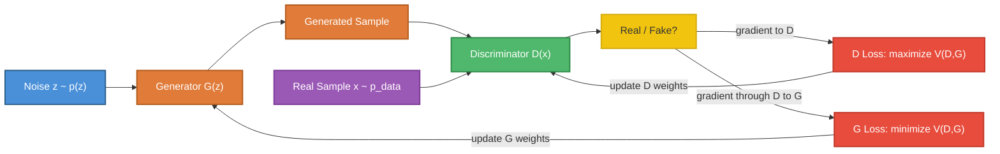
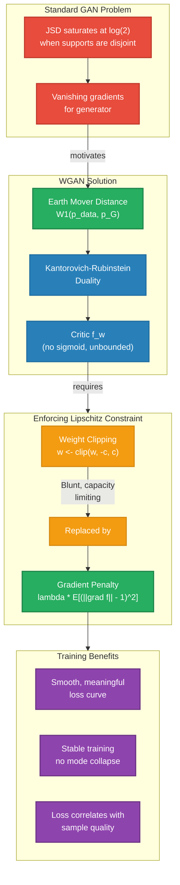
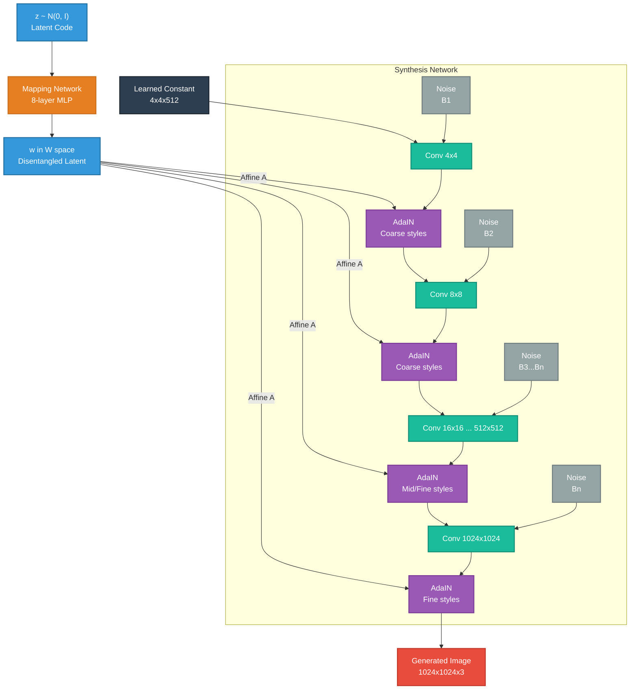

# Generative Adversarial Networks: A First-Principles Treatment

---

## Table of Contents

1. [The Adversarial Idea](#1-the-adversarial-idea)
2. [GAN Training Objective](#2-gan-training-objective)
3. [Training Dynamics](#3-training-dynamics)
4. [Wasserstein GAN (WGAN)](#4-wasserstein-gan-wgan)
5. [Architecture Innovations](#5-architecture-innovations)
6. [Conditional GANs](#6-conditional-gans)
7. [Evaluation Metrics](#7-evaluation-metrics)
8. [GANs vs Other Generative Models](#8-gans-vs-other-generative-models)

---

## 1. The Adversarial Idea

### The Core Intuition

A Generative Adversarial Network is built on a single, powerful insight: you can train a
generative model by pitting it against an adversary whose sole job is to distinguish real
data from fakes. The generator never sees the real data directly. It only receives a
learning signal that passes *through* the discriminator, telling it how to improve its
forgeries.

Two neural networks are trained simultaneously:

- **Generator $G$**: takes a random noise vector $z \sim p_z(z)$ and maps it to a data
  sample $G(z)$. Its goal is to produce outputs indistinguishable from real data.
- **Discriminator $D$**: takes a data sample $x$ (real or generated) and outputs a scalar
  $D(x) \in [0, 1]$ representing the probability that $x$ came from the real data
  distribution rather than from $G$.

### The Minimax Game

Training a GAN is formulated as a two-player minimax game:

$$\min_G \max_D \; V(D, G) = \mathbb{E}_{x \sim p_{\text{data}}(x)}[\log D(x)] + \mathbb{E}_{z \sim p_z(z)}[\log(1 - D(G(z)))]$$

- $D$ wants to **maximize** $V$: assign high probability to real data ($D(x) \to 1$) and
  low probability to generated data ($D(G(z)) \to 0$).
- $G$ wants to **minimize** $V$: make $D(G(z)) \to 1$, fooling the discriminator.

The discriminator is essentially a binary classifier trained with cross-entropy loss. The
generator's loss is the *negative* of what the discriminator tries to achieve on fake
samples.

### Nash Equilibrium

The solution concept for this game is a **Nash equilibrium**: a pair $(G^*, D^*)$ where
neither player can improve by unilaterally changing its strategy. Goodfellow et al. (2014)
showed that this equilibrium exists when:

$$p_G = p_{\text{data}}$$

At equilibrium, the optimal discriminator becomes:

$$D^*(x) = \frac{p_{\text{data}}(x)}{p_{\text{data}}(x) + p_G(x)} = \frac{1}{2}$$

The discriminator can no longer distinguish real from fake because they are drawn from the
same distribution. It outputs $\frac{1}{2}$ everywhere --- a coin flip.

In practice, reaching this equilibrium with gradient descent on neural networks is
notoriously difficult. The theoretical guarantee assumes infinite capacity and perfect
optimization, neither of which hold in reality.

---

## 2. GAN Training Objective

### Deriving the Optimal Discriminator

For a fixed generator $G$, the value function $V(D, G)$ is maximized by:

$$D^*_G(x) = \frac{p_{\text{data}}(x)}{p_{\text{data}}(x) + p_G(x)}$$

This is derived by writing $V$ as an integral and optimizing the integrand pointwise. For
any $(a, b) \in \mathbb{R}^2$ with $a, b \geq 0$ and $a + b > 0$, the function
$f(y) = a \log y + b \log(1 - y)$ is maximized at $y = \frac{a}{a+b}$.

### Jensen-Shannon Divergence

Substituting $D^*_G$ back into $V$:

$$V(D^*_G, G) = \mathbb{E}_{x \sim p_{\text{data}}}\left[\log \frac{p_{\text{data}}(x)}{p_{\text{data}}(x) + p_G(x)}\right] + \mathbb{E}_{x \sim p_G}\left[\log \frac{p_G(x)}{p_{\text{data}}(x) + p_G(x)}\right]$$

This can be rewritten as:

$$V(D^*_G, G) = -\log 4 + 2 \cdot \text{JSD}(p_{\text{data}} \| p_G)$$

where the **Jensen-Shannon Divergence** is:

$$\text{JSD}(p \| q) = \frac{1}{2} D_{\text{KL}}\left(p \;\Big\|\; \frac{p+q}{2}\right) + \frac{1}{2} D_{\text{KL}}\left(q \;\Big\|\; \frac{p+q}{2}\right)$$

Key properties of JSD:

| Property | Value |
|---|---|
| $\text{JSD}(p \| q) \geq 0$ | Always non-negative |
| $\text{JSD}(p \| q) = 0 \iff p = q$ | Zero only when distributions match |
| $\text{JSD}(p \| q) = \text{JSD}(q \| p)$ | Symmetric |
| $\text{JSD}(p \| q) \leq \log 2$ | Bounded above |

Therefore, the generator minimizes the JSD between $p_G$ and $p_{\text{data}}$, and the
global minimum of $V(D^*_G, G)$ is $-\log 4$ achieved when $p_G = p_{\text{data}}$.

### The Discriminator as a Density Ratio Estimator

The optimal discriminator encodes the **density ratio** between the two distributions:

$$\frac{D^*(x)}{1 - D^*(x)} = \frac{p_{\text{data}}(x)}{p_G(x)}$$

This is a deep insight. The discriminator implicitly learns the likelihood ratio without
ever estimating either density individually. This bypasses the fundamental difficulty of
high-dimensional density estimation --- you only need to learn a *ratio*, which is a
scalar function, rather than two full densities.

### The Non-Saturating Generator Loss

In practice, the original formulation suffers from vanishing gradients for $G$ early in
training: when $D$ easily rejects fakes, $\log(1 - D(G(z)))$ saturates near $\log 1 = 0$
and its gradient is tiny. Goodfellow proposed a practical alternative:

Instead of minimizing $\log(1 - D(G(z)))$, maximize $\log D(G(z))$.

The non-saturating loss:

$$\mathcal{L}_G = -\mathbb{E}_{z \sim p_z}[\log D(G(z))]$$

This has the same fixed point but provides much stronger gradients when $G$ is poor. The
tradeoff is that this objective no longer corresponds to minimizing JSD --- it minimizes a
reverse KL divergence $D_{\text{KL}}(p_G \| p_{\text{data}})$ in a certain limit, which
encourages **mode-seeking** behavior.

---

## 3. Training Dynamics

### Mode Collapse

**Mode collapse** is the most notorious failure mode of GANs. The generator discovers a
single sample (or a small set of samples) that reliably fools the discriminator and
collapses all of $p_z$ onto that point:

$$G(z) \approx x^* \quad \forall z$$

Why does this happen? The generator's objective is to fool $D$, not to cover $p_{\text{data}}$.
If there exists a mode $x^*$ for which $D(x^*)$ is high, $G$ concentrates mass there.
The discriminator then learns to reject $x^*$, so $G$ shifts to a different mode ---
producing an oscillation rather than convergence.

Formally, mode collapse is related to the choice of divergence:

- $D_{\text{KL}}(p_G \| p_{\text{data}})$ (reverse KL) is **mode-seeking**: $p_G$ is
  penalized for placing mass where $p_{\text{data}}$ has none, but NOT penalized for
  missing modes of $p_{\text{data}}$.
- $D_{\text{KL}}(p_{\text{data}} \| p_G)$ (forward KL) is **mode-covering**: $p_G$ is
  forced to cover all modes of $p_{\text{data}}$, potentially at the cost of blurriness.

The non-saturating GAN loss encourages reverse-KL-like behavior, making mode collapse a
structural tendency rather than an accident.

### Training Instability

The minimax game creates a **coupled dynamical system**. Each player's loss landscape
shifts as the other player updates. Gradient descent on such systems has no convergence
guarantee.

Consider the simplest case: a bilinear game $\min_\theta \max_\phi \; \theta \cdot \phi$.
Simultaneous gradient descent produces:

$$\dot{\theta} = -\phi, \quad \dot{\phi} = \theta$$

The solution is circular orbits, not convergence to $(0, 0)$. This rotational dynamic is
a fundamental property of zero-sum games under gradient descent, and it persists in GANs.

### Balancing G and D

A common heuristic is to train $D$ for $k$ steps per $G$ step. The intuition:

- If $D$ is too strong, $G$ receives gradients pointing toward "everything is fake" with
  no useful direction. The loss saturates.
- If $D$ is too weak, it provides a poor learning signal --- $G$ can fool $D$ with
  low-quality samples.
- The ideal regime is $D$ being "slightly ahead" of $G$: strong enough to give useful
  gradients, not so strong that gradients vanish.

In practice, $k = 1$ (alternating updates) works for many architectures, but the balance
is fragile and depends heavily on learning rates, architecture, and batch size.

### Practical Stabilization Techniques

Before WGAN, practitioners relied on a collection of heuristics:

- **Label smoothing**: replace real labels $1$ with $0.9$ to prevent $D$ from becoming
  overconfident
- **Instance noise**: add decaying Gaussian noise to inputs of $D$, ensuring the
  supports of $p_{\text{data}}$ and $p_G$ overlap
- **Spectral normalization**: constrain the spectral norm of each layer in $D$ to
  stabilize the Lipschitz constant
- **Gradient penalty**: directly penalize the norm of $\nabla_x D(x)$ (discussed further
  in the WGAN section)
- **Two-timescale learning rates**: use a higher learning rate for $D$ than $G$

---

## 4. Wasserstein GAN (WGAN)

### The Problem with JSD

When $p_{\text{data}}$ and $p_G$ have non-overlapping supports (which is almost always the
case in high dimensions --- real images live on a low-dimensional manifold), the JSD
becomes a constant:

$$\text{JSD}(p_{\text{data}} \| p_G) = \log 2 \quad \text{when supports are disjoint}$$

A constant provides **zero gradient**. The generator receives no learning signal about
*how far* it is from the real distribution or *which direction* to move. This is a
fundamental flaw: the JSD cannot metrize convergence of distributions on low-dimensional
manifolds embedded in high-dimensional spaces.

### Earth Mover's Distance

The **Wasserstein-1 distance** (Earth Mover's distance) measures the minimum cost of
transporting mass from $p_G$ to $p_{\text{data}}$:

$$W_1(p_{\text{data}}, p_G) = \inf_{\gamma \in \Pi(p_{\text{data}}, p_G)} \mathbb{E}_{(x, y) \sim \gamma}[\|x - y\|]$$

where $\Pi(p_{\text{data}}, p_G)$ is the set of all joint distributions (transport plans)
with marginals $p_{\text{data}}$ and $p_G$.

Critical advantages over JSD:

| Property | JSD | Wasserstein-1 |
|---|---|---|
| Disjoint support behavior | Constant $\log 2$ | Varies continuously |
| Gradient signal | Vanishes | Always informative |
| Metrizes weak convergence | No | Yes |
| Computational tractability | Via discriminator | Via Kantorovich dual |

### Kantorovich-Rubinstein Duality

Computing the infimum over transport plans is intractable. The **Kantorovich-Rubinstein
duality** provides an alternative:

$$W_1(p_{\text{data}}, p_G) = \sup_{\|f\|_L \leq 1} \left\{ \mathbb{E}_{x \sim p_{\text{data}}}[f(x)] - \mathbb{E}_{x \sim p_G}[f(x)] \right\}$$

where the supremum is over all 1-Lipschitz functions $f$, meaning:

$$|f(x_1) - f(x_2)| \leq \|x_1 - x_2\| \quad \forall x_1, x_2$$

The WGAN replaces the discriminator with a **critic** $f_w$ (no sigmoid, outputs an
unbounded scalar) and optimizes:

$$\max_w \; \mathbb{E}_{x \sim p_{\text{data}}}[f_w(x)] - \mathbb{E}_{z \sim p_z}[f_w(G_\theta(z))]$$

subject to $f_w$ being 1-Lipschitz.

### Weight Clipping

The original WGAN paper (Arjovsky et al., 2017) enforced the Lipschitz constraint by
clamping all weights of the critic to $[-c, c]$ after each gradient update:

$$w \leftarrow \text{clip}(w, -c, c)$$

This is a blunt instrument. It forces the critic toward simple functions (often with
gradients close to $+c$ or $-c$) and introduces a sensitive hyperparameter. If $c$ is too
small, the critic underfits. If $c$ is too large, training is slow and gradients can
explode.

### Gradient Penalty (WGAN-GP)

Gulrajani et al. (2017) proposed a principled alternative: the **gradient penalty**. An
optimal critic under the Wasserstein objective has gradient norm equal to 1 almost
everywhere along straight lines between pairs of real and generated points. WGAN-GP
enforces this directly:

$$\mathcal{L}_{\text{critic}} = \underbrace{\mathbb{E}_{z \sim p_z}[f_w(G(z))] - \mathbb{E}_{x \sim p_{\text{data}}}[f_w(x)]}_{\text{Wasserstein estimate}} + \underbrace{\lambda \; \mathbb{E}_{\hat{x} \sim p_{\hat{x}}}\left[(\|\nabla_{\hat{x}} f_w(\hat{x})\|_2 - 1)^2\right]}_{\text{gradient penalty}}$$

where $\hat{x} = \epsilon x + (1 - \epsilon) G(z)$, $\epsilon \sim U[0,1]$, and
$\lambda$ is typically set to 10.

The interpolated points $\hat{x}$ sample the region between real and generated data, which
is where the Lipschitz constraint matters most.

### Why WGAN Stabilizes Training

The Wasserstein distance provides three concrete improvements:

1. **Meaningful gradients everywhere**: even when $p_G$ and $p_{\text{data}}$ have disjoint
   supports, $W_1$ provides a gradient proportional to the geometric distance between the
   distributions.

2. **Loss correlates with sample quality**: unlike the original GAN where the
   discriminator's loss oscillates meaninglessly, the WGAN critic's loss is a genuine
   estimate of $W_1$ and decreases monotonically as the generator improves.

3. **Reduced mode collapse**: because the Wasserstein distance penalizes missing modes
   proportionally to their mass and distance, the generator has a continuous incentive to
   cover all modes rather than concentrating on a few.

---

## 5. Architecture Innovations

### DCGAN: Deep Convolutional GAN

Radford et al. (2015) established the first stable convolutional architecture for GANs
with a set of empirical guidelines:

- Replace pooling layers with **strided convolutions** (discriminator) and **transposed
  convolutions** (generator)
- Use **batch normalization** in both $G$ and $D$ (except the output layer of $G$ and the
  input layer of $D$)
- Remove fully connected hidden layers --- use global average pooling in $D$
- Use **ReLU** in $G$ (Tanh for the output), **LeakyReLU** in $D$

The generator takes a noise vector $z \in \mathbb{R}^{100}$, reshapes it to a small
spatial tensor (e.g., $4 \times 4 \times 512$), and progressively upsamples through
transposed convolution layers:

$$z \xrightarrow{\text{reshape}} 4{\times}4{\times}512 \xrightarrow{\text{deconv}} 8{\times}8{\times}256 \xrightarrow{\text{deconv}} 16{\times}16{\times}128 \xrightarrow{\text{deconv}} 32{\times}32{\times}64 \xrightarrow{\text{deconv}} 64{\times}64{\times}3$$

DCGAN demonstrated that the latent space $z$ has meaningful structure: vector arithmetic
on $z$ produces semantic operations on generated images (e.g.,
$z_{\text{man with glasses}} - z_{\text{man}} + z_{\text{woman}} \approx z_{\text{woman with glasses}}$).

### Progressive GAN: Growing Resolution

Karras et al. (2017) addressed the difficulty of training GANs at high resolution by
**progressively growing** both $G$ and $D$ from low to high resolution during training:

1. Start by training at $4 \times 4$ resolution
2. Once stable, add layers for $8 \times 8$ and fade them in using a learned blending
   factor $\alpha$
3. Continue doubling resolution: $16 \to 32 \to 64 \to 128 \to 256 \to 512 \to 1024$

The fade-in mechanism uses a linear interpolation:

$$\text{output} = (1 - \alpha) \cdot \text{upsampled\_old} + \alpha \cdot \text{new\_layer}$$

where $\alpha$ is linearly increased from 0 to 1 over a fixed number of training images.

This approach works because:

- Low-resolution training learns large-scale structure (layout, pose) first
- Each new resolution layer only needs to learn residual high-frequency details
- The discriminator at each stage has a tractable task

Progressive GAN was the first to generate convincing $1024 \times 1024$ face images.

### StyleGAN: Style-Based Generator Architecture

Karras et al. (2019) introduced **StyleGAN**, which fundamentally restructured the
generator. Instead of feeding $z$ directly into the first layer, StyleGAN introduces a
**mapping network** and uses **Adaptive Instance Normalization (AdaIN)** to inject style
at every layer.

**Mapping network**: An 8-layer MLP transforms $z \in \mathcal{Z}$ to an intermediate
latent code $w \in \mathcal{W}$:

$$w = f(z), \quad f: \mathbb{R}^{512} \to \mathbb{R}^{512}$$

The purpose is to **disentangle** the latent space. The raw space $\mathcal{Z}$ is forced
to be Gaussian, which warps it to match the distribution of training data features. The
learned mapping $f$ "unwraps" this warping, producing a space $\mathcal{W}$ where linear
interpolations correspond to perceptually smooth changes.

**Adaptive Instance Normalization (AdaIN)**: At each synthesis layer $i$, the intermediate
code $w$ is transformed via a learned affine transformation into a style vector
$(y_{s,i}, y_{b,i})$ that modulates the feature maps:

$$\text{AdaIN}(x_i, y) = y_{s,i} \cdot \frac{x_i - \mu(x_i)}{\sigma(x_i)} + y_{b,i}$$

where $\mu(x_i)$ and $\sigma(x_i)$ are the per-channel mean and standard deviation of
the feature map $x_i$.

**Stochastic variation**: Random noise is injected after each convolution (before AdaIN) to
control stochastic details (hair placement, freckles, background texture) without
affecting large-scale structure.

**Style mixing**: During training, two random latent codes $z_1, z_2$ are mapped to
$w_1, w_2$, and $w_1$ is used for some layers while $w_2$ is used for others. This
regularization prevents adjacent layers from becoming correlated and encourages each layer
to control an independent aspect of the image.

**StyleGAN2** (Karras et al., 2020) refined the architecture further:

- Replaced AdaIN with **weight demodulation** to remove droplet artifacts caused by
  instance normalization
- Used **skip connections** and **residual learning** in the generator
- Introduced **path length regularization** to encourage smoother mappings from $\mathcal{W}$
  to image space
- Removed progressive growing in favor of training at full resolution from the start (with
  skip connections providing a similar curriculum effect)

**StyleGAN3** (Karras et al., 2021) addressed aliasing artifacts by ensuring strict
translation and rotation equivariance through careful signal processing in the generator
layers.

---

## 6. Conditional GANs

### Class-Conditional Generation

A **conditional GAN (cGAN)** augments both $G$ and $D$ with auxiliary information $y$
(class labels, text embeddings, segmentation maps, etc.):

$$\min_G \max_D \; V(D, G) = \mathbb{E}_{x \sim p_{\text{data}}}[\log D(x | y)] + \mathbb{E}_{z \sim p_z}[\log(1 - D(G(z | y) | y))]$$

The conditioning can be implemented by:

- **Concatenation**: append $y$ (one-hot or embedded) to $z$ for $G$, and to $x$ (or an
  intermediate feature map) for $D$
- **Projection discriminator** (Miyato & Koyama, 2018): compute $D(x, y) = \sigma(f(x)^T e(y) + g(x))$
  where $e(y)$ is a learned embedding. This avoids the mode collapse issues of naive
  concatenation.
- **Auxiliary Classifier GAN (AC-GAN)**: $D$ also predicts the class label, adding a
  classification loss to both $G$ and $D$.

### pix2pix: Paired Image Translation

Isola et al. (2017) framed image-to-image translation as a conditional GAN problem. Given
paired training data $\{(x_i, y_i)\}$ (e.g., edges $\to$ photos, segmentation $\to$
scene), pix2pix trains:

$$\mathcal{L} = \mathcal{L}_{\text{cGAN}}(G, D) + \lambda \|y - G(x)\|_1$$

Key architectural choices:

- **U-Net generator**: encoder-decoder with skip connections, preserving fine spatial
  information from the input
- **PatchGAN discriminator**: instead of outputting a single real/fake score, $D$ outputs
  a grid of scores, each assessing a $70 \times 70$ patch. This captures high-frequency
  texture structure while the L1 loss handles low-frequency structure.

### CycleGAN: Unpaired Image Translation

Zhu et al. (2017) removed the requirement for paired training data. Given two domains
$X$ and $Y$ (e.g., horses and zebras) with **no known correspondences**, CycleGAN learns
mappings $G: X \to Y$ and $F: Y \to X$ using two GANs and a **cycle-consistency loss**:

$$\mathcal{L}_{\text{cyc}} = \mathbb{E}_{x \sim p_X}[\|F(G(x)) - x\|_1] + \mathbb{E}_{y \sim p_Y}[\|G(F(y)) - y\|_1]$$

The intuition: if you translate a horse to a zebra and back, you should recover the
original horse. This constraint, while not guaranteeing geometric consistency, strongly
regularizes the mapping space and prevents mode collapse.

Total loss:

$$\mathcal{L} = \mathcal{L}_{\text{GAN}}(G, D_Y) + \mathcal{L}_{\text{GAN}}(F, D_X) + \lambda \mathcal{L}_{\text{cyc}}$$

```mermaid
flowchart TB
    classDef classCondStyle fill:#3498db,stroke:#2471a3,color:#fff,stroke-width:2px
    classDef pixStyle fill:#e67e22,stroke:#ca6f1e,color:#fff,stroke-width:2px
    classDef cycleStyle fill:#27ae60,stroke:#1e8449,color:#fff,stroke-width:2px
    classDef headerStyle fill:#2c3e50,stroke:#1a252f,color:#fff,stroke-width:2px
    classDef lossStyle fill:#e74c3c,stroke:#c0392b,color:#fff,stroke-width:2px
    classDef dataStyle fill:#9b59b6,stroke:#7d3c98,color:#fff,stroke-width:2px

    TITLE["Conditional GAN Variants"]:::headerStyle

    subgraph CLASS_CGAN["Class-Conditional GAN"]
        direction LR
        CZ["z + class label y"]:::classCondStyle
        CG["Generator G(z, y)"]:::classCondStyle
        CD["Discriminator D(x, y)"]:::classCondStyle
        CZ --> CG --> CD
    end

    subgraph PIX2PIX["pix2pix (Paired)"]
        direction LR
        PINPUT["Input Image x\n(edges, segmap)"]:::pixStyle
        PUNET["U-Net Generator\nG(x)"]:::pixStyle
        PPATCH["PatchGAN\nDiscriminator"]:::pixStyle
        PL1["L1 Loss\n||y - G(x)||"]:::lossStyle
        PPAIR["Paired Target y\n(photo, scene)"]:::dataStyle

        PINPUT --> PUNET --> PPATCH
        PPAIR --> PPATCH
        PUNET --> PL1
        PPAIR --> PL1
    end

    subgraph CYCLEGAN["CycleGAN (Unpaired)"]
        direction LR
        HORSE["Domain X\n(horses)"]:::cycleStyle
        G_XY["G: X -> Y"]:::cycleStyle
        ZEBRA["Domain Y\n(zebras)"]:::cycleStyle
        F_YX["F: Y -> X"]:::cycleStyle
        CYCLE_LOSS["Cycle Loss\nF(G(x)) ~ x\nG(F(y)) ~ y"]:::lossStyle

        HORSE --> G_XY --> ZEBRA
        ZEBRA --> F_YX --> HORSE
        G_XY --> CYCLE_LOSS
        F_YX --> CYCLE_LOSS
    end

    TITLE --> CLASS_CGAN
    TITLE --> PIX2PIX
    TITLE --> CYCLEGAN
```

### Beyond CycleGAN

Several extensions address limitations of CycleGAN:

- **MUNIT** (Huang et al., 2018): decomposes representations into content and style codes,
  enabling multimodal outputs (one input mapped to many possible outputs)
- **StarGAN** (Choi et al., 2018): single generator handles multiple domains
  simultaneously using domain labels
- **SPADE** (Park et al., 2019): spatially-adaptive normalization for semantic image
  synthesis, where segmentation maps modulate normalization parameters at each layer

---

## 7. Evaluation Metrics

Evaluating generative models is fundamentally difficult. There is no single loss that
captures "quality" --- we care about fidelity (do samples look real?), diversity (do
samples cover all modes?), and novelty (is the model not just memorizing training data?).

### Inception Score (IS)

The Inception Score (Salimans et al., 2016) uses a pretrained Inception-v3 classifier.
For a generated image $x$:

$$\text{IS} = \exp\left(\mathbb{E}_{x \sim p_G}\left[D_{\text{KL}}(p(y|x) \| p(y))\right]\right)$$

where $p(y|x)$ is the Inception classifier's conditional label distribution and
$p(y) = \mathbb{E}_{x}[p(y|x)]$ is the marginal.

IS is high when:

- $p(y|x)$ is peaked (each sample is confidently classifiable --- high quality)
- $p(y)$ is uniform (samples span many classes --- high diversity)

Limitations:

- Only measures class-level diversity, not intra-class diversity
- Sensitive to the Inception model's training distribution (ImageNet)
- Does not compare against the real data distribution at all
- Can be gamed by generating one perfect sample per class

### Frechet Inception Distance (FID)

FID (Heusel et al., 2017) compares the statistics of generated and real images in the
feature space of Inception-v3's penultimate layer. It models both feature distributions as
multivariate Gaussians and computes their Frechet distance:

$$\text{FID} = \|\mu_r - \mu_g\|^2 + \text{Tr}\left(\Sigma_r + \Sigma_g - 2(\Sigma_r \Sigma_g)^{1/2}\right)$$

where $(\mu_r, \Sigma_r)$ and $(\mu_g, \Sigma_g)$ are the mean and covariance of the
Inception features for real and generated images respectively.

Properties:

| Aspect | FID |
|---|---|
| Lower is better | Yes; FID = 0 means identical distributions |
| Captures fidelity | Yes, via mean difference |
| Captures diversity | Yes, via covariance difference |
| Compares to real data | Yes |
| Sample efficiency | Needs ~10K-50K samples for stable estimates |
| Gaussian assumption | Can miss non-Gaussian structure |

FID has become the de facto standard for GAN evaluation, though it has known biases and
should be supplemented with other metrics.

### Precision and Recall for Generative Models

Sajjadi et al. (2018) and Kynkaanniemi et al. (2019) decomposed generation quality into
two axes:

- **Precision**: fraction of generated samples that fall within the support of the real
  data distribution. High precision means generated samples look realistic.
- **Recall**: fraction of the real data distribution covered by the generator. High recall
  means the generator does not miss modes.

The improved precision and recall (Kynkaanniemi et al., 2019) uses k-nearest-neighbor
manifold estimation:

$$\text{Precision} = \frac{1}{M}\sum_{j=1}^{M} \mathbb{1}[g_j \in \text{manifold}(r_1, \ldots, r_N)]$$

$$\text{Recall} = \frac{1}{N}\sum_{i=1}^{N} \mathbb{1}[r_i \in \text{manifold}(g_1, \ldots, g_M)]$$

This decomposition is essential because FID conflates the two. A model can have excellent
FID by producing high-quality samples that cover only half the modes (high precision, low
recall), or by covering all modes with some blurry samples (low precision, high recall).

### Other Metrics

- **KID (Kernel Inception Distance)**: an unbiased alternative to FID using MMD with a
  polynomial kernel. Better statistical properties with small sample sizes.
- **LPIPS (Learned Perceptual Image Patch Similarity)**: measures perceptual diversity
  within generated sets.
- **CLIP-FID**: uses CLIP features instead of Inception, providing better alignment with
  human judgment for diverse image domains.

---

## 8. GANs vs Other Generative Models

### Taxonomy of Generative Models

Generative models can be categorized by how they represent and learn the data distribution:

| Model Family | Core Mechanism | Density $p(x)$ | Training |
|---|---|---|---|
| **GANs** | Adversarial game | Implicit (no closed form) | Minimax optimization |
| **VAEs** | Variational inference | Lower bound (ELBO) | Maximize ELBO |
| **Diffusion** | Iterative denoising | Via score function | Denoising score matching |
| **Autoregressive** | Chain rule factorization | Exact $\prod p(x_i \| x_{<i})$ | Maximum likelihood |
| **Flow-based** | Invertible transforms | Exact via change of variables | Maximum likelihood |

### GANs vs VAEs

**VAEs** maximize a lower bound on the log-likelihood (ELBO):

$$\mathcal{L}_{\text{ELBO}} = \mathbb{E}_{q(z|x)}[\log p(x|z)] - D_{\text{KL}}(q(z|x) \| p(z))$$

Comparison:

- **Sample quality**: GANs produce sharper images. VAEs tend toward blurriness because the
  reconstruction loss (often L2) averages over modes, and the KL term limits the
  expressiveness of the posterior.
- **Training stability**: VAEs optimize a single well-defined objective with no adversarial
  dynamics. Training is stable and monotonic.
- **Mode coverage**: VAEs optimize forward KL, which is mode-covering. They rarely suffer
  from mode collapse but may spread probability mass too broadly.
- **Likelihood**: VAEs provide a tractable (lower-bound) likelihood. GANs provide no
  density estimate.
- **Latent space**: Both learn useful latent spaces, but VAE latent spaces are explicitly
  regularized to be Gaussian, which can limit expressiveness.

### GANs vs Diffusion Models

**Diffusion models** (Ho et al., 2020; Song et al., 2020) learn to iteratively denoise
Gaussian noise into data. They have largely overtaken GANs as the state of the art for
image generation quality (as measured by FID).

- **Sample quality**: Diffusion models now achieve lower FID than the best GANs on most
  benchmarks (ImageNet, LSUN, FFHQ). They produce diverse, high-fidelity samples without
  mode collapse.
- **Training stability**: Diffusion training is a simple regression problem (predict the
  noise added to an image). No adversarial dynamics, no minimax, no balancing act.
- **Speed**: This is where GANs still dominate. A diffusion model requires 20-1000
  denoising steps at inference time. A GAN generates a sample in a **single forward pass**.
  For real-time applications (video synthesis, interactive editing, on-device generation),
  this difference is decisive.
- **Controllability**: Both can be conditioned, but diffusion models offer classifier-free
  guidance, which provides an intuitive quality-diversity tradeoff. GANs require
  architectural changes (conditional discriminators, auxiliary losses) for comparable
  control.
- **Distillation**: Recent work (consistency models, progressive distillation) has reduced
  diffusion inference to 1-4 steps, narrowing the speed gap. Conversely, some methods
  use GANs to distill diffusion models into fast single-step generators.

### GANs vs Autoregressive Models

**Autoregressive models** (PixelCNN, GPT-family for images via VQ-VAE tokens) factorize
the joint distribution using the chain rule:

$$p(x) = \prod_{i=1}^{n} p(x_i | x_1, \ldots, x_{i-1})$$

- **Density estimation**: Autoregressive models provide exact log-likelihoods. GANs
  provide none.
- **Sample quality**: With sufficient scale, autoregressive models produce excellent
  samples. But they generate tokens sequentially, making them slow for high-resolution
  images.
- **Parallelism**: GANs generate all pixels simultaneously. Autoregressive models are
  inherently sequential (though recent architectures like MaskGIT use masked parallel
  decoding).

### Where GANs Still Excel

Despite the rise of diffusion models, GANs retain clear advantages in specific regimes:

1. **Real-time generation**: single-pass inference makes GANs uniquely suited for
   interactive applications (live video filters, game asset generation, on-device
   synthesis).

2. **Image-to-image translation**: architectures like pix2pix, CycleGAN, and SPADE remain
   highly competitive for structured translation tasks where speed matters.

3. **Super-resolution and enhancement**: single-image super-resolution models (ESRGAN,
   Real-ESRGAN) use GAN losses to produce perceptually sharp upscaled images in a single
   pass.

4. **Data augmentation**: generating training data for downstream classifiers, where
   speed and controllability matter more than state-of-the-art FID.

5. **Distillation targets**: GANs serve as efficient student models for distilling slow
   diffusion teachers into fast generators.

6. **Video synthesis**: temporal consistency over long sequences can leverage GAN
   discriminators that assess multi-frame coherence.

### The Convergence of Approaches

The boundaries between generative model families are blurring:

- **GAN + Diffusion**: adversarial losses are used to train or fine-tune diffusion models
  for sharper outputs and fewer steps
- **GAN + VAE**: VQ-GAN combines vector-quantized autoencoders with adversarial losses,
  forming the backbone of many modern text-to-image systems (DALL-E, Stable Diffusion use
  VQ-GAN-style encoders/decoders)
- **GAN + Autoregressive**: models like ViT-VQGAN combine autoregressive token prediction
  with GAN-trained decoders

The adversarial loss has proven to be a universally useful tool --- even when the overall
framework is not a "GAN", the discriminator's ability to push outputs toward perceptual
realism remains valuable.

---

## Summary of Key Equations

| Concept | Equation |
|---|---|
| GAN minimax | $\min_G \max_D \; \mathbb{E}[\log D(x)] + \mathbb{E}[\log(1 - D(G(z)))]$ |
| Optimal discriminator | $D^*(x) = \frac{p_{\text{data}}(x)}{p_{\text{data}}(x) + p_G(x)}$ |
| JSD connection | $V(D^*, G) = -\log 4 + 2 \cdot \text{JSD}(p_{\text{data}} \| p_G)$ |
| Wasserstein-1 | $W_1 = \inf_{\gamma \in \Pi} \mathbb{E}_{(x,y) \sim \gamma}[\|x - y\|]$ |
| K-R duality | $W_1 = \sup_{\|f\|_L \leq 1} \mathbb{E}_{p_{\text{data}}}[f(x)] - \mathbb{E}_{p_G}[f(x)]$ |
| Gradient penalty | $\lambda \mathbb{E}_{\hat{x}}[(\|\nabla_{\hat{x}} f(\hat{x})\|_2 - 1)^2]$ |
| AdaIN | $y_s \cdot \frac{x - \mu(x)}{\sigma(x)} + y_b$ |
| Cycle consistency | $\|F(G(x)) - x\|_1 + \|G(F(y)) - y\|_1$ |
| FID | $\|\mu_r - \mu_g\|^2 + \text{Tr}(\Sigma_r + \Sigma_g - 2(\Sigma_r\Sigma_g)^{1/2})$ |

---

## References

- Goodfellow, I. et al. (2014). *Generative Adversarial Nets*. NeurIPS.
- Radford, A. et al. (2015). *Unsupervised Representation Learning with DCGANs*. ICLR.
- Arjovsky, M. et al. (2017). *Wasserstein GAN*. ICML.
- Gulrajani, I. et al. (2017). *Improved Training of Wasserstein GANs*. NeurIPS.
- Karras, T. et al. (2017). *Progressive Growing of GANs*. ICLR.
- Isola, P. et al. (2017). *Image-to-Image Translation with Conditional Adversarial Networks*. CVPR.
- Zhu, J.-Y. et al. (2017). *Unpaired Image-to-Image Translation using Cycle-Consistent Adversarial Networks*. ICCV.
- Miyato, T. & Koyama, M. (2018). *cGANs with Projection Discriminator*. ICLR.
- Karras, T. et al. (2019). *A Style-Based Generator Architecture for GANs*. CVPR.
- Karras, T. et al. (2020). *Analyzing and Improving the Image Quality of StyleGAN*. CVPR.
- Karras, T. et al. (2021). *Alias-Free Generative Adversarial Networks*. NeurIPS.
- Heusel, M. et al. (2017). *GANs Trained by a Two Time-Scale Update Rule Converge to a Local Nash Equilibrium*. NeurIPS.
- Salimans, T. et al. (2016). *Improved Techniques for Training GANs*. NeurIPS.
- Kynkaanniemi, T. et al. (2019). *Improved Precision and Recall Metric for Assessing Generative Models*. NeurIPS.
