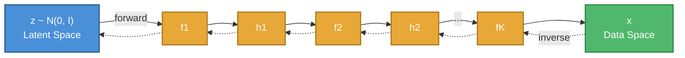
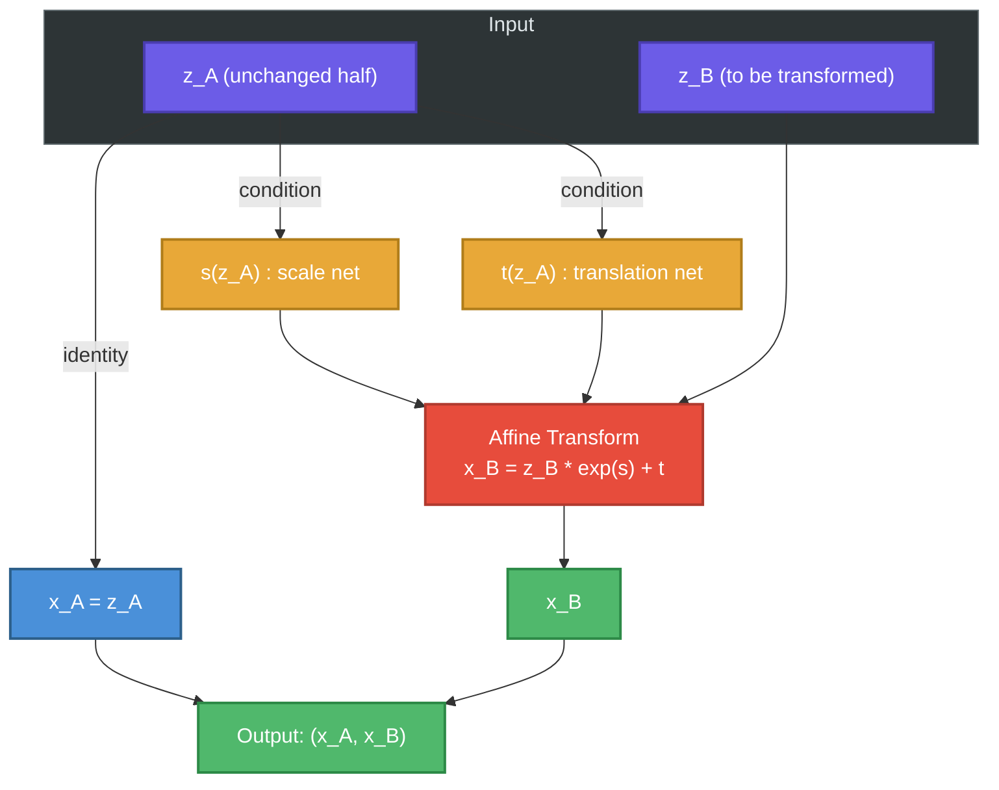
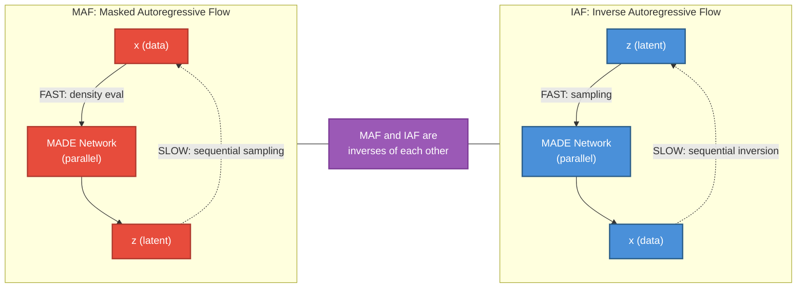
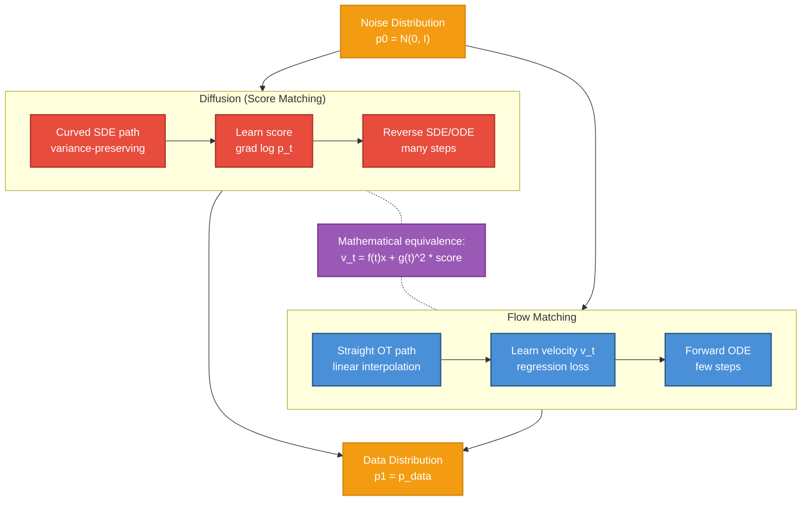

# Module 06: Normalizing Flows and Flow-Based Generative Models

This document builds a first-principles understanding of flow-based generative models --
a family of models that learn to transform a simple distribution (like a Gaussian) into
a complex data distribution through a chain of invertible transformations. The defining
feature of flows is **exact likelihood computation**, something no other major generative
model family provides without approximation.

Every section explains both the mathematical machinery and the design choices that make
these ideas practical at scale.

---

## 1. The Flow Idea

### 1.1 The Core Problem of Generative Modeling

All generative models solve the same fundamental problem: given samples from some
unknown data distribution $p_{\text{data}}(\mathbf{x})$, learn a model
$p_\theta(\mathbf{x})$ that approximates it. The families differ in *how* they
parameterize and train this model:

- **VAEs** optimize a lower bound on the log-likelihood (the ELBO).
- **GANs** sidestep likelihood entirely and use adversarial training.
- **Diffusion models** optimize a variational bound via a denoising objective.
- **Flows** compute the **exact** log-likelihood and optimize it directly via
  maximum likelihood.

### 1.2 Invertible Transformations

A normalizing flow defines a **bijection** (invertible mapping) between a latent
space $\mathcal{Z}$ and the data space $\mathcal{X}$:

$$f_\theta : \mathcal{Z} \to \mathcal{X}$$

Because $f_\theta$ is invertible, we also have:

$$f_\theta^{-1} : \mathcal{X} \to \mathcal{Z}$$

The latent distribution $p_{\mathcal{Z}}(\mathbf{z})$ is chosen to be simple --
typically a standard multivariate Gaussian $\mathcal{N}(\mathbf{0}, \mathbf{I})$.

**Sampling** is straightforward: draw $\mathbf{z} \sim p_{\mathcal{Z}}(\mathbf{z})$,
then compute $\mathbf{x} = f_\theta(\mathbf{z})$.

**Density evaluation** runs the other direction: given a data point $\mathbf{x}$,
compute $\mathbf{z} = f_\theta^{-1}(\mathbf{x})$, then use the change of variables
formula to get $p_\theta(\mathbf{x})$ exactly.

### 1.3 Why "Normalizing"?

The name comes from the fact that the transformation "normalizes" the complex data
distribution into the simple base distribution. Running the flow backward
(data to latent) maps any complicated, multimodal distribution back to a
well-behaved Gaussian.

### 1.4 Why Exact Likelihood Matters

Exact likelihood gives flows several unique advantages:

- **Principled model comparison** -- log-likelihood on held-out data is a direct,
  comparable metric across models.
- **No mode collapse** -- maximum likelihood training covers all modes of the data
  distribution, unlike GANs.
- **No posterior approximation gap** -- unlike VAEs, there is no gap between the
  ELBO and the true log-likelihood.
- **Lossless encoding** -- exact likelihood enables optimal compression via
  bits-back coding.

The price you pay: every layer must be invertible, which constrains the
architecture design significantly.

**Figure 1: The Normalizing Flow Transformation Chain.** The forward direction
(solid arrows) maps latent samples through $K$ invertible transforms to produce
data. The inverse direction (dashed arrows) maps data back to the latent space
for density evaluation. Each $f_k$ must be invertible with a tractable Jacobian
determinant.

---

## 2. Change of Variables Formula

### 2.1 The Single-Transform Case

Suppose $\mathbf{z} \in \mathbb{R}^d$ has density $p_{\mathcal{Z}}(\mathbf{z})$
and $\mathbf{x} = f(\mathbf{z})$ where $f$ is a differentiable bijection. The
density of $\mathbf{x}$ is:

$$p_{\mathcal{X}}(\mathbf{x}) = p_{\mathcal{Z}}\bigl(f^{-1}(\mathbf{x})\bigr) \left| \det \frac{\partial f^{-1}}{\partial \mathbf{x}} \right|$$

Equivalently, using the inverse function theorem
($\det J_{f^{-1}} = (\det J_f)^{-1}$):

$$p_{\mathcal{X}}(\mathbf{x}) = p_{\mathcal{Z}}\bigl(f^{-1}(\mathbf{x})\bigr) \left| \det \frac{\partial f}{\partial \mathbf{z}} \right|^{-1}$$

**Intuition:** When $f$ stretches a region of space, probability density in that
region must decrease to keep the total probability equal to 1. The Jacobian
determinant measures exactly how much $f$ locally stretches or compresses volume.

### 2.2 The Jacobian

The Jacobian of $f : \mathbb{R}^d \to \mathbb{R}^d$ is the $d \times d$ matrix
of all partial derivatives:

$$J_f = \frac{\partial f}{\partial \mathbf{z}} = \begin{bmatrix}
\frac{\partial f_1}{\partial z_1} & \cdots & \frac{\partial f_1}{\partial z_d} \\
\vdots & \ddots & \vdots \\
\frac{\partial f_d}{\partial z_1} & \cdots & \frac{\partial f_d}{\partial z_d}
\end{bmatrix}$$

Computing $\det(J_f)$ for a dense $d \times d$ matrix costs $O(d^3)$, which is
prohibitive when $d$ is the dimensionality of an image (e.g., $d = 3 \times 256 \times 256 = 196{,}608$).
This is why **every practical flow architecture is designed so the Jacobian has
special structure** (triangular, block-diagonal, etc.) that makes the determinant
cheap.

### 2.3 Log-Likelihood Through a Chain

A flow with $K$ layers composes transformations:

$$\mathbf{x} = f_K \circ f_{K-1} \circ \cdots \circ f_1(\mathbf{z})$$

By applying the change of variables formula repeatedly, the log-likelihood
decomposes into a sum:

$$\log p_\theta(\mathbf{x}) = \log p_{\mathcal{Z}}(\mathbf{z}_0) + \sum_{k=1}^{K} \log \left| \det \frac{\partial f_k}{\partial \mathbf{z}_{k-1}} \right|^{-1}$$

where $\mathbf{z}_0 = f_1^{-1} \circ \cdots \circ f_K^{-1}(\mathbf{x})$ and
$\mathbf{z}_{k-1}$ is the input to the $k$-th layer.

This is equivalent to:

$$\log p_\theta(\mathbf{x}) = \log p_{\mathcal{Z}}\bigl(f^{-1}(\mathbf{x})\bigr) - \sum_{k=1}^{K} \log \left| \det J_{f_k} \right|$$

The training objective is to maximize the average log-likelihood over the dataset:

$$\mathcal{L}(\theta) = \frac{1}{N} \sum_{i=1}^{N} \log p_\theta(\mathbf{x}^{(i)})$$

This is a clean, unbiased objective -- no variational bounds, no adversarial
dynamics, no surrogate losses.

### 2.4 The Design Constraint

Every flow layer must satisfy three properties:

1. **Invertibility** -- $f_k$ must be a bijection.
2. **Tractable Jacobian determinant** -- $\log|\det J_{f_k}|$ must be computable
   in $O(d)$ or $O(d \log d)$, not $O(d^3)$.
3. **Expressiveness** -- the composition must be flexible enough to model
   complex distributions.

The tension between (2) and (3) is the central challenge of flow design.

---

## 3. Coupling Layers

### 3.1 The Key Insight

The idea behind coupling layers (introduced in NICE and extended in RealNVP) is
disarmingly simple: **split the input into two halves and transform one half
conditioned on the other, leaving that other half unchanged.**

Given input $\mathbf{z} = (\mathbf{z}_A, \mathbf{z}_B)$ where the split is along
the channel or spatial dimension:

$$\mathbf{x}_A = \mathbf{z}_A$$
$$\mathbf{x}_B = g(\mathbf{z}_B; \, m(\mathbf{z}_A))$$

where $m$ is an arbitrary (non-invertible) neural network and $g$ is an invertible
function conditioned on the output of $m$.

### 3.2 Affine Coupling (RealNVP)

In the affine coupling layer, $g$ is an elementwise affine transformation:

$$\mathbf{x}_B = \mathbf{z}_B \odot \exp\bigl(s(\mathbf{z}_A)\bigr) + t(\mathbf{z}_A)$$

where $s$ (scale) and $t$ (translation) are neural networks that take
$\mathbf{z}_A$ as input. The $\exp$ ensures the scale is always positive.

**Inversion is trivial:**

$$\mathbf{z}_B = (\mathbf{x}_B - t(\mathbf{x}_A)) \odot \exp\bigl(-s(\mathbf{x}_A)\bigr)$$
$$\mathbf{z}_A = \mathbf{x}_A$$

Note that inversion requires only one forward pass through $s$ and $t$ -- the same
cost as the forward pass.

### 3.3 Why the Jacobian Is Triangular

The Jacobian of the coupling layer has a block structure:

$$J = \begin{bmatrix}
\mathbf{I} & \mathbf{0} \\
\frac{\partial \mathbf{x}_B}{\partial \mathbf{z}_A} & \text{diag}\bigl(\exp(s(\mathbf{z}_A))\bigr)
\end{bmatrix}$$

This is a **lower triangular** matrix. The determinant of a triangular matrix is
the product of its diagonal entries:

$$\det(J) = \prod_{j} \exp\bigl(s(\mathbf{z}_A)_j\bigr) = \exp\left(\sum_j s(\mathbf{z}_A)_j\right)$$

$$\log|\det(J)| = \sum_j s(\mathbf{z}_A)_j$$

This costs $O(d)$ -- just a sum over the scale outputs. The neural networks $s$
and $t$ can be arbitrarily complex (deep ResNets, U-Nets, etc.) without affecting
the cost of the determinant computation. This is the magic of coupling layers:
**the complexity of the transform is decoupled from the cost of the determinant.**

### 3.4 Masking Patterns

Since each coupling layer only transforms half the dimensions, you need to
**alternate which half is transformed** across layers. Common patterns:

- **Checkerboard masking** -- alternate spatial positions (used in early RealNVP layers).
- **Channel masking** -- split along the channel axis (used in later RealNVP layers
  after a squeeze operation).
- **Random binary masks** -- less common but valid.

After a squeeze operation (which reshapes spatial dimensions into channels, e.g.,
$H \times W \times C \to \frac{H}{2} \times \frac{W}{2} \times 4C$), channel
masking becomes effective because spatial correlations have been folded into the
channel dimension.

**Figure 2: Affine Coupling Layer.** The input is split into two halves. One
half ($\mathbf{z}_A$) passes through unchanged and conditions the scale and
translation networks. The other half ($\mathbf{z}_B$) is affinely transformed.
The Jacobian is triangular because $\mathbf{x}_A$ does not depend on
$\mathbf{z}_B$.

### 3.5 Limitations and Mitigations

The coupling layer has an inherent limitation: it leaves half the dimensions
unchanged in each layer. This means:

- You need many layers to ensure all dimensions are transformed.
- The alternating pattern must be carefully designed for good mixing.
- Each individual layer has limited expressiveness.

These limitations are addressed by stacking many layers, using expressive
conditioning networks, and combining coupling layers with other invertible
operations (1x1 convolutions, actnorm -- see Section 6 on Glow).

---

## 4. Autoregressive Flows

### 4.1 The Autoregressive Factorization

Any joint density can be decomposed autoregressively:

$$p(\mathbf{x}) = \prod_{i=1}^{d} p(x_i \mid x_1, \ldots, x_{i-1})$$

Autoregressive flows exploit this factorization by making each conditional an
invertible transformation of a single latent dimension:

$$x_i = z_i \cdot \sigma_i(x_1, \ldots, x_{i-1}) + \mu_i(x_1, \ldots, x_{i-1})$$

where $\mu_i$ and $\sigma_i$ are neural network outputs that depend only on the
previous dimensions.

### 4.2 Masked Autoregressive Flow (MAF)

MAF (Papamakarios et al., 2017) uses the autoregressive structure for density
evaluation. Given a data point $\mathbf{x}$:

$$z_i = \frac{x_i - \mu_i(x_1, \ldots, x_{i-1})}{\sigma_i(x_1, \ldots, x_{i-1})}$$

**Density evaluation is fast** (one forward pass through the masked network, all
$z_i$ computed in parallel using a MADE-style architecture), but **sampling is
slow** ($d$ sequential steps, since $x_i$ depends on $x_1, \ldots, x_{i-1}$).

The Jacobian is lower triangular with diagonal entries $1/\sigma_i$:

$$\log|\det J| = -\sum_{i=1}^{d} \log \sigma_i$$

### 4.3 Inverse Autoregressive Flow (IAF)

IAF (Kingma et al., 2016) flips the direction:

$$x_i = z_i \cdot \sigma_i(z_1, \ldots, z_{i-1}) + \mu_i(z_1, \ldots, z_{i-1})$$

Now the conditioning is on the **latent** dimensions (which are all known at
sampling time), so **sampling is fast** (one parallel forward pass), but
**density evaluation is slow** ($d$ sequential steps to invert).

### 4.4 The Fundamental Tradeoff

| Property | MAF | IAF |
|---|---|---|
| Density evaluation | Fast (parallel) | Slow (sequential) |
| Sampling | Slow (sequential) | Fast (parallel) |
| Use case | Training, evaluation | Sampling, VAE posterior |

This tradeoff is fundamental: it arises because the autoregressive dependency
runs in opposite directions for the forward and inverse passes. MAF is preferred
when you need to evaluate likelihoods (training, model comparison). IAF is
preferred when you need fast sampling (e.g., as a flexible posterior in a VAE).

### 4.5 Connection to Coupling Layers

A coupling layer is a special case of an autoregressive flow where the
autoregressive order has only **two groups**: the first group conditions the
second, and all elements within each group are processed in parallel. Coupling
layers sacrifice some expressiveness for the benefit that both the forward and
inverse passes are equally fast.

**Figure 3: MAF vs IAF Tradeoff.** MAF conditions on observed data, making
density evaluation parallel but sampling sequential. IAF conditions on latent
variables, making sampling parallel but density evaluation sequential. The two
are mathematical inverses of each other.

---

## 5. Residual Flows and Continuous Normalizing Flows

### 5.1 Moving Beyond Discrete Layers

The flows described so far use a discrete sequence of $K$ invertible layers.
A natural question: what happens if we take $K \to \infty$ and make the
step size infinitesimal? This leads to **continuous normalizing flows** (CNFs).

### 5.2 Neural ODEs

Instead of discrete transformations, define the evolution of $\mathbf{z}(t)$
through an ordinary differential equation:

$$\frac{d\mathbf{z}(t)}{dt} = v_\theta(\mathbf{z}(t), t)$$

where $v_\theta$ is a neural network parameterizing the velocity field. The
transformation from $t=0$ to $t=1$ maps the base distribution to the data
distribution:

$$\mathbf{z}(1) = \mathbf{z}(0) + \int_0^1 v_\theta(\mathbf{z}(t), t) \, dt$$

This is always invertible (by integrating backward in time) as long as $v_\theta$
is Lipschitz continuous, which standard neural networks with bounded weights
satisfy.

### 5.3 The Instantaneous Change of Variables

For continuous flows, the log-density evolves according to the **instantaneous
change of variables** formula (Chen et al., 2018):

$$\frac{\partial \log p(\mathbf{z}(t), t)}{\partial t} = -\text{tr}\left(\frac{\partial v_\theta}{\partial \mathbf{z}(t)}\right)$$

The log-likelihood at $t=1$ is:

$$\log p(\mathbf{z}(1)) = \log p(\mathbf{z}(0)) - \int_0^1 \text{tr}\left(\frac{\partial v_\theta}{\partial \mathbf{z}(t)}\right) dt$$

The key quantity is the **trace of the Jacobian** (not the determinant). The trace
is the sum of diagonal entries, which costs $O(d)$ if computed exactly -- but
computing all $d$ diagonal entries of $\partial v_\theta / \partial \mathbf{z}$
still requires $d$ backward passes.

### 5.4 FFJORD and Hutchinson's Trace Estimator

FFJORD (Grathwohl et al., 2019) makes continuous flows practical by using
**Hutchinson's trace estimator**:

$$\text{tr}(A) = \mathbb{E}_{\boldsymbol{\epsilon} \sim p(\boldsymbol{\epsilon})}\left[\boldsymbol{\epsilon}^T A \boldsymbol{\epsilon}\right]$$

where $\boldsymbol{\epsilon}$ is a random vector with $\mathbb{E}[\boldsymbol{\epsilon}] = \mathbf{0}$
and $\text{Cov}(\boldsymbol{\epsilon}) = \mathbf{I}$ (e.g., standard Gaussian or
Rademacher).

This reduces the cost from $O(d)$ backward passes to $O(1)$ -- a single
vector-Jacobian product $\boldsymbol{\epsilon}^T (\partial v_\theta / \partial \mathbf{z})$
computable via a single backward pass. The estimate is unbiased, and variance
decreases with more samples of $\boldsymbol{\epsilon}$.

The full FFJORD training objective becomes:

$$\log p(\mathbf{x}) = \log p(\mathbf{z}(0)) - \int_0^1 \mathbb{E}_{\boldsymbol{\epsilon}}\left[\boldsymbol{\epsilon}^T \frac{\partial v_\theta}{\partial \mathbf{z}(t)} \boldsymbol{\epsilon}\right] dt$$

### 5.5 Residual Flows (Discrete)

An alternative to continuous flows: use residual connections with constrained
Lipschitz constants. A residual flow layer has the form:

$$\mathbf{x} = \mathbf{z} + g_\theta(\mathbf{z})$$

where $\text{Lip}(g_\theta) < 1$ guarantees invertibility (by the Banach fixed
point theorem -- the inverse can be computed by iterative fixed-point iteration).

The log-determinant is computed using the power series:

$$\log|\det(I + J_g)| = \text{tr}\left(\sum_{k=1}^{\infty} \frac{(-1)^{k+1}}{k} J_g^k\right)$$

which is estimated stochastically using the "Russian roulette" estimator for
unbiased truncation.

### 5.6 Advantages of Continuous / Residual Flows

- **Free-form architecture** -- the velocity network $v_\theta$ can be any
  architecture (no coupling or autoregressive constraints).
- **Adaptive computation** -- ODE solvers use adaptive step sizes, spending more
  compute where the dynamics are complex.
- **Memory efficiency** -- the adjoint method allows backpropagation through the
  ODE solver with $O(1)$ memory (constant in the number of solver steps).
- **Theoretical elegance** -- connections to optimal transport, fluid dynamics,
  and Fokker-Planck equations.

The tradeoff: ODE solvers are typically slower than a fixed set of coupling
layers, especially at inference time.

---

## 6. Glow

### 6.1 Overview

Glow (Kingma & Dhariwal, 2018) is a landmark flow-based model that achieved
high-quality image generation by combining three ideas into each flow step:

1. **Actnorm** -- data-dependent initialization of scale and bias.
2. **Invertible 1x1 convolution** -- a learned permutation replacing fixed
   alternating masks.
3. **Affine coupling layer** -- the workhorse transform from RealNVP.

### 6.2 Actnorm

Actnorm is an affine transformation with per-channel scale and bias parameters:

$$\mathbf{x} = \mathbf{s} \odot \mathbf{z} + \mathbf{b}$$

where $\mathbf{s}, \mathbf{b} \in \mathbb{R}^C$ (one value per channel). The
parameters are initialized using data-dependent normalization: on the first
mini-batch, $\mathbf{s}$ and $\mathbf{b}$ are set so the output has zero mean
and unit variance per channel. After initialization, they are treated as regular
trainable parameters.

This replaces batch normalization (which is not invertible and has train/test
discrepancies) with a clean, invertible alternative.

Log-determinant: $\log|\det J| = H \cdot W \cdot \sum_c \log |s_c|$, where $H, W$
are spatial dimensions.

### 6.3 Invertible 1x1 Convolutions

In RealNVP, the alternating mask pattern is fixed. Glow replaces this with a
**learned permutation** implemented as an invertible 1x1 convolution -- essentially
a $C \times C$ weight matrix $W$ applied independently to each spatial position.

The log-determinant is:

$$\log|\det J| = H \cdot W \cdot \log|\det W|$$

Computing $\log|\det W|$ costs $O(C^3)$ via LU decomposition, which is cheap
because $C$ (number of channels) is small (typically 48-512), unlike the spatial
dimensions.

**LU parameterization:** To make this even cheaper, $W$ is parameterized via its
LU decomposition $W = PLU$, where $P$ is a fixed permutation matrix (sampled once
at initialization), $L$ is lower triangular with ones on the diagonal, and $U$ is
upper triangular. Then $\log|\det W| = \sum_i \log|U_{ii}|$, reducing the cost
to $O(C)$.

### 6.4 Multi-Scale Architecture

Glow uses a multi-scale architecture where spatial resolution is progressively
reduced:

1. **Squeeze** -- reshape $H \times W \times C$ to $\frac{H}{2} \times \frac{W}{2} \times 4C$
   by folding spatial dimensions into channels.
2. **Flow steps** -- apply $K$ steps of (actnorm + 1x1 conv + coupling) at this
   resolution.
3. **Split** -- factor out half the channels as "early output," modeling them
   directly with the base distribution.
4. **Repeat** at the next scale.

The split operation is crucial for efficiency: it means that at each scale, half
the dimensions are "done" and no longer need to be processed through subsequent
layers. This gives a hierarchical latent representation where early-split
dimensions capture large-scale structure and later dimensions capture fine details.

### 6.5 Glow Results

Glow achieved 3.35 bits/dim on CIFAR-10 and produced interpolations and
manipulations of 256x256 face images that were, at the time, the best results
from a likelihood-based model. The latent space was shown to have meaningful
structure: linear interpolation between latent codes of two faces produced
smooth, realistic transitions.

---

## 7. Flow Matching

### 7.1 The Simulation-Free Revolution

Classical normalizing flows (coupling layers, autoregressive flows, Glow)
require architectures that are explicitly invertible with tractable Jacobian
determinants. Continuous normalizing flows (FFJORD) remove the architectural
constraints but require expensive ODE simulation during training.

**Flow matching** (Lipman et al., 2023; Liu et al., 2023; Albergo & Vanden-Eijnden,
2023) achieves the best of both worlds: it trains a continuous normalizing flow
**without simulating the ODE during training**. This is done by regressing the
velocity field directly against a target velocity, using a **conditional** flow
that has a known, closed-form expression.

### 7.2 The Marginal and Conditional Perspectives

Define a time-dependent probability path $p_t(\mathbf{x})$ for $t \in [0, 1]$
with:

- $p_0(\mathbf{x}) = p_{\text{noise}}(\mathbf{x})$ (e.g., standard Gaussian)
- $p_1(\mathbf{x}) \approx p_{\text{data}}(\mathbf{x})$

A velocity field $v_t(\mathbf{x})$ generates this path if it satisfies the
continuity equation:

$$\frac{\partial p_t}{\partial t} + \nabla \cdot (p_t v_t) = 0$$

The **marginal flow matching** objective is:

$$\mathcal{L}_{\text{FM}}(\theta) = \mathbb{E}_{t \sim U[0,1], \, \mathbf{x} \sim p_t(\mathbf{x})} \left\| v_\theta(\mathbf{x}, t) - u_t(\mathbf{x}) \right\|^2$$

where $u_t(\mathbf{x})$ is the target velocity field that generates $p_t$. The
problem: both $p_t(\mathbf{x})$ and $u_t(\mathbf{x})$ are intractable in general.

### 7.3 Conditional Flow Matching

The key insight: instead of working with the marginal path, define a **conditional**
probability path $p_t(\mathbf{x} \mid \mathbf{x}_1)$ for each data point
$\mathbf{x}_1$:

$$p_t(\mathbf{x} \mid \mathbf{x}_1) = \mathcal{N}\bigl(\mathbf{x}; \, t\mathbf{x}_1, \, (1-t)^2 \mathbf{I}\bigr)$$

This is a Gaussian that starts at $\mathcal{N}(\mathbf{0}, \mathbf{I})$ when $t=0$
and collapses to a point mass at $\mathbf{x}_1$ when $t=1$.

The conditional velocity field that generates this path is:

$$u_t(\mathbf{x} \mid \mathbf{x}_1) = \frac{\mathbf{x}_1 - \mathbf{x}}{1 - t}$$

The **conditional flow matching** (CFM) objective is:

$$\mathcal{L}_{\text{CFM}}(\theta) = \mathbb{E}_{t, \, \mathbf{x}_1 \sim p_{\text{data}}, \, \mathbf{x} \sim p_t(\mathbf{x} \mid \mathbf{x}_1)} \left\| v_\theta(\mathbf{x}, t) - u_t(\mathbf{x} \mid \mathbf{x}_1) \right\|^2$$

**Theorem (Lipman et al.):** The gradients of $\mathcal{L}_{\text{CFM}}$ and
$\mathcal{L}_{\text{FM}}$ are identical (up to a constant). This means we can
train the marginal flow by only ever using the tractable conditional flow.

In practice, training is simple:

1. Sample $\mathbf{x}_1 \sim p_{\text{data}}$ and $\mathbf{x}_0 \sim \mathcal{N}(\mathbf{0}, \mathbf{I})$.
2. Sample $t \sim U[0,1]$.
3. Construct $\mathbf{x}_t = t \mathbf{x}_1 + (1-t) \mathbf{x}_0$.
4. Regress $v_\theta(\mathbf{x}_t, t)$ against $\mathbf{x}_1 - \mathbf{x}_0$.

That is it. No ODE simulation, no Jacobian computation, no special architecture.

### 7.4 Optimal Transport Paths

The conditional path described above uses a **linear interpolation** between noise
and data. This corresponds to the **optimal transport** displacement interpolation
between the two distributions (in the case of Gaussian conditionals).

Why this matters: the OT path is the "straightest" path between the two
distributions, which means:

- The velocity field is smoother and easier to learn.
- At inference time, ODE solvers require fewer steps (straighter trajectories
  need fewer corrections).
- Compared to diffusion model paths (which curve through high-noise regions),
  OT paths are significantly more efficient.

### 7.5 Rectified Flows

Rectified flows (Liu et al., 2023) take the OT idea further. The core idea is
iterative straightening:

1. **Train** a flow matching model to transport $p_0$ to $p_1$.
2. **Generate** paired samples $(\mathbf{x}_0, \mathbf{x}_1)$ by running the
   learned ODE.
3. **Retrain** a new model on the paired data, learning the straight-line
   interpolation between matched pairs.
4. **Repeat** -- each iteration produces straighter trajectories.

After rectification, the trajectories become nearly straight, meaning the ODE
can be solved with very few Euler steps (even 1-2 steps) with minimal quality
loss. This is the foundation of recent fast generation methods.

### 7.6 Connection to Diffusion Models

Flow matching and diffusion models are deeply connected:

- **Diffusion models** define a stochastic forward process (adding noise) and
  learn to reverse it. The reverse process involves a score function
  $\nabla_{\mathbf{x}} \log p_t(\mathbf{x})$.
- **Flow matching** defines a deterministic ODE that transports noise to data
  and learns the velocity field $v_t(\mathbf{x})$.

The two are related by:

$$v_t(\mathbf{x}) = f(t)\mathbf{x} + g(t)^2 \nabla_{\mathbf{x}} \log p_t(\mathbf{x})$$

where $f(t)$ and $g(t)$ are the drift and diffusion coefficients of the
corresponding SDE.

Key differences in practice:

| Aspect | Diffusion (Score Matching) | Flow Matching |
|---|---|---|
| Training target | Score $\nabla \log p_t$ | Velocity $v_t$ |
| Path shape | Curved (variance-preserving/exploding) | Straight (OT interpolation) |
| Inference steps | Typically 20-1000 | Typically 1-50 |
| Architecture constraints | None | None |
| Likelihood | Approximate (via probability flow ODE) | Exact (via ODE + trace) |

Flow matching has become the dominant paradigm for state-of-the-art generative
models (Stable Diffusion 3, Flux, etc.) largely because the straighter paths
enable faster inference.

**Figure 4: Diffusion (Score Matching) vs Flow Matching.** Both methods transport
a noise distribution to a data distribution. Diffusion uses curved stochastic
paths and learns the score function; flow matching uses straight OT paths and
learns the velocity field. The straighter paths of flow matching enable inference
with far fewer ODE solver steps.

---

## 8. Applications

### 8.1 Exact Likelihood and Model Evaluation

The most direct application of flows is as density estimators. Because flows
compute exact log-likelihoods, they can be used for:

- **Anomaly detection** -- assign likelihood to new data; low-likelihood points
  are anomalies. (Caveat: flows can assign high likelihood to out-of-distribution
  data due to the volume term in the change of variables formula -- this is a
  known failure mode that requires careful handling.)
- **Model comparison** -- bits-per-dimension on held-out data is a standard metric
  for comparing generative models.
- **Lossless compression** -- exact likelihood enables optimal coding schemes
  (bits-back coding with ANS).

### 8.2 Latent Representations

The invertible mapping between data and latent space means every data point has
a unique, deterministic latent code. This enables:

- **Interpolation** -- linear interpolation in latent space produces smooth
  transitions in data space (demonstrated dramatically in Glow with face images).
- **Attribute manipulation** -- find directions in latent space corresponding to
  semantic attributes (e.g., smile, age, glasses) and shift latent codes along
  these directions.
- **Disentanglement** -- the multi-scale architecture of Glow naturally separates
  coarse structure (early splits) from fine details (late splits).

### 8.3 Speech Synthesis: WaveGlow

WaveGlow (Prenger et al., 2019) applies the Glow architecture to raw audio
waveform generation:

- 12 coupling layers operating on audio segments.
- Affine coupling with dilated convolution conditioning networks (inspired by
  WaveNet).
- Generates 22kHz audio at faster-than-real-time on GPU.
- No autoregressive bottleneck -- the entire waveform is generated in a single
  forward pass.

This was a significant advance because previous high-quality neural vocoders
(WaveNet, WaveRNN) were autoregressive and slow. WaveGlow achieved comparable
quality with parallel generation.

### 8.4 Image Generation

The evolution of flow-based image generation:

- **NICE** (2014) -- additive coupling layers, proof of concept.
- **RealNVP** (2017) -- affine coupling, multi-scale architecture, first
  competitive image results.
- **Glow** (2018) -- 1x1 convolutions, high-resolution face generation,
  3.35 bits/dim on CIFAR-10.
- **Flow++** (2019) -- variational dequantization, logistic coupling, 3.08
  bits/dim on CIFAR-10.
- **Residual Flows** (2019) -- free-form layers with Lipschitz constraints.
- **Flow Matching models** (2023-present) -- Stable Diffusion 3, Flux, and
  other state-of-the-art systems use flow matching as their core training
  paradigm.

### 8.5 Scientific Applications

Flows have found significant use in scientific computing:

- **Lattice field theory** -- flows can generate configurations of lattice
  gauge fields for Monte Carlo simulations, dramatically reducing
  autocorrelation times.
- **Molecular generation** -- equivariant flows generate 3D molecular
  conformations while respecting physical symmetries.
- **Bayesian inference** -- normalizing flows as flexible variational
  posteriors (building on the IAF idea), enabling more accurate approximate
  inference.
- **Astrophysics** -- posterior estimation for gravitational wave parameter
  inference using conditional flows.

---

## 9. Summary: The Flow Family at a Glance

| Model | Jacobian Cost | Sampling | Density Eval | Architecture |
|---|---|---|---|---|
| RealNVP | $O(d)$ | Fast (parallel) | Fast (parallel) | Coupling layers |
| Glow | $O(d) + O(C^3)$ | Fast (parallel) | Fast (parallel) | Coupling + 1x1 conv |
| MAF | $O(d)$ | Slow (sequential) | Fast (parallel) | Autoregressive (MADE) |
| IAF | $O(d)$ | Fast (parallel) | Slow (sequential) | Autoregressive (MADE) |
| FFJORD | $O(1)$ stochastic | ODE solve | ODE solve | Free-form + Neural ODE |
| Residual Flow | $O(1)$ stochastic | Fixed-point iter | Forward pass | Free-form + Lipschitz |
| Flow Matching | N/A (training) | ODE solve (few steps) | ODE solve | Free-form (e.g., U-Net, DiT) |

The field has converged toward **flow matching** as the dominant paradigm for
large-scale generation, because it combines the theoretical elegance of
continuous normalizing flows with the practical simplicity of a regression
loss and the efficiency of straight OT paths. Classical discrete flows
(coupling, autoregressive) remain important for applications requiring
exact, fast likelihood evaluation or for theoretical understanding.

---

## 10. Key Equations Reference

**Change of variables (single transform):**

$$\log p(\mathbf{x}) = \log p(\mathbf{z}) - \log|\det J_f|, \quad \mathbf{z} = f^{-1}(\mathbf{x})$$

**Change of variables (chain of $K$ transforms):**

$$\log p(\mathbf{x}) = \log p(\mathbf{z}_0) - \sum_{k=1}^{K} \log|\det J_{f_k}|$$

**Affine coupling log-determinant:**

$$\log|\det J| = \sum_j s(\mathbf{z}_A)_j$$

**Instantaneous change of variables (continuous):**

$$\frac{\partial \log p(\mathbf{z}(t))}{\partial t} = -\text{tr}\left(\frac{\partial v_\theta}{\partial \mathbf{z}}\right)$$

**Hutchinson's trace estimator:**

$$\text{tr}(A) = \mathbb{E}_{\boldsymbol{\epsilon}}\left[\boldsymbol{\epsilon}^T A \boldsymbol{\epsilon}\right]$$

**Conditional flow matching loss:**

$$\mathcal{L}_{\text{CFM}} = \mathbb{E}_{t, \mathbf{x}_0, \mathbf{x}_1}\left\| v_\theta(t\mathbf{x}_1 + (1-t)\mathbf{x}_0, \, t) - (\mathbf{x}_1 - \mathbf{x}_0) \right\|^2$$

**1x1 convolution log-determinant:**

$$\log|\det J| = H \cdot W \cdot \log|\det W|$$
