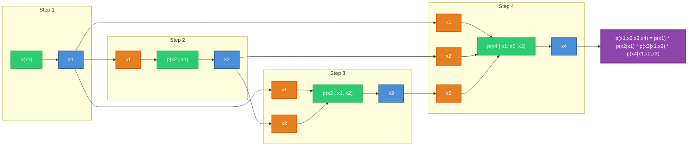
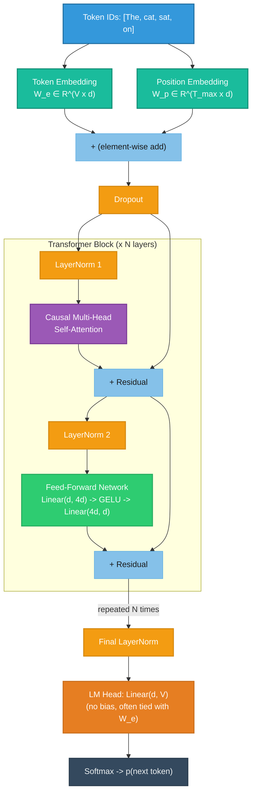
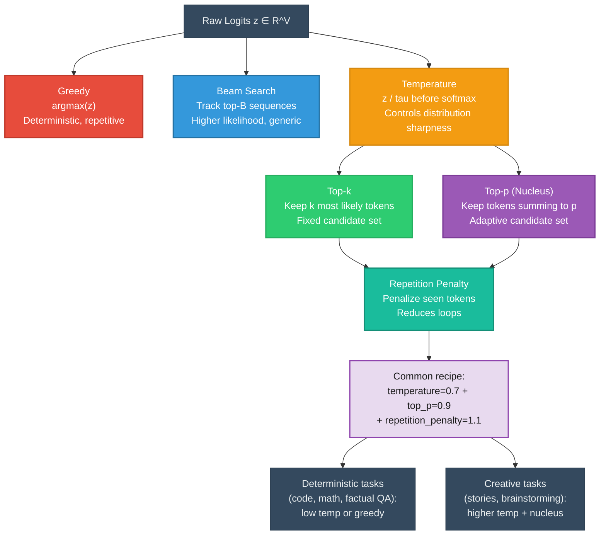
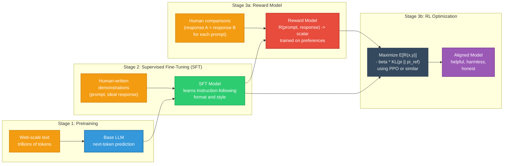

# Module 07: Autoregressive Generative Models

Autoregressive models are the engine behind modern language generation. GPT,
LLaMA, Claude, Gemini -- every large language model is, at its core, an
autoregressive model: it generates one token at a time, conditioning each new
token on everything that came before it. This document builds the idea from
first principles, walks through the architecture and training of GPT-style
models, covers the tricks that make generation controllable, and extends the
autoregressive paradigm to images and efficient deployment.

---

## 1. The Autoregressive Idea

### 1.1 Factoring Joint Probability

Suppose we want to model a joint distribution over a sequence of random
variables $x_1, x_2, \ldots, x_T$. The chain rule of probability gives us an
exact factorization -- no approximations, no assumptions:

$$p(x_1, x_2, \ldots, x_T) = \prod_{t=1}^{T} p(x_t \mid x_1, x_2, \ldots, x_{t-1})$$

or more compactly:

$$p(\mathbf{x}) = \prod_{t=1}^{T} p(x_t \mid \mathbf{x}_{<t})$$

This is the **autoregressive factorization**. It says: the probability of a
sequence equals the product of the conditional probabilities of each element
given all preceding elements.

**Why this is powerful:** This factorization holds for *any* joint distribution.
There is no modeling error introduced by the factorization itself -- all the
modeling capacity goes into approximating each conditional $p(x_t \mid \mathbf{x}_{<t})$
well. If we can learn perfect conditionals, we recover the true joint distribution
exactly.

### 1.2 Why Left-to-Right?

The chain rule can be applied in any order -- left-to-right, right-to-left,
random permutation (as in XLNet). Left-to-right is the dominant choice because:

1. **Natural language is produced left-to-right.** Humans write and speak
   sequentially. Training a model in the same direction aligns with the data's
   causal structure.
2. **Generation is straightforward.** To sample from the joint, we sample
   $x_1 \sim p(x_1)$, then $x_2 \sim p(x_2 \mid x_1)$, then
   $x_3 \sim p(x_3 \mid x_1, x_2)$, and so on. Each step only requires
   evaluating a single conditional.
3. **Causal masking is simple to implement.** A triangular attention mask
   ensures position $t$ can only attend to positions $1, \ldots, t$, which
   maps directly to the factorization order.

### 1.3 Autoregressive Factorization Visualized

The following diagram shows how a four-token sequence is generated step by step.
Each token conditions on all tokens that precede it:



### 1.4 Contrast with Other Generative Paradigms

| Paradigm | How it models $p(\mathbf{x})$ | Generation |
|---|---|---|
| **Autoregressive** | $\prod_t p(x_t \mid \mathbf{x}_{<t})$ | Sequential, one token at a time |
| **VAE** | $\int p(x \mid z) p(z) \, dz$ | Sample latent $z$, decode in one shot |
| **Diffusion** | Iterative denoising from $\mathcal{N}(0, I)$ | Multi-step refinement |
| **GAN** | Implicit via generator network | Single forward pass through generator |
| **Flow** | Invertible transformations of a base distribution | Single forward pass through inverse |

The autoregressive approach trades generation speed for exact likelihood
computation and training simplicity -- a trade-off that is extremely favorable
for language.

---

## 2. Language Modeling

### 2.1 Next-Token Prediction

A **language model** is an autoregressive model over token sequences. Given a
sequence of tokens $(w_1, w_2, \ldots, w_{t-1})$, it predicts a probability
distribution over the next token $w_t$:

$$p(w_t \mid w_1, w_2, \ldots, w_{t-1})$$

Training a language model means learning to assign high probability to the
tokens that actually follow in the training corpus. That is the entire
objective -- remarkably simple, yet sufficient to produce models that write
coherent text, answer questions, write code, and reason.

### 2.2 Tokenization

Raw text must be converted to a sequence of integers before a model can process
it. This conversion is **tokenization**.

**Byte Pair Encoding (BPE):**

1. Start with a vocabulary of individual characters (or bytes).
2. Count all adjacent pairs of tokens in the corpus.
3. Merge the most frequent pair into a new token.
4. Repeat until the vocabulary reaches a target size (e.g., 32,000 or 100,000).

Example: if "th" appears frequently, it becomes a single token. Then "the"
might merge into one token. Common words become single tokens; rare words are
split into subword pieces.

**SentencePiece:** A tokenizer that operates on raw text (including whitespace)
without requiring pre-tokenization into words. It treats the input as a raw
byte stream, making it language-agnostic. Used by LLaMA, T5, and many
multilingual models.

**Key properties of modern tokenizers:**

| Property | Typical value | Why it matters |
|---|---|---|
| Vocabulary size | 32K -- 128K | Larger vocab = shorter sequences but bigger embedding matrix |
| Coverage | All UTF-8 bytes | No "unknown token" problem |
| Compression ratio | ~3-4 characters per token (English) | Determines effective context length |
| Subword splitting | Rare words split, common words intact | Balances vocabulary size with sequence length |

**Why tokenization matters for model behavior:** A model's context window is
measured in tokens, not characters -- 4096 tokens is roughly 3000 English words
but far fewer in other languages. Arithmetic is hard partly because numbers
tokenize inconsistently ("127" may be one token, "1273" may split into
"127" + "3").

### 2.3 Perplexity

**Perplexity** is the standard evaluation metric for language models:

$$\text{PPL} = \exp\left(-\frac{1}{T} \sum_{t=1}^{T} \log p(w_t \mid w_{<t})\right)$$

This is the exponentiated average negative log-likelihood per token, or
equivalently, $\text{PPL} = \exp(H)$ where $H$ is the cross-entropy of the
model's predictions.

**Intuition:** Perplexity measures how "surprised" the model is by the actual
next token, on average. A perplexity of $k$ means the model is, on average, as
uncertain as if it were choosing uniformly among $k$ options at each step.

- PPL = 1: the model perfectly predicts every token (impossible in practice).
- PPL = $V$ (vocabulary size): the model is completely random.
- GPT-3 achieved ~20 PPL on standard benchmarks; modern models are lower.

Lower perplexity means better language modeling, but it does not capture
generation quality or factual accuracy -- hence the need for downstream
benchmarks and human evaluation.

---

## 3. GPT Architecture

GPT (Generative Pre-trained Transformer) is a **decoder-only transformer**.
"Decoder-only" means it uses only the decoder half of the original
encoder-decoder transformer from "Attention Is All You Need," with causal
(left-to-right) masking.

### 3.1 High-Level Architecture



### 3.2 Token and Position Embeddings

The input to the model is the sum of two embeddings:

$$\mathbf{h}_0^{(t)} = W_e[w_t] + W_p[t]$$

where:
- $W_e \in \mathbb{R}^{V \times d}$ is the **token embedding matrix** that maps
  each token ID to a $d$-dimensional vector.
- $W_p \in \mathbb{R}^{T_{\max} \times d}$ is the **position embedding matrix**
  that maps each position index to a $d$-dimensional vector.

GPT-2 uses learned absolute position embeddings. More recent models (LLaMA,
Mistral) use **Rotary Position Embeddings (RoPE)**, which encode relative
position information by rotating query and key vectors:

$$\text{RoPE}(q, m) = q \cdot e^{im\theta}$$

where $m$ is the position and $\theta$ varies across dimensions. RoPE allows
the model to generalize to sequence lengths longer than those seen during
training (with techniques like NTK-aware scaling or YaRN).

### 3.3 Causal Masking

The defining feature of decoder-only transformers is the **causal mask** (also
called the "attention mask" or "look-ahead mask"). It is an upper-triangular
matrix of $-\infty$ values added to the attention scores *before* softmax:

$$\text{Attention}(Q, K, V) = \text{softmax}\left(\frac{QK^T}{\sqrt{d_k}} + M\right)V$$

where $M_{ij} = 0$ if $i \geq j$ and $M_{ij} = -\infty$ if $i < j$.

After adding $-\infty$ and applying softmax, those positions get zero weight.
The effect: token at position $t$ can only attend to tokens at positions
$1, 2, \ldots, t$. This enforces the autoregressive property -- the model
cannot "peek" at future tokens.

**Why this is elegant:** A single forward pass computes
$p(x_t \mid \mathbf{x}_{<t})$ for *all* $t$ simultaneously during training --
$T$ conditional probability estimates in one pass instead of $T$ separate
forward passes.

### 3.4 The Transformer Block

Each block applies two sub-layers with residual connections and layer
normalization (using pre-norm, the modern default):

**Multi-head causal self-attention:**

$$Q = \mathbf{h} W_Q, \quad K = \mathbf{h} W_K, \quad V = \mathbf{h} W_V$$
$$\text{head}_i = \text{softmax}\left(\frac{Q_i K_i^T}{\sqrt{d_k}} + M\right) V_i$$
$$\text{Attn}(\mathbf{h}) = \text{Concat}(\text{head}_1, \ldots, \text{head}_H) W_O$$
$$\mathbf{h}' = \mathbf{h} + \text{Attn}(\text{LayerNorm}(\mathbf{h}))$$

**Feed-forward network (FFN):**

$$\text{FFN}(\mathbf{x}) = W_2 \cdot \text{GELU}(W_1 \mathbf{x} + \mathbf{b}_1) + \mathbf{b}_2$$

where $W_1 \in \mathbb{R}^{d \times 4d}$ and $W_2 \in \mathbb{R}^{4d \times d}$.
The inner dimension is typically $4\times$ the model dimension.

$$\mathbf{h}'' = \mathbf{h}' + \text{FFN}(\text{LayerNorm}(\mathbf{h}'))$$

Modern variants (LLaMA, Mistral) use **SwiGLU** instead of GELU:

$$\text{SwiGLU}(\mathbf{x}) = (\mathbf{x} W_1 \odot \text{Swish}(\mathbf{x} W_{\text{gate}})) W_2$$

This introduces a gating mechanism that empirically improves performance.

### 3.5 The Language Model Head

The final layer converts hidden states back to token probabilities:

$$\text{logits} = \mathbf{h}_N W_e^T$$

Note that the LM head often **ties weights** with the token embedding matrix
$W_e$ (transposed). This halves the parameter count of the embedding/output
layers and acts as a regularizer.

The logits are a vector in $\mathbb{R}^V$ (one score per vocabulary token).
Applying softmax gives the predicted probability distribution:

$$p(w_t = v \mid w_{<t}) = \text{softmax}(\text{logits})_v = \frac{\exp(\text{logits}_v)}{\sum_{j=1}^{V} \exp(\text{logits}_j)}$$

### 3.6 GPT Model Sizes

| Model | Layers ($N$) | Hidden dim ($d$) | Heads ($H$) | Parameters |
|---|---|---|---|---|
| GPT-2 Small | 12 | 768 | 12 | 117M |
| GPT-2 Medium | 24 | 1024 | 16 | 345M |
| GPT-2 Large | 36 | 1280 | 20 | 774M |
| GPT-2 XL | 48 | 1600 | 25 | 1.5B |
| GPT-3 | 96 | 12288 | 96 | 175B |
| LLaMA-2 7B | 32 | 4096 | 32 | 6.7B |
| LLaMA-2 70B | 80 | 8192 | 64 | 70B |

The parameter count is dominated by attention projections ($4d^2$ per layer)
and FFN weights ($8d^2$ per layer), giving roughly $12Nd^2 + Vd$ total.

---

## 4. Training

### 4.1 Cross-Entropy Loss on Next Token

The training objective is straightforward: minimize the cross-entropy between
the model's predicted distribution and the actual next token across all
positions in the training data:

$$\mathcal{L} = -\frac{1}{T} \sum_{t=1}^{T} \log p_\theta(w_t \mid w_{<t})$$

This is equivalent to maximum likelihood estimation (MLE) of the model
parameters $\theta$. The model sees a sequence of tokens and is trained to
predict each token given its predecessors. Because the causal mask allows
parallel computation of all positions, we get $T$ training signals from a
single sequence in a single forward pass.

### 4.2 Teacher Forcing

During training, the model conditions on **ground-truth** previous tokens, not
its own predictions. This is **teacher forcing** -- it avoids compounding
errors where a wrong prediction at position $t$ corrupts all subsequent context.

The downside is **exposure bias**: at inference, the model conditions on its
own (possibly erroneous) tokens. In practice, this matters less than early NLP
literature suggested, because modern LLMs generate well enough that errors are
mild, and RLHF further addresses the distribution shift.

### 4.3 Large-Scale Data

Modern LLMs are trained on massive, diverse text corpora:

| Dataset | Scale | Contents |
|---|---|---|
| Common Crawl | Trillions of tokens | Web pages (filtered and deduplicated) |
| The Pile | 800GB | Curated mix: books, code, arXiv, Wikipedia, StackExchange |
| RedPajama | 1.2T tokens | Open reproduction of LLaMA training data |
| RefinedWeb | 5T tokens | Aggressively filtered Common Crawl |
| StarCoder data | 783GB | Code from GitHub in 80+ languages |

Data quality matters enormously -- deduplication, filtering, and careful mixing
of sources are critical engineering decisions.

### 4.4 Scaling Laws

**The Chinchilla scaling laws** (Hoffmann et al., 2022) established that for a
given compute budget $C$, the optimal model size $N$ (parameters) and dataset
size $D$ (tokens) should scale proportionally:

$$N_{\text{opt}} \propto C^{0.5}, \quad D_{\text{opt}} \propto C^{0.5}$$

**The key insight:** GPT-3 was *undertrained* -- too many parameters for the
data it saw. Chinchilla showed a smaller model on more data outperforms a
larger model on less data. The optimal ratio is roughly 20 tokens per parameter.

| Model | Parameters | Training tokens | Tokens/param ratio |
|---|---|---|---|
| GPT-3 | 175B | 300B | 1.7 |
| Chinchilla | 70B | 1.4T | 20 |
| LLaMA | 65B | 1.4T | 21.5 |
| LLaMA-2 | 70B | 2T | 28.6 |

**The general scaling law** (Kaplan et al., 2020):

$$L(N, D) = \frac{A}{N^\alpha} + \frac{B}{D^\beta} + L_\infty$$

where $L_\infty$ is the irreducible loss, $\alpha \approx 0.076$, and
$\beta \approx 0.095$. Loss decreases as a power law with both model size and
data size, with no sign of saturation at current scales.

---

## 5. Decoding Strategies

Training gives us $p(w_t \mid w_{<t})$ -- a probability distribution over the
next token. **Decoding** is the process of actually selecting tokens from this
distribution to generate text. The choice of decoding strategy dramatically
affects output quality.

### 5.1 Greedy Decoding

At each step, pick the token with the highest probability:

$$w_t = \arg\max_v p(v \mid w_{<t})$$

**Pros:** Fast, deterministic, simple.
**Cons:** Produces repetitive, bland text. Greedy local choices do not
necessarily lead to globally good sequences. Once the model enters a repetitive
loop, there is no mechanism to escape.

### 5.2 Beam Search

Maintain the top $B$ (beam width) partial sequences at each step, expanding
each by all possible next tokens, then keeping only the top $B$ overall:

$$\text{score}(w_1, \ldots, w_t) = \sum_{i=1}^{t} \log p(w_i \mid w_{<i})$$

**Pros:** Finds higher-probability sequences than greedy. Good for tasks where
there is a "correct" output (translation, summarization).
**Cons:** Still tends to produce generic text. Beam search with large beams
often produces *worse* open-ended text than sampling methods because it
over-optimizes for likelihood, producing text that is probable but boring.

### 5.3 Temperature Sampling

Sample from the distribution after scaling logits by temperature $\tau$:

$$p_\tau(v) = \frac{\exp(z_v / \tau)}{\sum_j \exp(z_j / \tau)}$$

- $\tau < 1$: Sharpens the distribution (more deterministic, less creative).
- $\tau = 1$: Samples from the unmodified distribution.
- $\tau > 1$: Flattens the distribution (more random, more creative).

Temperature is the simplest knob for controlling the diversity-quality trade-off.

### 5.4 Top-k Sampling

Restrict sampling to the $k$ most probable tokens. Zero out all other
probabilities and renormalize:

$$p_{\text{top-k}}(v) = \begin{cases} \frac{p(v)}{\sum_{v' \in \text{top-k}} p(v')} & \text{if } v \in \text{top-k} \\ 0 & \text{otherwise} \end{cases}$$

**Pros:** Prevents sampling extremely unlikely tokens that would derail
generation.
**Cons:** A fixed $k$ is suboptimal. When the model is confident (one token
has 95% probability), $k=50$ still allows 49 unlikely tokens. When the model
is uncertain (flat distribution over many plausible continuations), $k=50$
might cut off valid options.

### 5.5 Top-p (Nucleus) Sampling

Instead of fixing $k$, fix a cumulative probability threshold $p$. Include the
smallest set of tokens whose cumulative probability exceeds $p$:

$$\text{top-p}(V) = \min \{S \subseteq V : \sum_{v \in S} p(v) \geq p\}$$

with tokens sorted by descending probability.

**Pros:** Adaptively adjusts the number of candidate tokens based on the
model's confidence. When the model is certain, only a few tokens pass the
threshold. When uncertain, many tokens are included.
**Cons:** The threshold $p$ still requires tuning. Typical values: $p = 0.9$
to $p = 0.95$.

### 5.6 Repetition Penalty

Apply a multiplicative penalty to tokens that have already appeared in the
generated text:

$$z_v' = \begin{cases} z_v / \alpha & \text{if } v \in \text{generated tokens and } z_v > 0 \\ z_v \cdot \alpha & \text{if } v \in \text{generated tokens and } z_v < 0 \end{cases}$$

where $\alpha > 1$ is the penalty factor. This discourages (but does not
prevent) the model from repeating itself.

Variants: **frequency penalty** (proportional to count) and **presence penalty**
(flat penalty for any token that appeared at least once).

### 5.7 Decoding Strategies Comparison



**Practical defaults:** $\tau = 0.7$, $p = 0.9$, repetition penalty $= 1.1$.
For deterministic tasks, $\tau \to 0$ (approaching greedy).

---

## 6. In-Context Learning and Prompting

One of the most surprising properties of large autoregressive models is their
ability to learn from examples provided in the prompt, without any gradient
updates. This is **in-context learning (ICL)**.

### 6.1 Zero-Shot

Provide only a task description, no examples:

```
Translate the following English text to French:
"The weather is beautiful today."
```

The model must infer the task from the instruction alone. Works well for tasks
the model has seen extensively during pretraining.

### 6.2 Few-Shot

Provide several input-output examples before the actual query:

```
Translate English to French:
"Hello" -> "Bonjour"
"Thank you" -> "Merci"
"The weather is beautiful today." ->
```

The model identifies the pattern from the examples and applies it to the new
input. Few-shot performance improves dramatically with model scale -- this is
one of the key findings of GPT-3.

### 6.3 Chain-of-Thought (CoT)

Prompt the model to show its reasoning step by step:

```
Q: If a store has 45 apples and sells 3/5 of them, how many remain?
A: Let me think step by step.
   Total apples: 45
   Fraction sold: 3/5
   Apples sold: 45 * 3/5 = 27
   Apples remaining: 45 - 27 = 18
   The answer is 18.
```

CoT dramatically improves performance on mathematical reasoning, logic puzzles,
and multi-step problems. The mechanism: by generating intermediate steps, the
model effectively creates a "scratchpad" that extends its working memory beyond
what a single forward pass can compute.

### 6.4 Why These Emerge at Scale

In-context learning is an **emergent capability** -- it appears at sufficient
model scale and is largely absent in smaller models. Key hypotheses:

1. **Implicit meta-learning.** Pretraining data contains naturally occurring
   few-shot patterns (tutorials, Q&A pages). The model learns to replicate
   this pattern.
2. **Induction heads.** Mechanistic interpretability research (Olsson et al.,
   2022) identified attention circuits that copy-and-complete: find previous
   instances of a token, predict what followed.
3. **Implicit gradient descent.** Theoretical work shows that transformer
   forward passes can implement algorithms equivalent to gradient descent on
   in-context examples (Akyurek et al., 2023; von Oswald et al., 2023).
4. **Sufficient world knowledge.** Larger models encode more facts and
   patterns, using examples to disambiguate the task rather than learn it.

---

## 7. RLHF and Alignment

Autoregressive pretraining produces a model that is good at predicting the next
token. But next-token prediction does not directly optimize for being helpful,
honest, or harmless. **RLHF (Reinforcement Learning from Human Feedback)**
bridges this gap.

### 7.1 The Three-Stage Pipeline



### 7.2 Stage 1: Pretraining

Standard next-token prediction on a large corpus (covered in sections 3 and 4).
The result is a base model that can complete text but does not reliably follow
instructions or produce helpful outputs.

### 7.3 Stage 2: Supervised Fine-Tuning (SFT)

The base model is fine-tuned on a dataset of (prompt, high-quality response)
pairs written by human annotators. This teaches the model to:
- Follow instructions.
- Respond in a conversational format.
- Produce structured, helpful outputs.

SFT alone produces a useful model but is limited by the demonstration data --
the model may mimic surface form without internalizing deeper preferences.

### 7.4 Stage 3a: Reward Model Training

Human annotators rank model outputs for the same prompt ($A > B$, or $A > B > C > D$).
A reward model $R_\phi(x, y)$ is trained to assign scalar scores that agree
with these rankings, using a Bradley-Terry model:

$$\mathcal{L}_{\text{RM}} = -\log \sigma(R_\phi(x, y_w) - R_\phi(x, y_l))$$

where $y_w$ is the preferred response and $y_l$ is the dispreferred one.

### 7.5 Stage 3b: RL Optimization (PPO)

The language model policy $\pi_\theta$ is optimized to maximize the reward
while staying close to the SFT model $\pi_{\text{ref}}$ (to prevent
reward hacking and catastrophic forgetting):

$$\max_\theta \mathbb{E}_{x \sim \mathcal{D}, \, y \sim \pi_\theta(\cdot | x)} \left[ R_\phi(x, y) \right] - \beta \, D_{KL}(\pi_\theta \| \pi_{\text{ref}})$$

The KL penalty prevents the model from exploiting reward model quirks.
**PPO (Proximal Policy Optimization)** clips the policy update to prevent
large changes in a single step:

$$\mathcal{L}_{\text{PPO}} = \min\left(r_t(\theta) \hat{A}_t, \; \text{clip}(r_t(\theta), 1-\epsilon, 1+\epsilon) \hat{A}_t\right)$$

where $r_t(\theta) = \frac{\pi_\theta(a_t | s_t)}{\pi_{\text{old}}(a_t | s_t)}$
is the probability ratio and $\hat{A}_t$ is the advantage estimate.

### 7.6 DPO: Direct Preference Optimization

DPO (Rafailov et al., 2023) eliminates the need for a separate reward model
and RL training loop. It shows that the RLHF objective has a closed-form
optimal policy, which can be used to derive a simple classification loss
directly on preference pairs:

$$\mathcal{L}_{\text{DPO}} = -\log \sigma\left(\beta \log \frac{\pi_\theta(y_w | x)}{\pi_{\text{ref}}(y_w | x)} - \beta \log \frac{\pi_\theta(y_l | x)}{\pi_{\text{ref}}(y_l | x)}\right)$$

**DPO is simpler:** No reward model, no RL loop, no PPO hyperparameters -- just
a supervised loss on preference pairs. DPO and its variants (IPO, KTO, ORPO)
are increasingly popular alternatives to PPO-based RLHF.

### 7.7 Constitutional AI (CAI)

An alternative where the model critiques its own outputs against a set of
principles, revises them, and uses revised outputs for preference training.
This reduces the human annotation bottleneck.

---

## 8. Autoregressive Image Models

The autoregressive factorization is not limited to language. Any sequence can be
modeled autoregressively -- including images, when we impose an ordering on
pixels or patches.

### 8.1 PixelRNN and PixelCNN

**PixelRNN** (van den Oord et al., 2016) models images pixel by pixel in
raster-scan order (left to right, top to bottom):

$$p(\mathbf{x}) = \prod_{i=1}^{N^2} p(x_i \mid x_1, \ldots, x_{i-1})$$

where each $x_i$ is a pixel value (or a tuple of RGB values). The conditional
distribution is parameterized by an LSTM that processes pixels sequentially.

**PixelCNN** replaces the RNN with masked convolutions. A causal mask on the
convolutional filters ensures that the receptive field of pixel $(i, j)$
includes only pixels that come before it in raster-scan order. This allows
parallel computation during training (similar to how causal attention works in
transformers).

**Limitations:** Generation requires $N^2$ sequential steps for an $N \times N$
image (65,536 steps for 256x256), making it extremely slow.

### 8.2 Image GPT (iGPT)

Image GPT (Chen et al., 2020) applies the GPT architecture directly to
sequences of image pixels:

1. Resize images to a lower resolution (e.g., 32x32 or 48x48).
2. Flatten pixels into a 1D sequence in raster-scan order.
3. Cluster pixel colors into a discrete palette (e.g., 512 colors).
4. Train a standard GPT model to predict the next pixel token.

iGPT showed the same architecture that works for language learns meaningful
visual representations, though quadratic attention cost on long pixel sequences
limits resolution.

### 8.3 Modern Autoregressive Image Models

The resolution bottleneck is addressed by operating on **discrete visual tokens**:
(1) train a VQ-VAE/VQ-GAN to encode image patches into discrete tokens (e.g.,
256x256 image to 256 tokens), (2) train an autoregressive transformer on token
sequences, (3) decode tokens back to pixels using the VQ decoder.

**Examples:** DALL-E (2021) uses a dVAE tokenizer + GPT conditioned on text.
Parti (2022) uses ViT-VQGAN + 20B transformer, matching diffusion model quality.
LlamaGen (2024) applies LLaMA directly to image tokens, showing off-the-shelf
LLM architectures work for image generation.

### 8.4 Why Transformers Are Taking Over

Transformers are replacing specialized image architectures because: (1) the
same architecture processes text, images, audio, and video by tokenizing
everything into sequences; (2) transformers have well-understood scaling laws
and benefit from LLM infrastructure; (3) autoregressive models naturally
interleave text and image tokens for multimodal generation.

---

## 9. Scaling and Efficiency

Autoregressive generation is inherently sequential -- each new token depends on
all previous tokens. At scale, this creates significant engineering challenges.
This section covers the key techniques for making inference fast and affordable.

### 9.1 The KV Cache

During generation, each new token requires attending to all previous tokens.
Naively, this means recomputing the key and value projections for all previous
tokens at every step -- $O(T^2)$ total computation for generating $T$ tokens.

The **KV cache** stores the key and value vectors from all previous steps:

1. At step $t$, the model computes $K_t, V_t$ only for the new token.
2. These are appended to the cached $K_{1:t-1}, V_{1:t-1}$.
3. The attention computation uses the full cached keys and values.

This reduces per-step computation from $O(t \cdot d)$ to $O(d)$ for the
projection (the attention computation is still $O(t \cdot d)$ but is memory-bound,
not compute-bound).

**Memory cost:** The KV cache stores $2 \times N \times T \times d$ values.
For a 70B model with $T = 4096$, this is roughly 1--2 GB in fp16 -- context
length is ultimately a memory constraint.

**Multi-Query Attention (MQA)** and **Grouped-Query Attention (GQA)** reduce
KV cache size by sharing key/value heads across multiple query heads:

| Method | KV heads | Cache reduction | Used by |
|---|---|---|---|
| Multi-Head Attention (MHA) | $H$ | 1x (baseline) | GPT-2, GPT-3 |
| Multi-Query Attention (MQA) | 1 | $H$x | PaLM, Falcon |
| Grouped-Query Attention (GQA) | $H/G$ | $G$x | LLaMA-2, Mistral |

### 9.2 Speculative Decoding

Autoregressive generation is slow because each token requires a full forward
pass through the large model. **Speculative decoding** accelerates this by
using a small, fast "draft" model to propose multiple tokens, then verifying
them in parallel with the large model:

1. The draft model generates $K$ candidate tokens autoregressively (fast, since
   the draft model is small).
2. The large model scores all $K$ tokens in a single forward pass (parallel
   evaluation using causal masking).
3. Accept tokens from the draft sequence as long as they agree with the large
   model's distribution (using a rejection sampling scheme that preserves the
   exact output distribution of the large model).
4. If a token is rejected, resample from the corrected distribution and discard
   the remaining draft tokens.

**The key guarantee:** Speculative decoding produces *exactly* the same output
distribution as the large model alone. Typical speedups: 2--3x.

### 9.3 Quantization

Quantization reduces the precision of model weights (and sometimes activations)
from 16-bit floating point to lower bit widths:

| Precision | Bits per weight | Memory (7B model) | Quality impact |
|---|---|---|---|
| FP16 / BF16 | 16 | ~14 GB | Baseline |
| INT8 | 8 | ~7 GB | Negligible |
| INT4 (GPTQ, AWQ) | 4 | ~3.5 GB | Small degradation |
| 2-bit (QuIP#, AQLM) | 2 | ~1.75 GB | Noticeable degradation |

**Key techniques:**

- **Post-training quantization (PTQ):** Quantize a trained model without
  retraining. GPTQ, AWQ, and SqueezeLLM are popular methods that calibrate
  quantization parameters on a small dataset.
- **Weight-only quantization:** Keep activations in higher precision, quantize
  only weights. This is the most common approach since weights are the memory
  bottleneck during inference.
- **Mixed precision:** Keep sensitive layers (embeddings, attention output
  projections, final LM head) in higher precision while quantizing the bulk
  of the model.

**Why quantization works:** Weight distributions in trained models cluster near
zero with few outliers. Group quantization (blocks of 32--128 weights) handles
outliers effectively.

### 9.4 Mixture of Experts (MoE)

MoE replaces the standard dense FFN in each transformer block with multiple
"expert" FFN sub-networks, of which only a few are activated for each token:

$$\text{MoE}(\mathbf{x}) = \sum_{i=1}^{E} g_i(\mathbf{x}) \cdot \text{Expert}_i(\mathbf{x})$$

where $g(\mathbf{x}) = \text{TopK}(\text{softmax}(W_g \mathbf{x}))$ is a
learned gating function that selects the top $K$ experts (typically $K = 2$)
out of $E$ total experts (typically $E = 8$ to $64$).

**Why MoE is powerful:** A model with 8 experts and top-2 routing has 4x the
parameters of an equivalent dense model at the same FLOPs. Mixtral 8x7B has
47B total parameters but only ~13B active per token, matching dense 70B models.

**Challenges:** load balancing (auxiliary losses encourage uniform expert
utilization), communication overhead in distributed training, and training
instability requiring careful initialization.

### 9.5 Other Efficiency Techniques

**Flash Attention:** An IO-aware exact attention algorithm that reduces memory
from $O(T^2)$ to $O(T)$ by tiling the computation to avoid materializing the
full attention matrix in GPU HBM. Standard in all modern implementations.

**Paged Attention (vLLM):** Manages KV cache memory like virtual memory pages,
allowing efficient batching of requests with different sequence lengths in
serving systems.

**Continuous batching:** Instead of waiting for all sequences in a batch to
finish, immediately replace completed sequences with new ones. This maximizes
GPU utilization during serving.

**Sliding window attention:** Restrict attention to the last $W$ tokens
(Mistral uses $W = 4096$). Reduces attention cost from $O(T^2)$ to $O(T \cdot W)$
and keeps KV cache bounded. Information beyond the window propagates through
stacked layers.

---

## 10. Key Equations Reference

| Concept | Equation |
|---|---|
| Autoregressive factorization | $p(\mathbf{x}) = \prod_{t=1}^{T} p(x_t \mid \mathbf{x}_{<t})$ |
| Cross-entropy loss | $\mathcal{L} = -\frac{1}{T} \sum_{t=1}^{T} \log p_\theta(w_t \mid w_{<t})$ |
| Perplexity | $\text{PPL} = \exp(\mathcal{L})$ |
| Causal attention | $\text{softmax}\left(\frac{QK^T}{\sqrt{d_k}} + M\right)V$ |
| Temperature sampling | $p_\tau(v) = \frac{\exp(z_v / \tau)}{\sum_j \exp(z_j / \tau)}$ |
| RLHF objective | $\max_\theta \mathbb{E}[R(x,y)] - \beta D_{KL}(\pi_\theta \| \pi_{\text{ref}})$ |
| DPO loss | $-\log \sigma\left(\beta \log \frac{\pi_\theta(y_w \mid x)}{\pi_{\text{ref}}(y_w \mid x)} - \beta \log \frac{\pi_\theta(y_l \mid x)}{\pi_{\text{ref}}(y_l \mid x)}\right)$ |
| Reward model loss | $-\log \sigma(R_\phi(x, y_w) - R_\phi(x, y_l))$ |
| Scaling law | $L(N, D) = \frac{A}{N^\alpha} + \frac{B}{D^\beta} + L_\infty$ |
| MoE gating | $g(\mathbf{x}) = \text{TopK}(\text{softmax}(W_g \mathbf{x}))$ |

---

## 11. Notation Reference

| Symbol | Meaning |
|---|---|
| $x_t, w_t$ | Token at position $t$ |
| $\mathbf{x}_{<t}$ | All tokens before position $t$: $(x_1, \ldots, x_{t-1})$ |
| $V$ | Vocabulary size |
| $d$ | Model hidden dimension |
| $d_k$ | Dimension per attention head ($d / H$) |
| $T$ | Sequence length |
| $N$ | Number of transformer layers |
| $H$ | Number of attention heads |
| $\tau$ | Temperature parameter |
| $\pi_\theta$ | Policy (language model) with parameters $\theta$ |
| $\pi_{\text{ref}}$ | Reference policy (SFT model) |
| $R_\phi$ | Reward model with parameters $\phi$ |
| $\beta$ | KL penalty coefficient in RLHF |
| $M$ | Causal attention mask |
| $W_Q, W_K, W_V, W_O$ | Attention projection matrices |
| $W_e$ | Token embedding matrix |
| $W_p$ | Position embedding matrix |
| PPL | Perplexity |
| BPE | Byte Pair Encoding |
| SFT | Supervised Fine-Tuning |
| RLHF | Reinforcement Learning from Human Feedback |
| DPO | Direct Preference Optimization |
| PPO | Proximal Policy Optimization |
| MoE | Mixture of Experts |
| MQA / GQA | Multi-Query / Grouped-Query Attention |
| KV cache | Stored key-value vectors for efficient generation |

---

## 12. Recommended Resources

- **GPT-2 paper:** Radford et al., "Language Models are Unsupervised Multitask Learners" (2019).
- **GPT-3 paper:** Brown et al., "Language Models are Few-Shot Learners" (2020).
- **Chinchilla paper:** Hoffmann et al., "Training Compute-Optimal Large Language Models" (2022).
- **InstructGPT:** Ouyang et al., "Training language models to follow instructions with human feedback" (2022).
- **DPO paper:** Rafailov et al., "Direct Preference Optimization" (2023).
- **Andrej Karpathy, "Let's build GPT":** YouTube walkthrough -- the best resource for understanding GPT code.
- **PixelCNN / PixelRNN:** van den Oord et al., "Pixel Recurrent Neural Networks" (2016).
- **Flash Attention:** Dao et al., "FlashAttention: Fast and Memory-Efficient Exact Attention" (2022).
- **Speculative decoding:** Leviathan et al., "Fast Inference from Transformers via Speculative Decoding" (2023).

---

*Previous: [Module 06 -- Flow Models](../06-flow-models/notes.md)*
*Next: [Module 08 -- Encoder-Decoder Models](../08-encoder-decoder/notes.md)*
