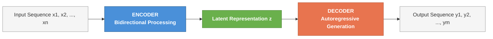
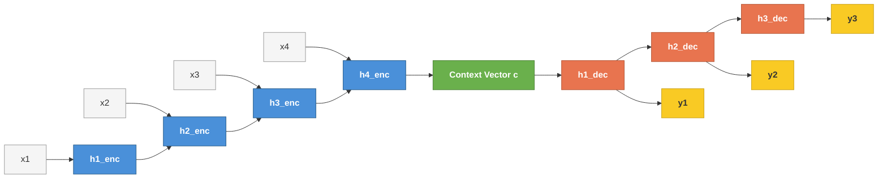
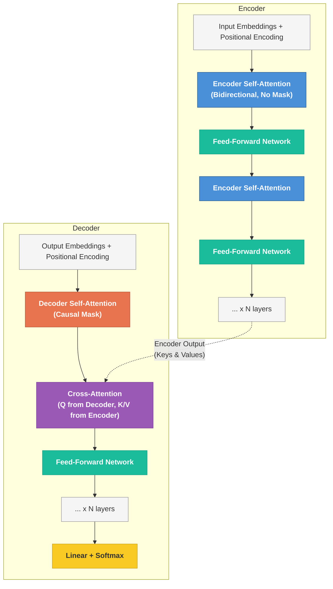
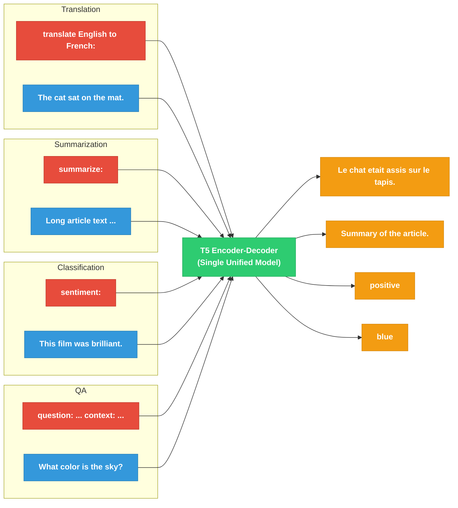
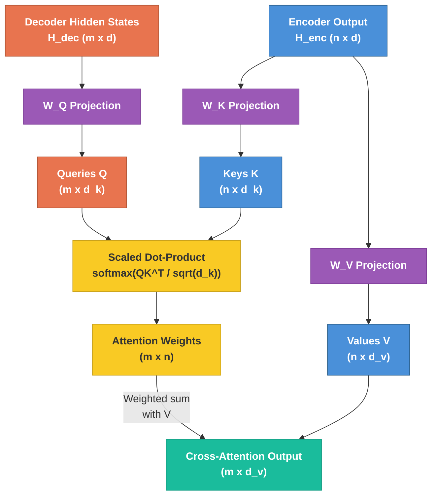

# Encoder-Decoder (Seq2Seq) Architectures for Generation

---

## 1. The Seq2Seq Idea

The encoder-decoder architecture, commonly called **sequence-to-sequence (seq2seq)**, solves a
fundamental problem: mapping an input sequence of arbitrary length to an output sequence of
arbitrary (and generally different) length. This is the structure behind machine translation,
summarization, question answering, and any task where the output is *conditioned* on structured
input.

The core abstraction has two stages:

1. **Encoder**: reads the entire input $x = (x_1, x_2, \ldots, x_n)$ and compresses it into an
   internal representation $\mathbf{z}$.
2. **Decoder**: takes $\mathbf{z}$ and generates the output $y = (y_1, y_2, \ldots, y_m)$ one
   token at a time, autoregressively.

$$
P(y \mid x) = \prod_{t=1}^{m} P(y_t \mid y_{<t},\, \mathbf{z})
$$

This factorization is why encoder-decoder is the natural choice for **conditional generation**:
the encoder gives the model a complete, bidirectional understanding of the input, and the decoder
produces the output causally, one step at a time.

Why not just use a single model? A decoder-only model (like GPT) can handle conditional
generation by concatenating the input and output into a single sequence. But this forces the
model to process the input causally -- each input token can only attend to tokens before it. The
encoder-decoder split lets the encoder see the *entire* input bidirectionally, which is a
strictly richer representation for understanding the conditioning context.

---

## 2. RNN Seq2Seq (Historical)

### 2.1 The Original Architecture

Sutskever et al. (2014) and Cho et al. (2014) introduced neural seq2seq using recurrent neural
networks. The architecture is straightforward:

**Encoder RNN** processes the input token by token, updating a hidden state:

$$
\mathbf{h}_t^{\text{enc}} = f_{\text{enc}}(x_t,\, \mathbf{h}_{t-1}^{\text{enc}})
$$

The final hidden state $\mathbf{h}_n^{\text{enc}}$ becomes the **context vector**
$\mathbf{c}$ -- the sole bridge between encoder and decoder.

**Decoder RNN** generates the output sequence conditioned on $\mathbf{c}$:

$$
\mathbf{h}_t^{\text{dec}} = f_{\text{dec}}(y_{t-1},\, \mathbf{h}_{t-1}^{\text{dec}},\, \mathbf{c})
$$

$$
P(y_t \mid y_{<t}, x) = \text{softmax}(W_o \mathbf{h}_t^{\text{dec}})
$$

### 2.2 The Bottleneck Problem

The critical flaw: the entire input sequence must be compressed into a single fixed-size vector
$\mathbf{c}$. For short sentences this works; for long sequences, information is inevitably lost.
Performance degrades sharply as input length grows beyond the lengths seen during training.

This is an information-theoretic bottleneck. If the context vector has dimension $d$, it can hold
at most $O(d)$ bits of information regardless of the input length $n$.

### 2.3 Attention as the Solution

Bahdanau et al. (2015) proposed **additive attention** to eliminate the bottleneck. Instead of
using a single context vector, the decoder attends to *all* encoder hidden states at each
generation step:

$$
e_{t,i} = \mathbf{v}^T \tanh(W_1 \mathbf{h}_t^{\text{dec}} + W_2 \mathbf{h}_i^{\text{enc}})
$$

$$
\alpha_{t,i} = \frac{\exp(e_{t,i})}{\sum_{j=1}^{n} \exp(e_{t,j})}
$$

$$
\mathbf{c}_t = \sum_{i=1}^{n} \alpha_{t,i}\, \mathbf{h}_i^{\text{enc}}
$$

Now the context is **dynamic**: at each decoder step $t$, the model computes a weighted
combination of encoder states. The weights $\alpha_{t,i}$ learn to focus on the relevant parts
of the input. This was the conceptual precursor to the transformer's cross-attention mechanism.

Luong et al. (2015) simplified this to **multiplicative (dot-product) attention**:

$$
e_{t,i} = (\mathbf{h}_t^{\text{dec}})^T \mathbf{h}_i^{\text{enc}}
$$

This is computationally cheaper and became the basis for scaled dot-product attention in
transformers.

---

## 3. Transformer Encoder-Decoder

### 3.1 The Full "Attention Is All You Need" Architecture

Vaswani et al. (2017) replaced the RNN entirely with attention. The transformer encoder-decoder
has three types of attention:

| Attention Type | Location | Query Source | Key/Value Source | Masking |
|---|---|---|---|---|
| Encoder self-attention | Encoder | Encoder | Encoder | None (bidirectional) |
| Decoder self-attention | Decoder | Decoder | Decoder | Causal mask |
| Cross-attention | Decoder | Decoder | Encoder | None |

All three use the same **scaled dot-product attention**:

$$
\text{Attention}(Q, K, V) = \text{softmax}\!\left(\frac{QK^T}{\sqrt{d_k}}\right) V
$$

### 3.2 Encoder Self-Attention (Bidirectional)

Each encoder layer applies multi-head self-attention where every position attends to every other
position. There is no causal mask -- this is fully bidirectional. Each token's representation is
informed by the complete input context.

For an input of length $n$, the attention matrix is $n \times n$ with no zeros from masking.
This is the key advantage of having a separate encoder: the model builds a representation of the
input where every token "knows about" every other token.

After self-attention, each encoder layer applies a position-wise feed-forward network (FFN):

$$
\text{FFN}(x) = \text{ReLU}(xW_1 + b_1)W_2 + b_2
$$

Both sub-layers use residual connections and layer normalization.

### 3.3 Decoder Self-Attention (Causal)

The decoder's self-attention is identical in mechanism but uses a **causal mask** to prevent
position $t$ from attending to positions $t+1, t+2, \ldots$. This preserves the autoregressive
property: the prediction for $y_t$ depends only on $y_1, \ldots, y_{t-1}$.

The mask is implemented by setting the upper-triangular entries of the attention logits to
$-\infty$ before the softmax:

$$
\text{mask}_{i,j} = \begin{cases} 0 & \text{if } j \leq i \\ -\infty & \text{if } j > i \end{cases}
$$

### 3.4 Cross-Attention (Decoder Attends to Encoder)

This is the mechanism that connects encoder and decoder. The decoder generates queries from its
own hidden states; the keys and values come from the encoder's output:

$$
Q = H_{\text{dec}} W^Q, \quad K = H_{\text{enc}} W^K, \quad V = H_{\text{enc}} W^V
$$

The attention matrix is $m \times n$ (decoder length by encoder length). Each decoder position
computes a weighted sum over all encoder positions, dynamically selecting which parts of the
input to focus on. This is the transformer generalization of Bahdanau attention.

### 3.5 Architecture Summary

The standard transformer encoder-decoder stacks $N$ encoder layers and $N$ decoder layers
(the original paper uses $N = 6$). Each encoder layer has 2 sub-layers (self-attention + FFN).
Each decoder layer has 3 sub-layers (causal self-attention + cross-attention + FFN).

---

## 4. T5: Text-to-Text Transfer Transformer

### 4.1 The Text-to-Text Framework

Raffel et al. (2020) introduced T5 with a unifying insight: **every NLP task can be cast as a
text-to-text problem**. Classification, regression, translation, summarization, question
answering -- all are expressed as mapping an input text string to an output text string.

The task is specified by a **prefix** prepended to the input:

| Task | Input | Target |
|---|---|---|
| Translation | `translate English to German: The house is big.` | `Das Haus ist gross.` |
| Summarization | `summarize: <article text>` | `
` |
| Sentiment | `sst2 sentence: This movie is great.` | `positive` |
| Similarity | `stsb sentence1: A man runs. sentence2: A person jogs.` | `4.2` |

This eliminates the need for task-specific output heads. The same encoder-decoder model with the
same loss function (cross-entropy on output tokens) handles everything.

### 4.2 Architectural Details

T5 follows the standard transformer encoder-decoder but with specific choices:

- **Relative position encodings**: instead of sinusoidal or learned absolute position embeddings,
  T5 uses a learned bias that depends only on the *distance* between tokens, not their absolute
  positions. The bias $b_{i-j}$ is added to the attention logits:

$$
e_{ij} = \frac{q_i^T k_j}{\sqrt{d_k}} + b_{i-j}
$$

  Distances are bucketed logarithmically, so the model handles sequences longer than those seen
  during training. Positions beyond a threshold share the same bucket.

- **Pre-norm**: layer normalization is applied *before* each sub-layer (not after), which
  improves training stability.

- **No bias terms**: linear layers omit bias parameters, slightly reducing parameter count.

- **Shared vocabulary**: encoder and decoder share the same SentencePiece vocabulary and embedding
  matrix. The output projection (before softmax) ties weights with the embedding matrix.

### 4.3 Pre-training Objective: Span Corruption

T5's pre-training uses a **span corruption** (denoising) objective. Random contiguous spans of
tokens are replaced with sentinel tokens, and the model must reconstruct the missing spans:

**Input**: `The <X> brown fox <Y> over the lazy dog`

**Target**: `<X> quick <Y> jumps <Z>`

Key parameters:
- **Corruption rate**: 15% of tokens are corrupted on average
- **Mean span length**: 3 tokens

This is more efficient than single-token masking (as in BERT) because the target sequence is
shorter -- it only contains the corrupted spans plus sentinels, not the entire input.

The loss is standard cross-entropy on the target tokens:

$$
\mathcal{L} = -\sum_{t=1}^{|\text{target}|} \log P(y_t \mid y_{<t},\, x_{\text{corrupted}})
$$

### 4.4 Model Sizes

| Variant | Parameters | $d_{\text{model}}$ | Layers | Heads |
|---|---|---|---|---|
| T5-Small | 60M | 512 | 6 | 8 |
| T5-Base | 220M | 768 | 12 | 12 |
| T5-Large | 770M | 1024 | 24 | 16 |
| T5-3B | 3B | 1024 | 24 | 32 |
| T5-11B | 11B | 1024 | 24 | 128 |

---

## 5. BART: Denoising Sequence-to-Sequence

### 5.1 Architecture

Lewis et al. (2020) introduced BART (Bidirectional and Auto-Regressive Transformers), which
combines a BERT-like encoder with a GPT-like decoder. The encoder uses bidirectional
self-attention; the decoder uses causal self-attention plus cross-attention to the encoder.

BART's architecture closely follows the standard transformer encoder-decoder. It uses learned
absolute position embeddings (not relative), and its decoder is autoregressive.

### 5.2 Pre-training: Denoising Autoencoder

BART's key innovation is in pre-training. The input text is corrupted using one or more
**noise functions**, and the model is trained to reconstruct the *original* uncorrupted text.

BART explores several corruption strategies:

| Corruption | Description |
|---|---|
| Token masking | Random tokens replaced with `[MASK]` (like BERT) |
| Token deletion | Random tokens removed entirely (model must figure out *what* is missing) |
| Text infilling | Random spans replaced by a *single* `[MASK]` (model must predict span length) |
| Sentence permutation | Sentences shuffled randomly |
| Document rotation | Document rotated to start at a random token |

The best-performing combination for downstream tasks was **text infilling** with Poisson-
distributed span lengths ($\lambda = 3$) combined with **sentence permutation**.

Unlike T5's span corruption, BART's decoder reconstructs the **entire original text**, not just
the corrupted spans. This means BART's pre-training target is longer, but it ensures the decoder
learns to generate fluent, complete text.

### 5.3 BART vs T5 Comparison

| Property | T5 | BART |
|---|---|---|
| Position encoding | Relative (learned, bucketed) | Absolute (learned) |
| Pre-training target | Corrupted spans only | Full original text |
| Corruption strategy | Span corruption (fixed) | Multiple strategies (explored) |
| Task framing | Text-to-text with task prefix | Standard fine-tuning with task heads |
| Vocabulary | SentencePiece (32k) | Byte-level BPE (50k, GPT-2 tokenizer) |
| Normalization | Pre-norm | Post-norm (BART-base), varies |

Both achieve strong results on generation tasks. T5's text-to-text framing is more flexible;
BART's full-sequence reconstruction may give it an edge for tasks requiring fluent long-form
generation (summarization in particular).

---

## 6. Cross-Attention Deep Dive

Cross-attention is the critical mechanism that distinguishes encoder-decoder models from
simple pipelines. Understanding its information flow is essential.

### 6.1 Mechanism

In cross-attention at decoder layer $\ell$, let:

- $H_{\text{dec}}^{(\ell)} \in \mathbb{R}^{m \times d}$ be the decoder hidden states (after
  causal self-attention)
- $H_{\text{enc}} \in \mathbb{R}^{n \times d}$ be the final encoder output

The projections are:

$$
Q = H_{\text{dec}}^{(\ell)} W^Q \in \mathbb{R}^{m \times d_k}
$$

$$
K = H_{\text{enc}} W^K \in \mathbb{R}^{n \times d_k}
$$

$$
V = H_{\text{enc}} W^V \in \mathbb{R}^{n \times d_v}
$$

The attention output is:

$$
\text{CrossAttn} = \text{softmax}\!\left(\frac{QK^T}{\sqrt{d_k}}\right) V \in \mathbb{R}^{m \times d_v}
$$

### 6.2 Information Flow

The information flow is asymmetric and purposeful:

1. **Queries from decoder**: "What information do I need from the input to generate the next
   token?" The decoder's current state encodes what has been generated so far and what the model
   is trying to produce next.

2. **Keys from encoder**: "What information is available at each input position?" The keys are a
   learned indexing of the encoder's representations.

3. **Values from encoder**: "What information should be retrieved?" Once the attention weights
   select which encoder positions are relevant, the values carry the actual content.

The attention weight $\alpha_{t,i}$ between decoder position $t$ and encoder position $i$
represents how much the $t$-th generation step relies on the $i$-th input token. For
translation, these weights often trace a roughly diagonal pattern (monotonic alignment), but
for summarization they can be highly non-monotonic.

### 6.3 Multi-Head Cross-Attention

With $h$ attention heads, each head can specialize. Empirically, different heads learn to attend
to different types of information:

- **Positional heads**: attend to the corresponding position or nearby positions
- **Syntactic heads**: attend to syntactically related tokens (e.g., subject-verb agreement)
- **Rare-word heads**: focus on rare or content-bearing words
- **Spread heads**: attend broadly across the input (aggregating global context)

$$
\text{MultiHead}(Q, K, V) = \text{Concat}(\text{head}_1, \ldots, \text{head}_h) W^O
$$

where $\text{head}_i = \text{Attention}(QW_i^Q, KW_i^K, VW_i^V)$.

### 6.4 Why Cross-Attention Matters

Cross-attention enables something that cannot be achieved by simple concatenation:

- **Selective information retrieval**: the decoder dynamically chooses which parts of the input
  to focus on at each generation step.
- **Length independence**: the mechanism works regardless of input or output length.
- **Soft alignment**: the model learns implicit alignments between input and output without
  requiring explicit alignment labels.
- **Layered refinement**: cross-attention occurs at every decoder layer, allowing progressively
  more abstract interactions between encoder and decoder representations.

Without cross-attention, an encoder-decoder model would need to compress all relevant input
information into the decoder's initial state -- exactly the bottleneck problem that attention
was designed to solve.

---

## 7. Encoder-Decoder for Vision

The encoder-decoder framework extends naturally beyond text. Vision-language tasks are a
particularly successful application.

### 7.1 Image Captioning: ViT Encoder + GPT Decoder

The most direct vision application of encoder-decoder is **image captioning**:

- **Encoder**: a Vision Transformer (ViT) processes the image. The image is split into patches
  (e.g., 16x16 pixels), each patch is linearly projected to an embedding, and the resulting
  sequence is processed by transformer encoder layers. The output is a sequence of patch
  representations $\mathbf{z}_1, \ldots, \mathbf{z}_p$.

- **Decoder**: a GPT-style transformer decoder generates the caption autoregressively. Cross-
  attention layers allow the decoder to attend to the patch representations.

$$
Q = H_{\text{text}}^{(\ell)} W^Q, \quad K = H_{\text{image}} W^K, \quad V = H_{\text{image}} W^V
$$

The decoder's query "where should I look in the image to generate the next word?" is answered
by attention weights over image patches. When generating the word "dog," the model attends to
patches containing the dog.

Notable models:
- **GIT** (Wang et al., 2022): simple ViT encoder + causal decoder, achieves strong captioning
  results
- **BLIP-2** (Li et al., 2023): frozen ViT + Q-Former bridge + frozen LLM decoder
- **PaLI** (Chen et al., 2023): ViT-e (4B params) encoder + mT5 decoder

### 7.2 Visual Question Answering (VQA)

VQA requires the model to answer a natural language question about an image. This naturally fits
the encoder-decoder framework:

- **Encoder input**: image patches (from ViT) + question tokens
- **Decoder output**: answer tokens

The cross-attention mechanism allows the decoder to jointly attend to both visual and textual
information from the encoder. The question guides which parts of the image are relevant; the
image provides the visual evidence needed to answer.

### 7.3 Cross-Modal Alignment

A key challenge in vision-language encoder-decoder models is **modality alignment**: the
encoder must produce representations where image patches and text tokens live in compatible
spaces. Approaches include:

- **Projection layers**: linear or MLP projection from image patch space to text embedding space
- **Q-Former** (BLIP-2): a small transformer that learns to extract text-relevant features from
  image representations using learned query tokens
- **Joint pre-training**: training the full model end-to-end on image-text pairs with
  objectives like image-text matching and captioning

---

## 8. When to Use Encoder-Decoder vs Decoder-Only

### 8.1 The Architectural Trade-off

The choice between encoder-decoder and decoder-only is not merely stylistic. It reflects a
fundamental trade-off between **specialization** and **simplicity**.

**Encoder-decoder advantages:**
- Bidirectional encoding gives a richer input representation
- Natural separation of understanding (encoder) and generation (decoder)
- More parameter-efficient for tasks where input and output have different natures
- Cross-attention provides explicit, interpretable input-output interaction

**Decoder-only advantages:**
- Simpler architecture, easier to scale
- No architectural distinction between "input" and "output" -- more flexible
- Better at in-context learning (few-shot prompting)
- Dominates at very large scales (GPT-4, Claude, Gemini)

### 8.2 Task-Specific Considerations

| Task | Better Fit | Reasoning |
|---|---|---|
| Machine translation | Encoder-decoder | Input fully known, output is a different language; bidirectional encoding of source is valuable |
| Summarization | Encoder-decoder | Long input, short output; bidirectional understanding of the document is critical |
| Open-ended generation | Decoder-only | No structured input to encode; generation is unconditional or lightly prompted |
| Code generation from spec | Either | Depends on spec length and structure; encoder-decoder if spec is long and fixed |
| Conversational AI | Decoder-only | Multi-turn context blurs the input/output boundary |
| Speech recognition | Encoder-decoder | Audio encoder + text decoder is natural (Whisper) |
| Classification (as generation) | Encoder-decoder | T5-style: the "output" is a label token, encoder captures full input |

### 8.3 Current Trends

The field has shifted strongly toward **decoder-only** architectures at scale. The reasons are
primarily practical:

1. **Scaling simplicity**: one architecture, one training objective (next-token prediction), one
   codebase. Encoder-decoder requires managing two sub-networks with different attention patterns.

2. **Emergent capabilities**: decoder-only models at sufficient scale develop in-context learning,
   chain-of-thought reasoning, and instruction following -- capabilities that reduce the need for
   architectural specialization.

3. **Prefix LM as a middle ground**: some decoder-only models use a prefix LM setup where the
   input prefix uses bidirectional attention (no causal mask) and only the output portion is
   causal. This captures some of the encoder-decoder benefit within a single architecture.

However, encoder-decoder remains dominant in specific domains:

- **Machine translation**: NLLB (Meta) and related systems use encoder-decoder
- **Speech**: Whisper (OpenAI) is an encoder-decoder model (audio encoder + text decoder)
- **Document understanding**: models processing long documents with short outputs benefit from
  the architectural asymmetry
- **Efficiency-sensitive deployment**: for tasks with long inputs and short outputs, encoding
  once and decoding cheaply is more efficient than processing the full input causally at every
  generation step

```mermaid
graph TB
    classDef headerNode fill:#34495e,stroke:#2c3e50,color:#fff,font-weight:bold
    classDef encDecNode fill:#3498db,stroke:#2980b9,color:#fff,font-weight:bold
    classDef decOnlyNode fill:#e74c3c,stroke:#c0392b,color:#fff,font-weight:bold
    classDef bothNode fill:#9b59b6,stroke:#7d3c98,color:#fff,font-weight:bold
    classDef noteNode fill:#f5f5f5,stroke:#aaa,color:#333

    H["Architecture Selection Guide"]:::headerNode

    ED["Encoder-Decoder<br/>Preferred"]:::encDecNode
    DO["Decoder-Only<br/>Preferred"]:::decOnlyNode
    EITHER["Either Works Well"]:::bothNode

    T1["Machine Translation"]:::encDecNode
    T2["Summarization"]:::encDecNode
    T3["Speech Recognition"]:::encDecNode
    T4["Document QA"]:::encDecNode

    T5["Open Dialogue"]:::decOnlyNode
    T6["Creative Writing"]:::decOnlyNode
    T7["General Reasoning"]:::decOnlyNode
    T8["Code Completion"]:::decOnlyNode

    T9["Code from Spec"]:::bothNode
    T10["Classification"]:::bothNode
    T11["Data-to-Text"]:::bothNode

    N1["Key: Structured input,<br/>bidirectional encoding valuable"]:::noteNode
    N2["Key: Flexible I/O boundary,<br/>benefits from scale"]:::noteNode

    H --> ED
    H --> DO
    H --> EITHER

    ED --> T1
    ED --> T2
    ED --> T3
    ED --> T4

    DO --> T5
    DO --> T6
    DO --> T7
    DO --> T8

    EITHER --> T9
    EITHER --> T10
    EITHER --> T11

    ED -.- N1
    DO -.- N2
```

### 8.4 The Efficiency Argument

For tasks with long inputs and short outputs (summarization, document QA), encoder-decoder has a
computational advantage that is often overlooked.

Consider summarizing a 4000-token document into a 200-token summary:

- **Encoder-decoder**: the encoder processes 4000 tokens with bidirectional attention (one forward
  pass). The decoder generates 200 tokens, each attending to the encoder output via cross-
  attention. Total self-attention cost is dominated by the encoder's $O(4000^2)$.

- **Decoder-only**: at each of the 200 generation steps, the model processes the full
  4000 + (tokens generated so far) context. With KV caching, the incremental cost per step is
  $O(4000 + t)$, but the initial prefill is $O(4000^2)$ -- and this is *causal*, providing a
  weaker representation than bidirectional attention.

The encoder-decoder's advantage: the encoder computation is done *once* and cached. The decoder's
generation steps only need cross-attention to the cached encoder states plus causal self-attention
over the (short) generated sequence. The KV cache for cross-attention is fixed after encoding.

For decoder-only models, the KV cache for the input tokens grows with context and must be
maintained throughout generation. The practical difference may be small with modern implementations,
but the architectural asymmetry of encoder-decoder naturally matches the asymmetry of the task.

---

## Summary

The encoder-decoder architecture embodies a clean separation of concerns: **understand the input
fully, then generate the output step by step**. From RNN seq2seq through the transformer to T5
and BART, the core idea has remained stable while the mechanisms have improved dramatically.

Cross-attention is the bridge that makes this work -- a learned, dynamic, differentiable
mechanism for the decoder to query the encoder's representation. It generalizes naturally to
multimodal settings where the encoder and decoder operate over different modalities.

The current dominance of decoder-only models at scale does not invalidate the encoder-decoder
paradigm. For tasks with clear input-output asymmetry -- translation, summarization, speech
recognition, document understanding -- the architectural specialization of encoder-decoder
continues to provide meaningful advantages in quality and efficiency.

The key principles:

- **Bidirectional encoding** captures richer input representations than causal processing
- **Cross-attention** enables dynamic, position-by-position information retrieval from input to output
- **Text-to-text framing** (T5) unifies diverse tasks under a single encoder-decoder framework
- **Denoising pre-training** (T5's span corruption, BART's corruption strategies) teaches the model to reconstruct from partial information
- **The right architecture depends on the task**: when the input is structured, complete, and needs deep understanding, encoder-decoder is the natural choice
