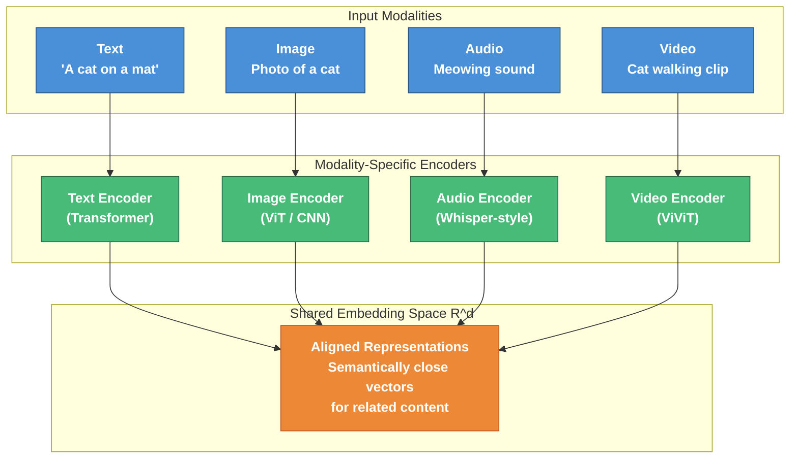
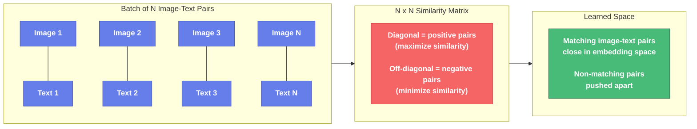
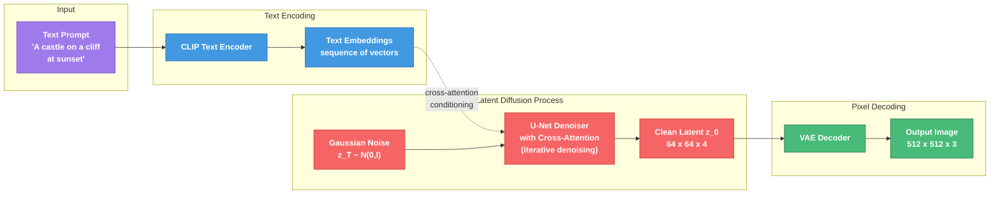
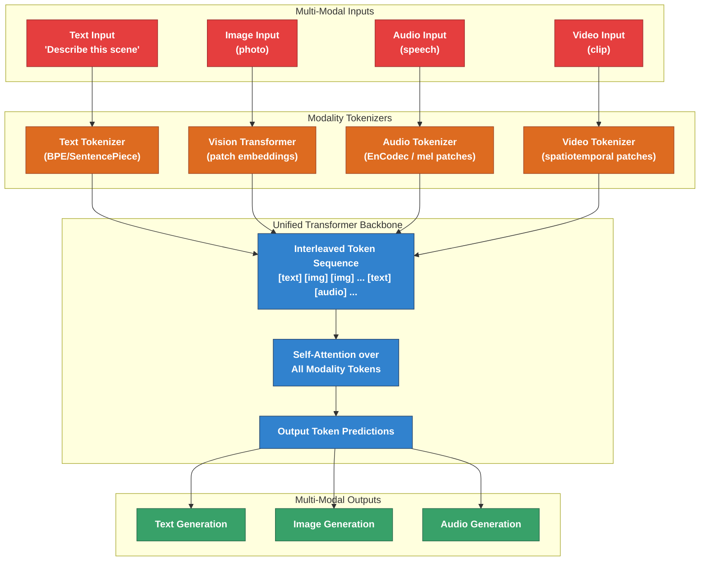
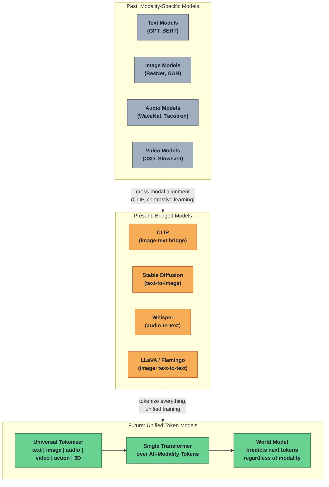

# Module 9: Multimodal Generative Models

## From First Principles to Unified Architectures

The world is not text. It is not images. It is not sound. It is all of these simultaneously, perceived through parallel sensory channels that our brains fuse into coherent understanding. Multimodal generative AI attempts to build systems that can perceive and generate across these modalities -- and, critically, translate between them.

This module traces the path from single-modality models to unified architectures that treat every modality as tokens in a shared sequence.

---

## 1. The Multimodal Challenge

### Why Modalities Are Fundamentally Different

Each modality has its own native structure:

| Modality | Dimensionality | Temporal? | Native Representation |
|----------|---------------|-----------|----------------------|
| Text | 1D sequence | Yes (sequential) | Discrete tokens from a finite vocabulary |
| Image | 2D spatial | No (single frame) | Continuous pixel values in $H \times W \times C$ |
| Audio | 1D waveform | Yes (continuous) | Continuous amplitude samples at ~16-48 kHz |
| Video | 3D spatiotemporal | Yes (frame sequence) | $T \times H \times W \times C$ tensor |

Text is inherently discrete -- there are a finite number of words. Images are continuous and spatially structured -- neighboring pixels are correlated. Audio is a continuous waveform with temporal structure at multiple timescales (phonemes, words, prosody). Video combines spatial and temporal structure with strict coherence requirements.

### The Alignment Problem

The core challenge of multimodal AI is **alignment**: learning which parts of one modality correspond to which parts of another.

Given an image of a dog catching a frisbee and the caption "A golden retriever leaps to catch a red frisbee in a park," the system must learn:
- "golden retriever" $\leftrightarrow$ the dog region
- "red frisbee" $\leftrightarrow$ the disc object
- "leaps" $\leftrightarrow$ the airborne pose
- "park" $\leftrightarrow$ the background grass and trees

This is not just pattern matching. It requires grounding: connecting symbols to perceptual content. The alignment must be:

1. **Compositional** -- understanding "red frisbee" as the combination of a color and an object
2. **Relational** -- understanding "catches" as a spatial and temporal relationship
3. **Abstract** -- understanding "park" as a scene category, not a specific pixel pattern

### The Shared Representation Hypothesis

The dominant approach is to learn a **shared embedding space** where semantically similar content from different modalities maps to nearby points:

$$f_{\text{text}}(\text{"a dog"}) \approx f_{\text{image}}(\text{photo of a dog})$$

where $f_{\text{text}}$ and $f_{\text{image}}$ are encoder functions that map into a common $d$-dimensional space $\mathbb{R}^d$.

The quality of this shared space determines everything downstream: generation quality, retrieval accuracy, and the model's ability to reason across modalities.



---

## 2. Contrastive Learning: CLIP

### The Breakthrough Insight

Before CLIP (Contrastive Language-Image Pretraining, Radford et al., 2021), vision models were trained on fixed label sets -- ImageNet's 1,000 classes, for example. This created a fundamental bottleneck: the model could only recognize what it was explicitly trained on.

CLIP's insight was to replace discrete labels with free-form text descriptions, trained on 400 million image-text pairs scraped from the internet. Instead of learning "this is class 457 (golden retriever)," the model learns to associate images with arbitrary natural language.

### Architecture: Dual Encoders

CLIP uses two separate encoders:

**Image Encoder** $f_I$: Either a ResNet or Vision Transformer (ViT). Takes an image $x$ and produces a vector $\mathbf{v}_I = f_I(x) \in \mathbb{R}^d$.

**Text Encoder** $f_T$: A Transformer. Takes a text string $t$ and produces a vector $\mathbf{v}_T = f_T(t) \in \mathbb{R}^d$.

Both vectors are L2-normalized to live on the unit hypersphere, so their dot product equals cosine similarity:

$$\text{sim}(x, t) = \frac{f_I(x) \cdot f_T(t)}{\lVert f_I(x) \rVert \cdot \lVert f_T(t) \rVert} = \mathbf{v}_I \cdot \mathbf{v}_T$$

### Contrastive Loss: InfoNCE

Given a batch of $N$ image-text pairs $\{(x_i, t_i)\}_{i=1}^N$, the contrastive loss pushes matching pairs together and non-matching pairs apart.

For image $i$, the probability of matching with its correct text $t_i$ vs. all texts in the batch:

$$\mathcal{L}_i^{I \to T} = -\log \frac{\exp(\text{sim}(x_i, t_i) / \tau)}{\sum_{j=1}^{N} \exp(\text{sim}(x_i, t_j) / \tau)}$$

Symmetrically, for text $i$:

$$\mathcal{L}_i^{T \to I} = -\log \frac{\exp(\text{sim}(x_i, t_i) / \tau)}{\sum_{j=1}^{N} \exp(\text{sim}(x_j, t_i) / \tau)}$$

The total loss is the average of both directions:

$$\mathcal{L} = \frac{1}{2N} \sum_{i=1}^{N} \left( \mathcal{L}_i^{I \to T} + \mathcal{L}_i^{T \to I} \right)$$

Here $\tau$ is a learned temperature parameter that controls the sharpness of the distribution. The key is that with batch size $N$, each positive pair is contrasted against $N-1$ negatives. CLIP used batch sizes of 32,768, providing a rich negative signal.



### Zero-Shot Classification

CLIP enables zero-shot classification without any task-specific training. To classify an image into $K$ categories:

1. Create text prompts: "a photo of a {class name}" for each class
2. Encode all $K$ prompts with the text encoder
3. Encode the image with the image encoder
4. The predicted class is the one with maximum cosine similarity:

$$\hat{y} = \arg\max_{k \in \{1, \ldots, K\}} \text{sim}(x, t_k)$$

This works because the shared embedding space has learned general semantic alignment. CLIP matched or exceeded supervised ResNet-50 on ImageNet zero-shot -- remarkable given it never saw ImageNet labels during training.

### Why CLIP Representations Are So Useful

CLIP's embedding space has become the foundation for an enormous range of downstream applications:

1. **Semantic richness**: Trained on internet-scale data with free-form text, CLIP understands concepts far beyond fixed taxonomies.
2. **Compositionality**: The text encoder can represent novel compositions ("an astronaut riding a horse") that may never appear in training data.
3. **Transfer**: The same embeddings work for classification, retrieval, generation guidance, and more.
4. **Guidance signal**: CLIP similarity provides a differentiable objective for steering generative models -- if a generated image has high CLIP similarity to a text prompt, it likely depicts that concept.

CLIP is not perfect. It struggles with spatial relationships ("a cube on top of a sphere" vs. "a sphere on top of a cube"), counting ("three cats"), and fine-grained attributes. But as a general-purpose vision-language bridge, it was transformational.

---

## 3. Text-to-Image Generation

The progression of text-to-image models illustrates the rapid evolution of generative architectures. Each generation solved limitations of the previous one.

### DALL-E (January 2021): Discrete VAE + Autoregressive

**Architecture**: Two-stage approach.

**Stage 1 -- dVAE Training**: A discrete variational autoencoder compresses $256 \times 256$ images into $32 \times 32$ grids of discrete tokens from a codebook of 8,192 entries.

The encoder maps image $x$ to a distribution over codebook indices at each spatial position:

$$q_\phi(z_{ij} | x) = \text{Categorical}(e_{ij,1}, \ldots, e_{ij,8192})$$

The decoder reconstructs from these discrete codes: $p_\theta(x | z)$.

Training uses the evidence lower bound with Gumbel-Softmax relaxation for differentiability through discrete sampling:

$$\mathcal{L}_{\text{dVAE}} = \mathbb{E}_{q_\phi(z|x)}[\log p_\theta(x|z)] - \beta \cdot D_{KL}(q_\phi(z|x) \| p(z))$$

**Stage 2 -- Autoregressive Modeling**: A 12-billion parameter Transformer models the joint distribution of text tokens (up to 256 BPE tokens) and image tokens (1,024 dVAE tokens) as a single sequence of 1,280 tokens:

$$p(\text{text}, \text{image}) = \prod_{i=1}^{1280} p(s_i | s_1, \ldots, s_{i-1})$$

At inference, given text tokens, the model autoregressively samples image tokens, which are decoded back to pixels by the dVAE decoder.

**Limitations**: Autoregressive generation over 1,024 image tokens is slow. The discrete codebook limits reconstruction quality. Samples were often blurry or incoherent.

### DALL-E 2 (April 2022): CLIP + Diffusion

DALL-E 2 replaced the autoregressive backbone with diffusion and leveraged CLIP as a bridge between text and images.

**Architecture**: Three components.

1. **CLIP** (frozen): Provides text embeddings $\mathbf{z}_t = f_T(t)$ and image embeddings $\mathbf{z}_i = f_I(x)$.

2. **Prior** $p(\mathbf{z}_i | \mathbf{z}_t)$: Given a CLIP text embedding, generates a CLIP image embedding. Implemented as either an autoregressive model or a diffusion model (diffusion worked better).

3. **Decoder** $p(x | \mathbf{z}_i)$: A diffusion model that generates a $64 \times 64$ image conditioned on the CLIP image embedding, followed by two upsampling diffusion models ($64 \to 256 \to 1024$).

The key insight: by operating through CLIP's embedding space, the model inherits CLIP's semantic understanding. The prior translates between text semantics and visual semantics in CLIP space, and the decoder renders visual semantics into pixels.

**Image variations**: Since the decoder takes CLIP image embeddings, you can encode a real image with CLIP and decode it to produce semantic variations -- images that have the same meaning but different appearance.

### Stable Diffusion (August 2022): Latent Diffusion + CLIP Text Encoder

Stable Diffusion (Rombach et al.) made a crucial efficiency innovation: run diffusion in a compressed latent space rather than pixel space.

**Architecture**:

1. **VAE Encoder** $\mathcal{E}$: Compresses $512 \times 512 \times 3$ images into $64 \times 64 \times 4$ latent representations. Compression factor of $8\times$ in each spatial dimension.

2. **U-Net Denoiser**: Operates in this $64 \times 64 \times 4$ latent space. The forward process adds noise: $z_t = \sqrt{\bar{\alpha}_t} z_0 + \sqrt{1 - \bar{\alpha}_t} \epsilon$. The U-Net predicts the noise $\epsilon_\theta(z_t, t, c)$ conditioned on timestep $t$ and text conditioning $c$.

3. **CLIP Text Encoder**: Encodes the text prompt into a sequence of embeddings that condition the U-Net via cross-attention at multiple resolutions.

4. **VAE Decoder** $\mathcal{D}$: Decompresses the denoised latent back to pixel space.

**Cross-attention conditioning**: At each attention layer in the U-Net, the image features $\mathbf{Q}$ attend to the text features $\mathbf{K}, \mathbf{V}$:

$$\text{Attention}(\mathbf{Q}, \mathbf{K}, \mathbf{V}) = \text{softmax}\left(\frac{\mathbf{Q}\mathbf{K}^T}{\sqrt{d_k}}\right)\mathbf{V}$$

where $\mathbf{Q} = W_Q \cdot \phi(z_t)$ (image features) and $\mathbf{K} = W_K \cdot \tau(t)$, $\mathbf{V} = W_V \cdot \tau(t)$ (text features from CLIP).

**Classifier-free guidance**: At inference, the model evaluates both conditional and unconditional predictions, amplifying the conditional signal:

$$\hat{\epsilon} = \epsilon_\theta(z_t, t, \varnothing) + s \cdot (\epsilon_\theta(z_t, t, c) - \epsilon_\theta(z_t, t, \varnothing))$$

where $s > 1$ is the guidance scale (typically 7-15). Higher $s$ produces images more aligned with the prompt at the cost of diversity.

**Why it mattered**: Running diffusion in latent space reduced compute by $\sim$$50\times$ compared to pixel-space diffusion at the same resolution. The model was open-source, enabling an explosion of community development.



### Imagen (May 2022): T5 + Pixel Diffusion

Google's Imagen took a different approach: use a large frozen language model (T5-XXL, 4.6B parameters) as the text encoder, and run diffusion directly in pixel space.

**Key findings**:
- Text encoder quality matters more than diffusion architecture quality. Scaling the text encoder improved image quality more than scaling the U-Net.
- T5-XXL embeddings provided richer language understanding than CLIP's text encoder, especially for compositional prompts.
- Dynamic thresholding prevented pixel saturation at high guidance scales.

The training objective for the base $64 \times 64$ model:

$$\mathcal{L} = \mathbb{E}_{x_0, \epsilon, t}\left[||\epsilon - \epsilon_\theta(x_t, t, c_{\text{T5}})||^2\right]$$

followed by super-resolution models: $64 \to 256 \to 1024$.

### Flux, SDXL, and Beyond

More recent models have converged on several improvements:
- **Rectified flow** (Flux): Straight-line trajectories instead of curved diffusion paths, enabling fewer sampling steps
- **DiT (Diffusion Transformer)**: Replacing U-Net with pure Transformer architecture
- **T5 + CLIP dual conditioning**: Using both text encoders for complementary strengths
- **Resolution scaling**: Training at multiple resolutions with aspect ratio bucketing

---

## 4. Image-to-Text: Visual Understanding

The inverse problem -- generating text from images -- requires the model to perceive, reason about, and describe visual content.

### Image Captioning

Classic captioning architectures use an encoder-decoder framework:

$$p(\text{caption} | \text{image}) = \prod_{i=1}^{L} p(w_i | w_1, \ldots, w_{i-1}, f_I(\text{image}))$$

where $f_I$ is a pretrained vision encoder (CNN or ViT) and the decoder is typically an autoregressive language model.

### Visual Question Answering (VQA)

VQA adds a question as additional conditioning:

$$p(\text{answer} | \text{image}, \text{question})$$

This requires not just perception but reasoning -- spatial ("What is to the left of the chair?"), counting ("How many people are in the image?"), and relational ("What color is the object the woman is holding?").

### Flamingo (2022)

DeepMind's Flamingo interleaved visual and textual information via **Perceiver Resampler** and **gated cross-attention** layers inserted into a frozen language model.

**Perceiver Resampler**: Takes variable-length visual features from a frozen vision encoder and compresses them into a fixed number of visual tokens (e.g., 64), regardless of image resolution:

$$\mathbf{V}_{\text{resampled}} = \text{PerceiverResampler}(f_I(x)) \in \mathbb{R}^{64 \times d}$$

**Gated cross-attention**: Inserted between frozen LM layers. The language model attends to visual tokens via cross-attention, with a learned gating parameter $\alpha$ initialized to zero (so the model starts as the original LM and gradually learns to incorporate visual information):

$$\mathbf{h}' = \mathbf{h} + \alpha \cdot \text{CrossAttention}(\mathbf{h}, \mathbf{V}_{\text{resampled}})$$

Flamingo achieved strong few-shot performance on vision-language tasks by processing interleaved sequences of images and text.

### LLaVA (2023): Visual Instruction Tuning

LLaVA (Large Language and Vision Assistant) demonstrated a simpler, highly effective approach:

1. **Vision encoder**: A pretrained CLIP ViT-L/14 that produces a grid of visual tokens.
2. **Projection layer**: A simple linear (or MLP) projection that maps visual tokens into the language model's embedding space: $\mathbf{H}_v = W \cdot \text{ViT}(x)$.
3. **Language model**: A pretrained LLM (e.g., Vicuna/LLaMA) that receives the projected visual tokens concatenated with text tokens.

**Training**:
- **Stage 1 -- Alignment pretraining**: Train only the projection layer $W$ on image-caption pairs, keeping both ViT and LLM frozen. This teaches the projection to map visual features into the LLM's "language."
- **Stage 2 -- Visual instruction tuning**: Fine-tune the LLM (and optionally the projection) on instruction-following data generated by GPT-4 from image descriptions.

The simplicity was the point: a linear projection is sufficient to bridge modalities if both the vision and language models are strong enough.

---

## 5. Unified Multimodal Models

### The Tokenization Insight

The key insight driving modern multimodal models: **every modality can be represented as a sequence of tokens**. Once tokenized, the powerful sequence modeling machinery of Transformers applies uniformly.

- **Text**: Already discrete tokens (BPE, SentencePiece)
- **Images**: Patch embeddings (ViT), discrete codes (VQ-VAE), or continuous embeddings
- **Audio**: Discrete codes (SoundStream, EnCodec), mel-spectrogram patches
- **Video**: Spatial-temporal patch embeddings

### Vision Transformers as Image Tokenizers

The Vision Transformer (ViT, Dosovitskiy et al., 2020) treats an image as a sequence of patches:

1. Divide image into $P \times P$ patches (typically $14 \times 14$ or $16 \times 16$ pixels)
2. Flatten each patch into a vector: $\mathbf{p}_i \in \mathbb{R}^{P^2 \cdot C}$
3. Linearly project to embedding dimension: $\mathbf{e}_i = W_p \mathbf{p}_i + \mathbf{b}_p$
4. Add positional embeddings: $\mathbf{z}_i = \mathbf{e}_i + \mathbf{pos}_i$
5. Process through standard Transformer encoder

A $224 \times 224$ image with $16 \times 16$ patches yields $14 \times 14 = 196$ tokens -- comparable to a short text sequence.

### GPT-4V / GPT-4o

OpenAI's multimodal models accept interleaved text and images. While architectural details are not fully public, the approach likely involves:

- A vision encoder that produces visual tokens from images
- These visual tokens are injected into the LLM's context alongside text tokens
- The LLM processes the combined sequence with its standard attention mechanism
- GPT-4o extends this to audio input/output, processing speech tokens natively

The model can reason about images, read text in images (OCR), understand charts and diagrams, and combine visual and textual information for complex reasoning.

### Gemini

Google's Gemini family was designed as natively multimodal from the ground up, rather than bolting vision onto a text model:

- Trained jointly on text, images, audio, and video from the start
- Uses a combination of visual and auditory encoders feeding into a unified Transformer
- Can interleave generation of text and images (Gemini 2.0+)
- Processes video as temporal sequences of visual tokens with audio alignment

The "natively multimodal" design means the model's internal representations are shaped by all modalities simultaneously, potentially learning richer cross-modal connections than models trained on text first and adapted to vision later.



### The Architectural Spectrum

Multimodal models fall on a spectrum:

**Loosely coupled**: Separate specialist models connected through a shared embedding space (CLIP + Stable Diffusion). Modular but limited in cross-modal reasoning.

**Adapter-based**: A frozen LLM with trainable adapters for new modalities (LLaVA, Flamingo). Efficient but the LLM's representations may not optimally accommodate visual information.

**Natively multimodal**: A single model trained from scratch on all modalities (Gemini). Potentially the most capable but requires enormous compute and data.

The trend is clearly toward native multimodality, as the benefits of joint training compound with scale.

---

## 6. Audio and Speech

### Whisper: Speech-to-Text

OpenAI's Whisper (Radford et al., 2022) is a speech recognition model trained on 680,000 hours of weakly supervised audio from the internet.

**Architecture**: Encoder-decoder Transformer.

- **Audio preprocessing**: Raw audio $\to$ 80-channel log-mel spectrogram with 25ms windows and 10ms stride
- **Encoder**: Standard Transformer encoder. Two convolutional layers first downsample the mel spectrogram by $2\times$ in the time dimension, then positional embeddings are added and the sequence passes through Transformer blocks.
- **Decoder**: Autoregressive Transformer that generates text tokens, conditioned on encoder outputs via cross-attention.

**Multitask training**: Whisper uses special tokens to specify the task:

```
[StartOfTranscript] [Language: en] [Task: transcribe] [Timestamps: yes]
```

The same model handles transcription, translation (any language to English), language identification, and timestamp prediction.

**Training objective**:

$$\mathcal{L} = -\sum_{i=1}^{L} \log p_\theta(y_i | y_{<i}, \text{audio})$$

where $y$ is the token sequence including task specifiers.

**Why it works**: Scale and diversity. 680K hours spanning 99 languages with noisy internet supervision. The model learns to be robust to background noise, accents, domain-specific jargon, and recording quality variations.

### Text-to-Speech: Bark and VALL-E

**VALL-E** (Microsoft, 2023) treats TTS as a language modeling problem over discrete audio tokens.

1. Audio is encoded into discrete codes using EnCodec (a neural audio codec that compresses waveforms into sequences of discrete tokens at multiple quantization levels).
2. Given a 3-second voice sample and text, VALL-E autoregressively generates audio codes that match the voice.
3. The audio codes are decoded back to a waveform.

The formulation for the first quantization level (autoregressive):

$$p(c_{1,1}, \ldots, c_{1,T} | \text{text}, \text{voice\_prompt}) = \prod_{t=1}^{T} p(c_{1,t} | c_{1,<t}, \text{text}, \text{voice\_prompt})$$

Subsequent quantization levels (adding detail) are modeled with a non-autoregressive model conditioned on the coarser levels:

$$p(c_{l,1:T} | c_{1:l-1,1:T}, \text{text})$$

This achieves high-quality zero-shot voice cloning from just 3 seconds of reference audio.

**Bark** (Suno) takes a similar approach but also generates non-verbal sounds -- laughter, sighs, music -- by training on diverse audio rather than just clean speech.

### Music Generation: MusicLM

Google's MusicLM generates high-fidelity music from text descriptions. The architecture uses a hierarchy of audio token models:

1. **MuLan** (Music-Language model): A CLIP-like model trained on music-text pairs, creating a shared embedding space for musical concepts and descriptions.
2. **Semantic modeling**: From the MuLan embedding, generate semantic tokens (capturing musical structure -- melody, harmony, rhythm).
3. **Acoustic modeling**: From semantic tokens, generate acoustic tokens (capturing timbre, production quality).
4. **Waveform synthesis**: Decode acoustic tokens to audio via SoundStream.

The hierarchical approach separates high-level musical decisions (what to play) from low-level acoustic rendering (how it sounds), enabling long-range coherent generation.

---

## 7. Video Generation

### The Temporal Consistency Challenge

Video generation is dramatically harder than image generation because of **temporal consistency**: objects must maintain their identity, physics must be plausible, and motion must be smooth across frames.

A 10-second video at 24 fps and $1024 \times 1024$ resolution contains:

$$24 \times 10 \times 1024 \times 1024 \times 3 \approx 750\text{M pixels}$$

compared to $\sim$3M pixels for a single image. The data is 250 times larger, but the real challenge is not the data volume -- it is the **constraints** between frames.

Consider generating a video of "a person walking through a park." Each frame must:
- Maintain the person's appearance (face, clothing, body proportions)
- Follow physically plausible biomechanics (gait cycle, weight transfer)
- Show consistent background with appropriate parallax as the camera or person moves
- Maintain consistent lighting and shadows
- Handle occlusions and disocclusions correctly

### Video Diffusion Models

The natural extension of image diffusion to video adds a temporal dimension. The noise prediction model becomes:

$$\epsilon_\theta(\mathbf{x}_t^{1:F}, t, c)$$

where $\mathbf{x}_t^{1:F}$ represents $F$ noisy frames at noise level $t$.

**3D U-Net approaches**: Extend the 2D U-Net with temporal attention layers. Spatial attention handles within-frame coherence; temporal attention handles across-frame consistency.

At each resolution level, the architecture alternates:
1. **Spatial self-attention**: Each frame attends to itself (standard image generation)
2. **Temporal self-attention**: Each spatial position attends across frames (ensuring temporal coherence)
3. **Cross-attention**: All frames attend to text conditioning

### Sora-Style Approaches

OpenAI's Sora (2024) demonstrated high-quality minute-long video generation. While full architectural details remain unpublished, the approach builds on several known ideas:

**Spacetime patches**: Rather than treating video as a sequence of images, decompose it into spacetime patches -- small 3D chunks that span space and time simultaneously. A video is tokenized into a sequence of these patches, analogous to how ViT tokenizes images into 2D patches.

**Diffusion Transformer (DiT)**: Replace the U-Net with a pure Transformer architecture operating on spacetime patch tokens. This leverages the Transformer's ability to model long-range dependencies across both space and time.

**Variable resolution and duration**: By operating on patches, the model can handle videos of different resolutions, aspect ratios, and durations -- the number of tokens simply changes.

**Emergent properties**: At sufficient scale, video generation models appear to learn implicit physics -- objects have inertia, gravity works approximately correctly, reflections are roughly accurate. These are not programmed but emerge from learning to predict video data.

### Current Limitations

Even the best video models struggle with:
- **Long-range consistency**: Objects may subtly change appearance over many seconds
- **Physics violations**: Impossible movements, objects passing through each other
- **Complex multi-object interactions**: Tracking many objects with mutual interactions
- **Text rendering**: Generating readable, stable text within video
- **Counting**: Maintaining the correct number of objects across frames

---

## 8. Cross-Modal Retrieval and Embeddings

### Shared Embedding Spaces

The ability to map different modalities into a shared vector space enables **cross-modal retrieval**: finding relevant content in one modality given a query in another.

Given a shared embedding space with $N$ items from modality $A$ and a query from modality $B$:

$$\text{retrieve}(q_B) = \arg\max_{a_i \in A} \text{sim}(f_B(q_B), f_A(a_i))$$

With approximate nearest neighbor search (HNSW, IVF), this scales to billions of items with sub-second latency.

### CLIP-Based Applications

CLIP's embedding space has enabled a wide range of applications:

**Image search with natural language**: Embed all images in a database with the image encoder. At query time, embed the text query with the text encoder and find nearest images. No labeled training data needed.

**Content moderation**: Compute CLIP similarity between images and descriptions of prohibited content. High similarity flags potentially violating content.

**Image generation guidance**: CLIP similarity between generated images and text prompts provides a differentiable loss signal for optimizing generative models (used in early CLIP-guided diffusion work by Katherine Crowson and others).

**Style transfer**: By manipulating CLIP embeddings, you can guide generation toward specific visual styles described in natural language ("in the style of Van Gogh," "cyberpunk aesthetic").

### Beyond CLIP: Richer Embedding Spaces

**SigLIP** (Sigmoid Loss for Language-Image Pretraining): Replaces the softmax-based contrastive loss with per-pair sigmoid loss, removing the need for large batch sizes and enabling better scaling:

$$\mathcal{L} = -\frac{1}{N} \sum_{i=1}^{N} \sum_{j=1}^{N} \log \sigma(y_{ij} \cdot z_{ij})$$

where $y_{ij} = 1$ if pair $(i,j)$ is matched and $-1$ otherwise, and $z_{ij} = \text{sim}(x_i, t_j) / \tau - b$ with learnable bias $b$.

**ImageBind** (Meta, 2023): Extends the shared embedding space to six modalities -- images, text, audio, depth, thermal, and IMU data -- using images as the binding modality. Since paired data exists between images and each other modality (image-text, image-audio, image-depth, etc.), alignment propagates transitively: audio and text become aligned through their shared alignment with images.

**CLAP** (Contrastive Language-Audio Pretraining): Applies the CLIP paradigm to audio-text pairs, creating a shared embedding space for sound and language.

### Multimodal RAG (Retrieval-Augmented Generation)

Multimodal embeddings enable RAG systems that retrieve across modalities:

1. A user asks a text question about a collection of images, documents, and videos
2. The query is embedded in the shared space
3. Relevant content from any modality is retrieved
4. A multimodal LLM processes the retrieved content to generate an answer

This combines the breadth of retrieval with the reasoning of generation, and the multimodal embedding space ensures that relevance is judged semantically rather than by keyword matching.

---

## 9. The Convergence Thesis

### All Modalities Are Becoming Tokens

The most striking trend in multimodal AI is convergence: every modality is being reduced to discrete or continuous tokens processed by the same Transformer architecture.

| Modality | Tokenization Method | Typical Sequence Length |
|----------|-------------------|----------------------|
| Text | BPE / SentencePiece | 100s - 10,000s |
| Image | ViT patches / VQ-VAE codes | 256 - 1,024 |
| Audio | EnCodec / SoundStream codes | 1,000s - 10,000s |
| Video | Spacetime patches | 10,000s - 100,000s |
| 3D | Point cloud tokens / NeRF features | 1,000s |
| Actions | Discrete action tokens | 10s - 100s |

Once everything is tokens, the architecture becomes modality-agnostic. The same attention mechanism, the same positional encodings, the same training objective (next-token prediction or denoising) applies regardless of whether the content is a word, an image patch, or a sound clip.



### Unified Architectures

The progression is clear:

1. **Specialist models** (pre-2020): Separate architectures per modality. CNNs for images, RNNs/Transformers for text, WaveNets for audio. No shared representations.

2. **Bridge models** (2021-2023): Separate encoders connected through shared embedding spaces. CLIP, LLaVA, Whisper. Modalities communicate but are processed separately.

3. **Unified models** (2023+): Single architecture processing all modalities as tokens. Gemini, GPT-4o, Chameleon. The model learns cross-modal relationships through joint attention over all tokens.

The mathematical framework for a unified model is straightforward. Given a sequence $S$ of tokens from any combination of modalities:

$$S = [t_1^{\text{text}}, t_2^{\text{text}}, t_1^{\text{image}}, t_2^{\text{image}}, \ldots, t_1^{\text{audio}}, \ldots]$$

The model predicts:

$$p(t_{n+1} | t_1, t_2, \ldots, t_n)$$

where $t_{n+1}$ can be a token from any modality. The same loss function, the same optimization, the same architecture. The modality-specific logic is pushed entirely into the tokenizer and detokenizer.

### Toward World Models

The ultimate vision is a **world model** -- a system that builds an internal representation of the world rich enough to:

1. **Predict**: Given the current state, what happens next? (Video prediction, physics simulation)
2. **Generate**: Given a description, render a plausible realization (text-to-image, text-to-video, text-to-3D)
3. **Understand**: Given observations, extract meaning (captioning, VQA, reasoning)
4. **Act**: Given a goal, plan a sequence of actions (robotics, embodied AI)

A sufficiently powerful model trained on next-token prediction over all modalities implicitly learns a world model. To predict the next frame of a video, you must understand physics. To describe an image, you must understand objects and relationships. To follow instructions in a 3D environment, you must understand spatial reasoning and causality.

This is the convergence thesis: **intelligence is compression, and the best compression of multimodal data requires understanding the world that generated it.**

### The Token Vocabulary Problem

A practical challenge: the vocabularies differ enormously. Text has $\sim$50K-100K tokens. Images at high resolution might need $\sim$16K visual tokens per image. Audio runs at thousands of tokens per second. Video multiplies everything by the frame rate.

This creates an asymmetry in the attention computation. A 1-minute video at 30 fps might require millions of tokens, making full self-attention computationally intractable ($O(n^2)$ complexity).

Solutions under active research:
- **Hierarchical tokenization**: Coarse tokens for global structure, fine tokens for detail
- **Selective attention**: Attending only to relevant tokens across modalities (e.g., a text token about color attends primarily to color-relevant visual tokens)
- **Compression through abstraction**: The Perceiver approach -- compress each modality to a fixed number of latent tokens before cross-modal attention
- **Linear attention variants**: Reducing the quadratic cost to linear or near-linear

### Open Questions

Several fundamental questions remain:

**Is joint training necessary?** Can we achieve the same quality by training specialist models and aligning them post-hoc (as CLIP + Stable Diffusion does), or does true joint training unlock qualitatively different capabilities?

**How much data redundancy helps?** The same concept appears across modalities (you can see, hear, and describe a dog). Does this redundancy improve sample efficiency, or does it merely provide more training signal for the same underlying concepts?

**What is the right tokenization?** Discrete vs. continuous tokens. Fixed vs. learned vocabularies. The granularity of tokens (pixel-level? patch-level? object-level?) may fundamentally limit what the model can represent.

**Can we achieve grounding?** Current models learn statistical correlations between modalities. Is this sufficient for genuine understanding, or is something more needed -- interaction with the physical world, embodiment, causal reasoning?

**Scaling laws**: Do multimodal models follow scaling laws similar to text-only models? Is there a scaling law for the number of modalities? For the ratio of data between modalities?

These questions are not merely academic. Their answers will determine the architecture, training paradigm, and data requirements of the next generation of AI systems.

---

## Summary

The trajectory of multimodal AI follows a clear arc:

| Era | Approach | Example | Limitation |
|-----|---------|---------|------------|
| Pre-2020 | Modality-specific models | ResNet, GPT-2, WaveNet | No cross-modal understanding |
| 2021 | Contrastive alignment | CLIP | Retrieval only, no generation |
| 2021-2022 | Bridged generation | DALL-E 2, Stable Diffusion | Text-to-image only, separate pipelines |
| 2022-2023 | Adapted multimodal | LLaVA, Flamingo | Vision bolted onto LLM, limited modalities |
| 2023+ | Natively multimodal | Gemini, GPT-4o | Compute-intensive, open questions on grounding |
| Future | World models | -- | The convergence thesis, not yet realized |

The foundational insight is that **alignment between modalities is learnable from data at scale**. CLIP proved this for retrieval. Stable Diffusion proved it for generation. LLaVA proved it for understanding. Gemini and GPT-4o are proving it for unified reasoning.

The remaining question is whether token prediction over multimodal data -- scaling current approaches further -- is sufficient for the full spectrum of intelligent behavior, or whether new architectural ideas are needed. The pace of progress suggests we will find out soon.
