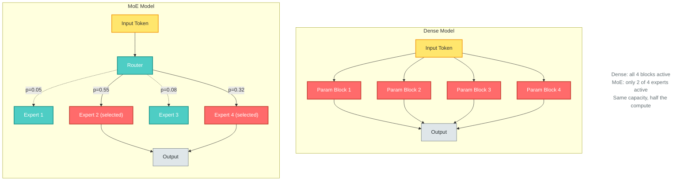
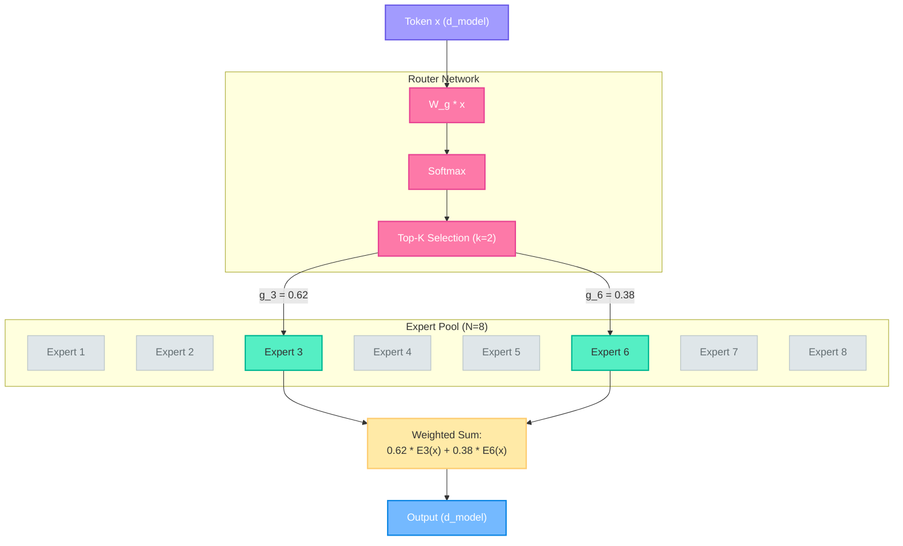
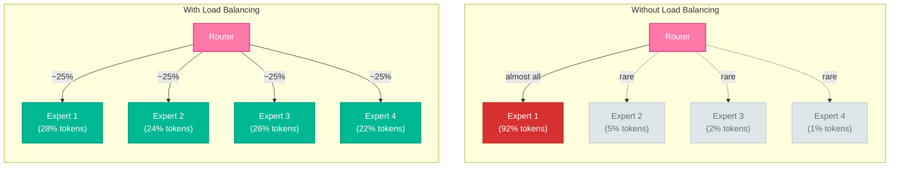
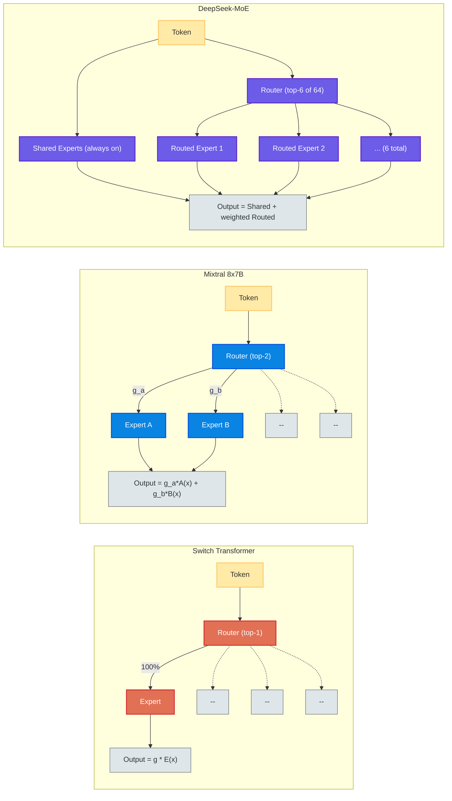

# Mixture of Experts: A First-Principles Treatment

---

## Table of Contents

1. [The MoE Idea](#1-the-moe-idea)
2. [Architecture](#2-architecture)
3. [Routing Mechanisms](#3-routing-mechanisms)
4. [Load Balancing](#4-load-balancing)
5. [Training Challenges](#5-training-challenges)
6. [Landmark Models](#6-landmark-models)
7. [Sparse vs Dense](#7-sparse-vs-dense)
8. [Practical Considerations](#8-practical-considerations)

---

## 1. The MoE Idea

### The Parameter Efficiency Problem

Standard dense neural networks activate every parameter for every input. A model with 70
billion parameters performs 70 billion parameters' worth of computation on every single
forward pass, regardless of whether the input is a simple "hello" or a complex mathematical
derivation. This is wasteful --- most of the knowledge stored in those parameters is
irrelevant to any given input.

Consider the analogy of a hospital. A hospital employs dozens of specialists ---
cardiologists, neurologists, oncologists, pediatricians. When a patient arrives with chest
pain, you do not convene every specialist. You route the patient to the cardiologist. The
hospital's total capacity (all specialists combined) far exceeds the resources used for any
single patient. This is exactly the principle behind Mixture of Experts.

### Conditional Computation

The core idea is **conditional computation**: not every parameter needs to activate for every
input. Instead, a learned routing mechanism selects which subset of parameters --- which
"experts" --- should process each input. This decouples two quantities that are tightly
coupled in dense models:

- **Model capacity** --- the total number of parameters, which determines how much knowledge
  the model can store.
- **Compute cost** --- the number of parameters activated per input, which determines
  inference speed and training FLOPs.

In a dense model, capacity equals cost. In an MoE model, capacity can be 4x, 8x, or even
16x larger than cost. A model with 8 experts, each the size of the original FFN, has 8x the
parameters but only activates 1 or 2 experts per token --- meaning compute cost is only
1x--2x that of a single expert.

$$\text{Active parameters} = \frac{k}{N} \times \text{Total expert parameters}$$

where $N$ is the number of experts and $k$ is the number selected per token (typically
$k \in \{1, 2\}$).

### The Free Lunch (Almost)

This sounds too good to be true, and the qualifier matters. MoE models achieve higher quality
per FLOP than dense models, but they come with significant caveats:

- **Memory**: all expert parameters must reside in memory (or at least be accessible), even
  though only a fraction activates per token.
- **Communication**: in distributed training, routing tokens to the right expert on the right
  device requires all-to-all communication.
- **Training instability**: the router must learn to distribute tokens across experts without
  collapsing to a degenerate solution.

These are engineering problems, not fundamental limitations. The last five years have seen
steady progress on all three fronts, culminating in models like Mixtral, DeepSeek-V2, and
DBRX that demonstrate MoE can work at production scale.

---

## 2. Architecture

### Where Experts Live

In a standard Transformer block, the computation flows through two main sub-layers:

1. **Multi-Head Self-Attention** (MHSA) --- captures inter-token relationships.
2. **Feed-Forward Network** (FFN) --- applies a non-linear transformation to each token
   independently.

The FFN is the natural place to introduce experts because it operates on tokens independently
(no cross-token interaction), making it easy to route different tokens to different experts
without breaking the attention mechanism. In an MoE Transformer, the FFN sub-layer is
replaced by an MoE layer:

$$\text{TransformerBlock}(x) = \text{MoE}(\text{LayerNorm}(\text{MHSA}(x) + x)) + \text{MHSA}(x) + x$$

Some architectures (like DeepSeek-MoE) also experiment with MoE in the attention layer, but
the FFN replacement is the dominant approach.

### The Expert Sub-Network

Each expert is a standard FFN --- the same architecture you would find in a dense Transformer:

$$\text{Expert}_i(x) = W_2^{(i)} \cdot \sigma(W_1^{(i)} x + b_1^{(i)}) + b_2^{(i)}$$

where $x \in \mathbb{R}^{d_{\text{model}}}$ is the input token representation,
$W_1^{(i)} \in \mathbb{R}^{d_{\text{ff}} \times d_{\text{model}}}$ expands the
dimensionality, $\sigma$ is an activation function (ReLU, GELU, or SwiGLU), and
$W_2^{(i)} \in \mathbb{R}^{d_{\text{model}} \times d_{\text{ff}}}$ projects back down.

The key point: every expert has the same architecture but **different learned weights**. They
specialize through training, not through structural differences.

### The Router (Gate Network)

The router is a small network --- typically a single linear layer --- that takes a token
representation and produces a probability distribution over the $N$ experts:

$$g(x) = \text{Softmax}(W_g \cdot x)$$

where $W_g \in \mathbb{R}^{N \times d_{\text{model}}}$ is the gating weight matrix. The
output $g(x) \in \mathbb{R}^N$ gives the probability (or affinity) for each expert.

Top-$k$ selection then picks the $k$ experts with the highest gate values. The final output
is a weighted combination of the selected experts' outputs:

$$\text{MoE}(x) = \sum_{i \in \text{TopK}(g(x))} \hat{g}_i(x) \cdot \text{Expert}_i(x)$$

where $\hat{g}_i(x)$ are the renormalized gate values over the selected experts:

$$\hat{g}_i(x) = \frac{g_i(x)}{\sum_{j \in \text{TopK}(g(x))} g_j(x)}$$

### Interleaved vs Every-Layer MoE

Not every Transformer layer needs to be an MoE layer. Some architectures alternate between
dense FFN layers and MoE layers:

- **Every layer**: Mixtral 8x7B uses MoE in every layer.
- **Interleaved**: GShard applies MoE every other layer.
- **Selective**: Some architectures only use MoE in a subset of layers (e.g., the middle
  layers where the model does most of its "thinking").

The tradeoff is straightforward: more MoE layers means more capacity for the same compute,
but also more routing overhead, more load balancing challenges, and more memory.

---

## 3. Routing Mechanisms

The routing mechanism is the most critical design choice in an MoE model. A good router must
solve a difficult optimization problem: it must learn to send tokens to the experts that can
best process them, while ensuring that the workload is evenly distributed across experts.

### Top-K Gating (Shazeer et al., 2017)

The original formulation from "Outrageously Large Neural Networks" introduced noisy top-k
gating. The gate values are computed with added noise to encourage exploration:

$$g(x) = \text{Softmax}(\text{TopK}(H(x), k))$$

where:

$$H(x)_i = (W_g \cdot x)_i + \epsilon \cdot \text{Softplus}((W_{\text{noise}} \cdot x)_i)$$

and $\epsilon \sim \mathcal{N}(0, 1)$ is standard Gaussian noise. The noise term, scaled by
a learned noise parameter, encourages the router to explore different experts during
training. The TopK function sets all values outside the top $k$ to $-\infty$ before the
Softmax, ensuring only $k$ experts receive non-zero weight.

### Softmax Router (Standard)

The simplest router drops the noise and applies a straightforward softmax over the linear
projection:

$$g(x) = \text{Softmax}(W_g \cdot x)$$

This is the baseline approach used in many modern implementations. It relies on the auxiliary
load balancing loss (discussed in Section 4) rather than noise to prevent expert collapse.

### Expert Choice Routing (Zhou et al., 2022)

Standard routing is **token-choice**: each token picks its top-$k$ experts. Expert Choice
flips this: each expert picks its top-$k$ tokens from a batch. This guarantees perfect load
balance by construction --- every expert processes exactly the same number of tokens.

Given a batch of $T$ tokens with gate logits $S \in \mathbb{R}^{N \times T}$:

1. Compute $G = \text{Softmax}(S, \text{dim=token})$ along the token dimension.
2. For each expert $i$, select the top-$C$ tokens by gate value, where $C = k \cdot T / N$
   is the capacity per expert.
3. Expert $i$ processes only its selected tokens.

The elegance of this approach is that load balance is no longer a soft constraint enforced by
an auxiliary loss --- it is a hard architectural guarantee. The downside is that a token might
not be selected by any expert (it gets "dropped") or might be selected by more experts than
intended.

### Hash Routing (Roller et al., 2021)

The simplest possible routing: assign tokens to experts based on a fixed hash function
(e.g., token identity modulo $N$). No learned parameters, no gating network, no load
balancing loss. This sounds absurd, but it works surprisingly well for certain tasks,
suggesting that much of the benefit of MoE comes from having diverse experts rather than from
sophisticated routing.

### Comparison of Routing Strategies

| Strategy | Load Balance | Differentiable | Overhead | Quality |
|----------|-------------|----------------|----------|---------|
| Noisy Top-K | Requires aux loss | Yes | Low | High |
| Softmax + aux loss | Requires aux loss | Yes | Low | High |
| Expert Choice | Perfect by design | Yes | Medium | High |
| Hash Routing | Perfect by design | No | Zero | Moderate |

---

## 4. Load Balancing

### The Collapse Problem

Without explicit constraints, MoE training reliably degenerates. The router learns to send
most tokens to one or two "favorite" experts. Those experts get more training signal, become
better, and attract even more tokens. The remaining experts receive little data, stagnate,
and become useless. This positive feedback loop is called **expert collapse** or **winner
take all**.

The result: a model with 8 experts that effectively uses only 1 or 2. The extra parameters
are wasted. The model is no better than a dense model of equivalent compute, but uses 8x the
memory.

### Auxiliary Load Balancing Loss

The standard solution is an auxiliary loss term that penalizes uneven expert utilization.
Given a batch of $T$ tokens and $N$ experts, define:

- $f_i$ = fraction of tokens routed to expert $i$:
  $$f_i = \frac{1}{T} \sum_{t=1}^{T} \mathbb{1}[i \in \text{TopK}(g(x_t))]$$

- $p_i$ = average router probability for expert $i$:
  $$p_i = \frac{1}{T} \sum_{t=1}^{T} g_i(x_t)$$

The load balancing loss is:

$$\mathcal{L}_{\text{balance}} = \alpha \cdot N \cdot \sum_{i=1}^{N} f_i \cdot p_i$$

where $\alpha$ is a hyperparameter (typically $\alpha = 0.01$). The factor $N$ normalizes so
that perfectly balanced routing gives $\mathcal{L}_{\text{balance}} = \alpha$.

**Why this works**: The product $f_i \cdot p_i$ is minimized when $f_i$ and $p_i$ are
uniform across experts. If expert $i$ receives a disproportionate fraction of tokens (high
$f_i$), the loss encourages reducing $p_i$ for that expert, diverting tokens elsewhere.

The total training loss becomes:

$$\mathcal{L} = \mathcal{L}_{\text{task}} + \mathcal{L}_{\text{balance}}$$

### Expert Capacity Factor

Even with the auxiliary loss, some experts may temporarily receive more tokens than they can
handle. The **capacity factor** $C_f$ limits the maximum number of tokens an expert can
process:

$$\text{Expert capacity} = C_f \cdot \frac{T}{N}$$

where $T/N$ is the perfectly balanced allocation. Typical values are $C_f \in [1.0, 1.5]$.

- $C_f = 1.0$: each expert gets exactly its fair share. Tokens routed to an overloaded
  expert are **dropped** (their representation passes through unchanged or is zeroed out).
- $C_f = 1.25$: each expert can handle 25% more than its fair share, providing slack for
  imperfect balance.
- $C_f > 1.5$: diminishing returns; too much slack means the load balancing constraint is
  too loose.

### Router Z-Loss

Introduced in the ST-MoE paper (Zoph et al., 2022), the z-loss penalizes large logits in
the router, preventing the gate from becoming too confident:

$$\mathcal{L}_z = \frac{1}{T} \sum_{t=1}^{T} \left( \log \sum_{i=1}^{N} e^{z_i(x_t)} \right)^2$$

where $z_i(x_t)$ are the raw (pre-softmax) router logits. This stabilizes training by
keeping the router's output entropy from collapsing.

### Jitter Noise

Adding small multiplicative noise to the input of the router during training:

$$x_{\text{jittered}} = x \cdot (1 + \epsilon), \quad \epsilon \sim \mathcal{U}(-\delta, \delta)$$

where $\delta$ is small (e.g., 0.01). This serves a similar purpose to dropout --- it
prevents the router from becoming overly sensitive to small differences in the input
representation and encourages exploration of different routing patterns.

---

## 5. Training Challenges

### Expert Collapse

Even with the auxiliary loss, expert collapse remains the most persistent failure mode in MoE
training. Symptoms include:

- A few experts handle 80%+ of all tokens.
- The remaining experts have near-zero gradient norms.
- Training loss plateaus well above what a well-balanced MoE should achieve.
- Removing the "dead" experts has negligible effect on model quality.

Mitigations beyond the auxiliary loss:

1. **Expert initialization**: Initialize all experts identically or from the same
   pre-trained FFN, then let routing diverge naturally.
2. **Router temperature**: Use a temperature parameter in the softmax to control the
   sharpness of routing decisions. Higher temperature early in training encourages
   exploration.
3. **Expert dropout**: Randomly drop experts during training (with probability proportional
   to their utilization) to force the router to explore alternatives.

### Routing Instability

The router must make discrete decisions (which experts to select) but must learn through
gradient descent (which requires continuous, differentiable operations). This tension creates
instability:

- The top-$k$ selection is non-differentiable. Gradients flow only through the selected
  experts' gate weights, not through the selection itself.
- Small changes in router weights can cause discontinuous changes in which experts are
  selected, leading to oscillating training dynamics.
- The router and experts are co-adapting: the router learns to route based on the experts'
  current specializations, while the experts specialize based on what the router sends them.
  This co-adaptation can lead to oscillation.

### Communication Overhead in Distributed Training

MoE models are typically trained with **expert parallelism**: different experts reside on
different devices. When a token on device A needs expert 3 on device C, the token
representation must be communicated. This requires an all-to-all communication pattern that
is fundamentally different from the all-reduce pattern used in data parallelism.

The communication cost scales with:
- The number of tokens that cross device boundaries.
- The dimensionality of the token representations ($d_{\text{model}}$).
- The number of devices.

In practice, this all-to-all communication can become the bottleneck, especially when the
ratio of communication to computation is unfavorable (small experts, large batches, many
devices).

### Token Dropping

When an expert reaches its capacity limit, additional tokens routed to it must be handled
somehow:

- **Drop**: The token's representation is passed through unchanged (residual connection
  only). This means the token misses the FFN computation entirely, which can degrade quality.
- **Overflow buffer**: Send overflow tokens to a shared "overflow" expert that handles the
  excess. This adds parameters but prevents information loss.
- **Re-route**: Route dropped tokens to their next-best expert. This adds latency but
  preserves information.

Switch Transformer uses token dropping with a capacity factor. Mixtral avoids the issue
entirely by ensuring sufficient capacity.

---

## 6. Landmark Models

### GShard (Lepikhin et al., 2020)

GShard was one of the first demonstrations of MoE at massive scale. Key contributions:

- Scaled MoE to 600B parameters across 2048 TPU v3 cores.
- Used top-2 gating with MoE applied every other Transformer layer.
- Introduced the capacity factor and auxiliary load balancing loss that became standard.
- Applied to machine translation, achieving state-of-the-art results with far less compute
  than equivalent dense models.

### Switch Transformer (Fedus et al., 2022)

Switch Transformer made a radical simplification: use **top-1 routing** instead of top-2.
Each token goes to exactly one expert.

$$\text{MoE}(x) = g_{i^*}(x) \cdot \text{Expert}_{i^*}(x), \quad i^* = \arg\max_i g_i(x)$$

This halves the compute cost compared to top-2 and simplifies the implementation. Despite
the apparent loss of information (no weighted combination of experts), Switch Transformer
matched or exceeded the quality of top-2 models at the same compute budget.

Key insights:
- Simpler routing works when you have enough experts (32, 64, or 128).
- The capacity factor $C_f = 1.25$ provides sufficient slack for top-1 routing.
- Scaling to 1.6T parameters with 2048 experts on TPUs.

### GLaM (Du et al., 2022)

Google's Generalist Language Model: 1.2T parameters, 64 experts per MoE layer, top-2
routing. Notable for its efficiency claims --- GLaM used roughly 1/3 the compute of GPT-3 to
achieve comparable quality on a broad set of benchmarks.

### Mixtral 8x7B (Jiang et al., 2024)

Mistral AI's Mixtral brought MoE to the open-source world. Architecture:

- 8 experts per MoE layer, top-2 routing in every layer.
- Each expert is a 7B-parameter-scale FFN (though the total model is ~46.7B parameters).
- Active parameters per token: ~12.9B (2 of 8 experts plus shared attention).
- Performance competitive with LLaMA 2 70B at a fraction of the inference cost.

Mixtral demonstrated that MoE works for general-purpose language models, not just specialized
tasks like translation. It also showed that open-weight MoE models are practical.

### DeepSeek-MoE / DeepSeek-V2

DeepSeek introduced two innovations that advanced the state of the art:

1. **Fine-grained experts**: Instead of 8 large experts, use 64 smaller experts with top-6
   routing. More experts provide finer-grained specialization.

2. **Shared experts**: Some experts are always activated for every token (not routed). These
   shared experts capture common knowledge, while the routed experts capture specialized
   knowledge. This is a hybrid between dense and sparse computation:

$$\text{MoE}(x) = \sum_{s \in \text{Shared}} \text{Expert}_s(x) + \sum_{i \in \text{TopK}(g(x))} \hat{g}_i(x) \cdot \text{Expert}_i(x)$$

DeepSeek-V2 (236B total, 21B active) demonstrated excellent quality-per-FLOP, suggesting
that the combination of fine-grained routing and shared experts is a significant
architectural improvement.

### Grok (xAI)

xAI's Grok-1 (314B parameters) was released as an open-weight MoE model. It uses 8 experts
with top-2 routing, broadly similar to the Mixtral architecture but at a larger scale. Its
release was notable primarily for being one of the largest open-weight models at the time.

### DBRX (Databricks)

DBRX used a fine-grained MoE architecture with 16 experts and top-4 routing, with each
expert being relatively small. The design philosophy --- more experts, more selected per
token --- follows the DeepSeek direction of preferring granularity over having fewer, larger
experts.

---

## 7. Sparse vs Dense

### When MoE Wins

MoE provides the greatest advantage in the **large model, efficiency-constrained** regime:

1. **Scaling to very large models**: When you want model capacity beyond what is
   computationally feasible with a dense model. A dense 1T-parameter model requires 1T
   parameters of compute per token. An MoE model with 1T parameters might only activate 100B
   per token.

2. **Inference efficiency**: For a given quality level, an MoE model uses fewer FLOPs per
   token than a dense model. This translates directly to lower latency and higher throughput
   at inference time (assuming memory is not the bottleneck).

3. **Training efficiency**: MoE models typically achieve a given loss level with fewer
   training FLOPs than dense models. The empirical scaling law is roughly: an MoE model with
   $N$ total parameters and $k/N$ active ratio achieves the same loss as a dense model with
   approximately $\sqrt{N \cdot k}$ parameters, while using only $k$ FLOPs per token.

### When Dense is Better

1. **Small models**: The routing overhead (gate computation, load balancing loss, potential
   token dropping) is not worth it when the model is small enough to run efficiently as a
   dense model. Below approximately 1--2B parameters, dense models are simpler and often
   better.

2. **Memory-constrained deployment**: All expert parameters must be in memory, even though
   only a fraction are used. A Mixtral 8x7B model requires ~90GB of memory (in fp16) despite
   only activating ~25GB worth of parameters per token. A dense 13B model achieves similar
   quality with ~26GB of memory.

3. **Simpler training**: Dense models do not suffer from expert collapse, routing instability,
   or load balancing challenges. If you want to train a model without specialized
   infrastructure, dense is more straightforward.

4. **Fine-tuning**: MoE models can be harder to fine-tune because the routing patterns
   learned during pre-training may not transfer well to new domains. Some experts may become
   irrelevant for the fine-tuning task while others become overloaded.

### The Compute-Memory Tradeoff

The fundamental equation governing the MoE tradeoff:

$$\frac{\text{MoE quality}}{\text{Dense quality}} \approx f\left(\frac{\text{Total params}}{\text{Active params}}\right) > 1$$

but:

$$\frac{\text{MoE memory}}{\text{Dense memory}} = \frac{\text{Total params}}{\text{Active params}} \gg 1$$

MoE gives you more quality per FLOP, but at the cost of more memory per FLOP. Whether this
tradeoff is favorable depends entirely on whether your deployment is compute-bound (MoE wins)
or memory-bound (dense wins).

### Empirical Scaling Comparison

The Switch Transformer paper demonstrated the following rough scaling relationship:

| Dense Model | MoE Equivalent (same quality) | MoE Compute Savings |
|-------------|-------------------------------|---------------------|
| 223M | 223M (1 expert = dense) | 1x |
| 1.5B | 3.5B MoE (7x fewer FLOPs) | ~7x |
| 11B | 26B MoE (4x fewer FLOPs) | ~4x |
| 175B | ~600B MoE (est. 3--4x fewer FLOPs) | ~3--4x |

The savings ratio increases with model scale, which is why MoE is most compelling for the
largest models.

---

## 8. Practical Considerations

### Memory Requirements

An MoE model's memory footprint is dominated by the expert parameters. For a model with $N$
experts, each with FFN parameters:

$$\text{Expert memory} = N \times (2 \times d_{\text{model}} \times d_{\text{ff}} + d_{\text{model}} + d_{\text{ff}}) \times \text{bytes per param}$$

For Mixtral 8x7B in fp16:
- 8 experts, each ~5.6B parameters in the FFN layers.
- Total expert parameters: ~44.8B.
- Shared parameters (attention, embeddings): ~1.9B.
- Total: ~46.7B parameters x 2 bytes = ~93.4 GB.
- Active per token: ~12.9B parameters x 2 bytes = ~25.8 GB equivalent compute.

The ratio of memory to active compute is roughly 3.6x. This is the "MoE tax" you pay for
the capacity advantage.

### Expert Parallelism

In distributed training, the standard approach is to place different experts on different
devices:

- **Expert parallelism (EP)**: Each device holds a subset of experts. An all-to-all
  communication dispatches tokens to the correct device.
- **Combined with data parallelism (DP)**: Replicate the shared parameters (attention,
  embeddings) across data-parallel groups, while distributing experts across expert-parallel
  groups.
- **Combined with tensor parallelism (TP)**: Shard individual experts across devices for
  very large expert FFNs.

The all-to-all communication pattern is the key bottleneck. Each device must send tokens
destined for other devices' experts and receive tokens destined for its own experts. The
volume scales as:

$$\text{Communication volume} \propto \frac{(EP - 1)}{EP} \times B \times S \times d_{\text{model}}$$

where $EP$ is the expert parallelism degree, $B$ is the batch size, and $S$ is the sequence
length.

### Inference Challenges

MoE inference has unique challenges compared to dense model inference:

**Batch routing**: In batched inference, different tokens in the batch may route to different
experts. If the batch routes primarily to experts 1 and 3, experts 2, 4, 5, 6, 7, 8 are
idle. This creates load imbalance at the hardware level, reducing GPU utilization.

**Expert caching (offloading)**: When GPU memory is insufficient to hold all experts, some
experts can be offloaded to CPU memory or disk and loaded on demand. The effectiveness of
this strategy depends on routing locality: if consecutive tokens tend to use the same experts,
caching works well. If routing is uniform, thrashing occurs.

**Speculative expert loading**: Predict which experts the next tokens will need and
pre-load them while the current token is being processed. This overlaps computation with
memory transfers.

### Quantization of MoE Models

MoE models are particularly amenable to aggressive quantization because:

1. Each expert is used relatively infrequently, so the accuracy loss from quantization is
   spread across many experts rather than concentrated in a single path.
2. The router gate values already provide a form of soft selection --- minor quantization
   errors in a low-gate-weight expert have minimal impact on the output.
3. Different experts can be quantized to different precisions based on their utilization
   and sensitivity.

In practice, Mixtral 8x7B quantized to 4-bit (GPTQ or AWQ) fits in ~24GB of VRAM (a single
GPU) while retaining most of its quality. This makes MoE models surprisingly practical for
deployment despite their large total parameter count.

### Expert Merging and Pruning

After training, it is common to find that some experts are redundant (similar weights, similar
specializations). Post-training optimization techniques include:

- **Expert pruning**: Remove the least-utilized experts and redistribute their tokens.
- **Expert merging**: Average the weights of similar experts to reduce the total expert count.
- **Distillation**: Train a smaller dense model to mimic the MoE model's behavior, capturing
  the MoE's quality in a more deployable form.

These techniques bridge the gap between MoE's training efficiency and dense models'
deployment simplicity.

---

## Summary

Mixture of Experts represents a fundamental architectural insight: **model capacity and
compute cost need not scale together**. By routing each token to a small subset of
specialized expert sub-networks, MoE models achieve the knowledge storage of very large
models with the computational cost of much smaller ones.

The key tradeoffs:

| Dimension | Dense | MoE |
|-----------|-------|-----|
| Compute per token | High (all params) | Low (k/N params) |
| Memory | Proportional to compute | Much larger than compute |
| Training stability | Straightforward | Requires load balancing |
| Scaling efficiency | Good | Better (more quality per FLOP) |
| Deployment complexity | Simple | Complex (expert parallelism, caching) |
| Fine-tuning | Standard | More delicate (routing transfer) |

The trajectory of the field is clear: the largest and most capable models are increasingly
MoE. GPT-4 is widely reported to use MoE. Mixtral, DeepSeek-V2, Grok, and DBRX are all MoE.
The engineering challenges are being solved, and the efficiency advantages are too large to
ignore. Understanding MoE is essential for understanding where large language models are
headed.

---

## References

1. Shazeer, N. et al. (2017). "Outrageously Large Neural Networks: The Sparsely-Gated
   Mixture-of-Experts Layer." ICLR 2017.
2. Lepikhin, D. et al. (2020). "GShard: Scaling Giant Models with Conditional Computation
   and Automatic Sharding." arXiv:2006.16668.
3. Fedus, W. et al. (2022). "Switch Transformers: Scaling to Trillion Parameter Models with
   Simple and Efficient Sparsity." JMLR 2022.
4. Du, N. et al. (2022). "GLaM: Efficient Scaling of Language Models with Mixture-of-Experts."
   ICML 2022.
5. Zhou, Y. et al. (2022). "Mixture-of-Experts with Expert Choice Routing." NeurIPS 2022.
6. Jiang, A. Q. et al. (2024). "Mixtral of Experts." arXiv:2401.04088.
7. DeepSeek-AI. (2024). "DeepSeek-V2: A Strong, Economical, and Efficient Mixture-of-Experts
   Language Model." arXiv:2405.04434.
8. Zoph, B. et al. (2022). "ST-MoE: Designing Stable and Transferable Sparse Expert Models."
   arXiv:2202.08906.
9. Roller, S. et al. (2021). "Hash Layers For Large Sparse Models." NeurIPS 2021.
