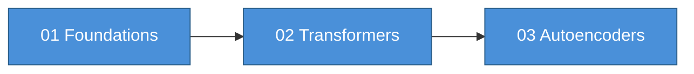
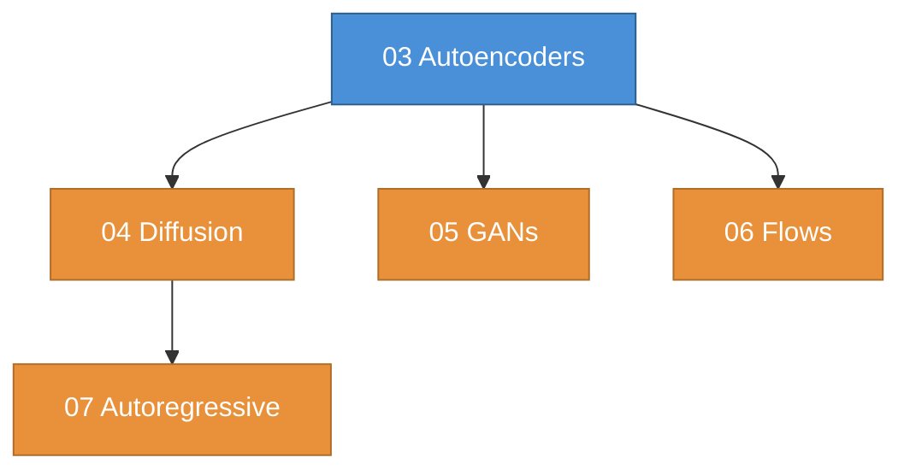

# Learn Generative AI

A from-first-principles study of generative AI — covering the math, the architectures, and the code. Each module builds on the last, taking you from linear algebra through transformers, diffusion models, GANs, and beyond.

Every module includes:
- **notes.md** — dense, practitioner-oriented reference with LaTeX math and Mermaid diagrams
- **notebook.ipynb** — hands-on PyTorch implementation (where available)
- **study-guide.md** — condensed quick-reference for review (where available)
- **NotebookLM** — AI-generated audio overview, slides, infographic, and study report

## Modules

| # | Module | Notes | Notebook | GPU? | NotebookLM |
|---|--------|-------|----------|------|------------|
| 01 | [Foundations](01-foundations/) | [notes.md](01-foundations/notes.md) | [](https://colab.research.google.com/github/prashantkul/learn-generative-ai/blob/main/01-foundations/notebook.ipynb) | No | [NotebookLM](https://notebooklm.google.com/notebook/47e52580-46c5-4c94-8b34-e060f56939b1) |
| 02 | [Transformers](02-transformers/) | [notes.md](02-transformers/notes.md) | [](https://colab.research.google.com/github/prashantkul/learn-generative-ai/blob/main/02-transformers/notebook.ipynb) | No | [NotebookLM](https://notebooklm.google.com/notebook/63d1ee07-489a-4ce1-bd81-fc06b9350a68) |
| 03 | [Autoencoders](03-autoencoders/) | [notes.md](03-autoencoders/notes.md) | [](https://colab.research.google.com/github/prashantkul/learn-generative-ai/blob/main/03-autoencoders/notebook.ipynb) | Yes | [NotebookLM](https://notebooklm.google.com/notebook/8d608b88-ffc1-408d-a78c-f4e7744d7b8f) |
| 04 | [Diffusion Models](04-diffusion-models/) | [notes.md](04-diffusion-models/notes.md) | [](https://colab.research.google.com/github/prashantkul/learn-generative-ai/blob/main/04-diffusion-models/notebook.ipynb) | Yes | [NotebookLM](https://notebooklm.google.com/notebook/b43bdea6-aee7-4a9e-83ca-7b98c8576e3c) |
| 05 | [GANs](05-gans/) | [notes.md](05-gans/notes.md) | [](https://colab.research.google.com/github/prashantkul/learn-generative-ai/blob/main/05-gans/notebook.ipynb) | Yes | [NotebookLM](https://notebooklm.google.com/notebook/bbde36f6-cf91-45d8-8bde-6c8b09f6a938) |
| 06 | [Flow Models](06-flow-models/) | [notes.md](06-flow-models/notes.md) | [](https://colab.research.google.com/github/prashantkul/learn-generative-ai/blob/main/06-flow-models/notebook.ipynb) | No | [NotebookLM](https://notebooklm.google.com/notebook/7db9a8ff-56e2-48f9-96b4-119a661b6a6d) |
| 07 | [Autoregressive](07-autoregressive/) | [notes.md](07-autoregressive/notes.md) | [](https://colab.research.google.com/github/prashantkul/learn-generative-ai/blob/main/07-autoregressive/notebook.ipynb) | Yes | [NotebookLM](https://notebooklm.google.com/notebook/c3ce6a0c-3745-44bb-ac6d-6924da35c573) |
| 08 | [Encoder-Decoder](08-encoder-decoder/) | [notes.md](08-encoder-decoder/notes.md) | [](https://colab.research.google.com/github/prashantkul/learn-generative-ai/blob/main/08-encoder-decoder/notebook.ipynb) | No | [NotebookLM](https://notebooklm.google.com/notebook/ab2fdf3a-334a-46d7-965e-4eadb65b233e) |
| 09 | [Multimodal](09-multimodal/) | [notes.md](09-multimodal/notes.md) | [](https://colab.research.google.com/github/prashantkul/learn-generative-ai/blob/main/09-multimodal/notebook.ipynb) | Yes | [NotebookLM](https://notebooklm.google.com/notebook/3ec8a8ec-483b-426b-bbf2-a4a9a3c1501a) |

Each NotebookLM notebook contains AI-generated artifacts: audio podcast, slide deck, infographic, and study report.

---

## Learning Path

The modules are ordered intentionally. Here is the recommended path, organized into three phases.

### Phase 1: Build the Foundation (Weeks 1-3)



**Module 01 — Foundations** is non-negotiable. Even if you have an ML background, skim it to calibrate. It covers the exact linear algebra, probability, and optimization concepts that appear repeatedly in every generative model: softmax, layer normalization, residual connections, KL divergence, and the chain rule as backpropagation.

**Module 02 — Transformers** is the single most important module. The transformer is the backbone of nearly every modern generative model — LLMs, diffusion models, multimodal systems. Understand attention, multi-head attention, and the full transformer block deeply. Do the notebook. You will use this knowledge in every subsequent module.

**Module 03 — Autoencoders** introduces the encoder-decoder paradigm and latent spaces. The progression from vanilla AE to VAE to VQ-VAE is foundational — VAEs provide the latent space for Stable Diffusion, and VQ-VAE tokenization connects vision to language models.

### Phase 2: The Generative Model Zoo (Weeks 4-7)



These four modules can be studied in any order, but the suggested sequence is:

**Module 04 — Diffusion Models** — the dominant approach for image/video generation. Builds directly on the probability and optimization from Module 01, and the latent spaces from Module 03. Understand DDPM, DDIM, classifier-free guidance, and latent diffusion (Stable Diffusion).

**Module 05 — GANs** — historically important and still relevant for fast, high-quality generation. The adversarial training framework is a different way of thinking about generation. StyleGAN remains state-of-the-art for faces.

**Module 06 — Flow Models** — the theoretically cleanest generative model (exact likelihood). Flow matching is increasingly important and connects back to diffusion. Worth studying for the mathematical elegance even if you never train one.

**Module 07 — Autoregressive Models** — GPT, LLMs, and the next-token prediction paradigm. This is where language modeling, RLHF, and scaling laws live. If your primary interest is LLMs, you could move this to Phase 1 right after Transformers.

### Phase 3: Putting It All Together (Weeks 8-9)


**Module 08 — Encoder-Decoder** — seq2seq, T5, BART, and cross-attention. This is the architecture behind translation, summarization, and conditional generation. It also sets up the cross-modal attention patterns used in multimodal models.

**Module 09 — Multimodal** — the frontier. CLIP, text-to-image (DALL-E, Stable Diffusion), image-to-text (LLaVA), video generation (Sora), and the convergence thesis that all modalities are becoming tokens. This module ties everything together.

### Alternative Paths

**"I only care about LLMs"**: 01 → 02 → 07 → 08 → 09

**"I only care about image generation"**: 01 → 02 → 03 → 04 → 05 → 09

**"I want the theoretical foundations"**: 01 → 02 → 03 → 06 → 04 → 05

**"Speed run (weekend intensive)"**: 01 (study guide only) → 02 → 04 → 07 → 09

---

## How to Use This Repository

### Reading the Notes

Each `notes.md` is a self-contained reference. Read it linearly the first time, then use it as a lookup. The Mermaid diagrams render in GitHub, VS Code, and most markdown viewers.

### Running the Notebooks

```bash
# Clone the repository
git clone git@github.com:prashantkul/learn-generative-ai.git
cd learn-generative-ai

# Install dependencies with uv
uv sync

# Launch Jupyter
uv run jupyter lab
```

For modules that need additional dependencies:

```bash
# Transformers/NLP extras
uv sync --extra transformers

# Diffusion model extras
uv sync --extra diffusion
```

### Using NotebookLM

Each module has a linked NotebookLM notebook with pre-generated artifacts:

| Artifact | What It Is | Best For |
|----------|-----------|----------|
| Audio Overview | ~15 min podcast-style discussion | Commute listening, initial exposure |
| Slides | Visual slide deck | Quick visual review, presentations |
| Infographic | Single-page visual summary | Pinning to your wall, quick reference |
| Report | Structured study report | Deep review, exam prep |

---

## Prerequisites

- Python 3.11+
- Basic familiarity with Python and NumPy
- Some calculus and linear algebra (Module 01 covers the specific topics you need)
- No prior deep learning experience required — Module 01 starts from neurons

## Tech Stack

- **Framework**: PyTorch
- **Package Manager**: [uv](https://docs.astral.sh/uv/)
- **Notebooks**: Jupyter Lab
- **Diagrams**: Mermaid (renders in GitHub markdown)

---

## License

This project is for educational purposes.
